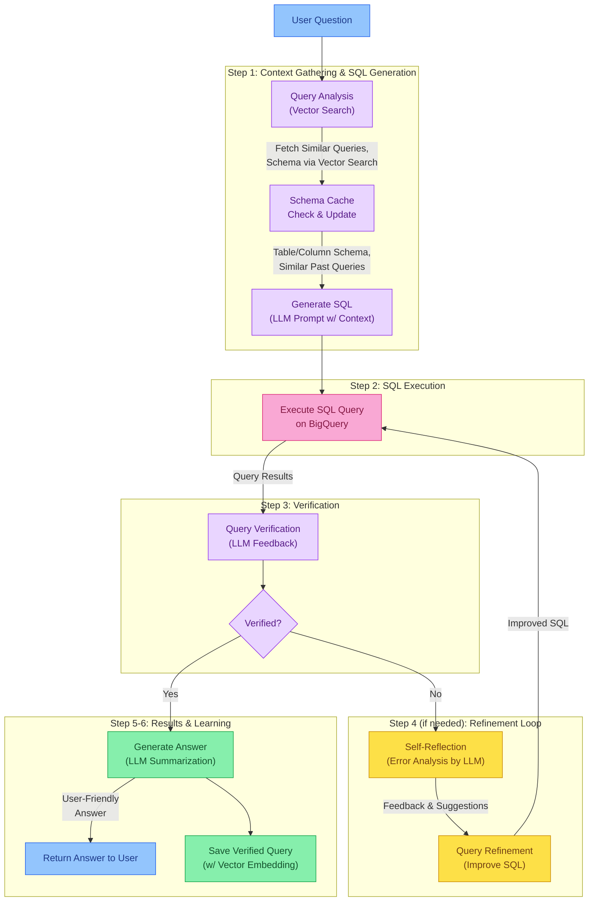

# Agentic SQL Analysis

**Author:** Adam McCabe

This experiment houses code related to evaluating agentic SQL analysis frameworks (e.g. User question -> ... -> data narrative). Testing with an approach inspired by [vanna](https://github.com/vanna-ai/vanna) which uses historical, verified, SQL queries to help reinforce the contextual understanding of the data schema and business logic.

## Overview

The Agentic SQL system allows users to query databases using natural language questions, with advanced features like self-reflection and query refinement. It delivers a concise, actionable answer rather than just raw SQL results.

## System Flow



### Data Flow Details

1. **Schema Caching & Vector Search**:
   - When a user asks a question, we search for relevant tables using vector embeddings of the `Table`, `Column` and `Dataset` views within the information schema for specified datasets (defaults to `prod_mart_reporting`, `prod_core`, `prod_mart_finance`)
   - We maintain a schema cache in a new postgres table, `bigquery_schema_cache` with vector embeddings of table metadata, most importantly any `ddl` statements which contain column descriptions. The cache is at the grain of one row per table per cache version
   - Cache freshness is checked (< 24 hours old) and updated if needed
   - Vector similarity search finds the most semantically relevant tables to the question

2. **Context Assembly for LLM**:
   - We gather table schemas, column definitions, and sample data
   - Find similar past questions and their verified SQL queries from a new postgres table, `sql_query_pairs`
   - All this context is formatted and sent to the LLM in the system prompt

3. **SQL Generation**:
   - The LLM generates SQL with proper BigQuery syntax
   - Tables are fully qualified with project/dataset information
   - The LLM explains its reasoning for the generated SQL

4. **Verification & Refinement Process**:
   - The LLM analyzes query results against the original question
   - If verification fails, detailed feedback is provided
   - Self-reflection analyzes what went wrong and improves the query
   - Multiple refinement iterations (up to 3 by default) can occur until verification succeeds

5. **Answer Generation**:
   - The final step transforms SQL results into a concise, plain-language answer
   - The answer includes caveats/limitations and suggested follow-up questions
   - This happens regardless of whether the query was verified or required refinement

## Features

- **Natural Language to SQL**: Converts user questions to SQL queries using LLMs
- **Self-Verification**: Uses LLMs to verify query accuracy and provide feedback
- **Self-Reflection & Refinement**: Allows for multiple query refinement attempts
- **Concise Answers**: Generates clear, actionable answers with possible caveats and follow-up questions
- **Vector Similarity Search**: Finds similar past questions using vector embeddings
- **Schema Caching**: Stores database schema information with vector representations for fast semantic search
- **Database Schema Analysis**: Dynamically analyzes table structures from BigQuery
- **Continuous Learning**: Saves verified queries in a PostgreSQL database for future reference

## Implementation Details

The system is composed of several core components:

- `main.py`: Main application logic, process flow, and user interface
- `llm.py`: LLM interaction methods for SQL generation, verification, refinement, and answer generation
- `get_context.py`: Database connectivity, PostgreSQL models, and query search functionality
- `bigquery_context.py`: BigQuery schema caching and vector search capabilities
- `models.py`: Data models for all request/response types
- `settings.py`: Configuration settings and environment variables
- `prompts/`: Jinja2 templates for all LLM interactions, including system and user prompts

## Usage

Run the experiment in interactive mode to ask your own questions:

```bash
make run_experiment ARGS="agentic_sql"
```

Or run with example questions in demo mode:

```bash
make run_experiment ARGS="agentic_sql --demo"
```

### Additional Command Options

- Clear existing query cache before running:
  ```bash
  make run_experiment ARGS="agentic_sql --clear-queries"
  ```

- Clear query cache and run in demo mode:
  ```bash
  make run_experiment ARGS="agentic_sql --clear-queries --demo"
  ```

- Only clear the query cache without running the interactive mode:
  ```bash
  make run_experiment ARGS="agentic_sql --clear-queries"
  ```

### Interactive Commands

Once in interactive mode, you can use these commands:

- Enter your natural language question to generate SQL
- Type `schema` to view the available database schema
- Type `sql:YOUR_QUERY` to execute a BigQuery SQL query directly
- Type `bq:YOUR_QUERY` to execute a BigQuery SQL query directly
- Type `q` or `quit` to exit

## Example Questions

Here are some example questions you can ask:

### General Business Questions

- "How many active users does our platform have?"
- "What was our total GMV in Q1 2025?"
- "How many companies were created in the last 30 days?"
- "What is our average order value over the past 6 months?"

### Data Exploration

- "What tables contain information about users?"
- "Which table has the most rows?"
- "Show me a sample of the most recent orders"
- "What tables are related to partnerships?"

### Advanced Analysis

- "What is the month-over-month growth in active users?"
- "Show me the top 10 companies by GMV in Q1 2025"
- "What percentage of orders are from first-time buyers?"
- "Compare the number of active users between 2024 and 2025"

## System Operation

The system performs the following steps:

1. **Query Analysis**: Analyzes your question and finds relevant database tables using vector similarity search
2. **SQL Generation**: Generates syntactically correct and optimized SQL for BigQuery
3. **Query Execution**: Runs the generated SQL query on BigQuery
4. **Verification**: Verifies that the query correctly answers your question
5. **Self-Reflection & Refinement** (if needed): Refines the query up to 3 times if it doesn't pass verification
6. **Answer Generation**: Provides a concise, direct answer to your question, not just SQL results
7. **Knowledge Storage**: Saves verified queries to improve future responses

## Extending and Customizing

To extend the system:

1. Add new prompt templates in `prompts/sql_generation/`
2. Extend the database schema cache by modifying `bigquery_context.py`
3. Add new PostgreSQL models in `get_context.py`
4. Change the maximum refinement attempts in `settings.py`
