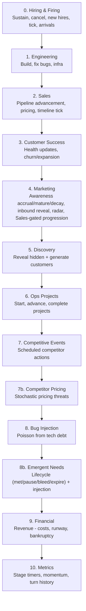
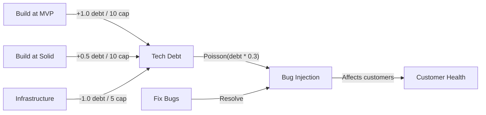
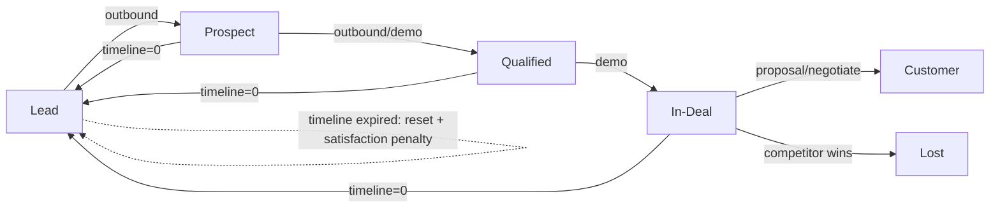
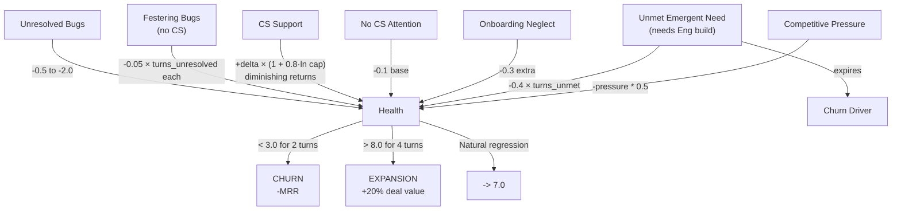
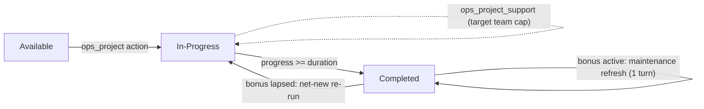

# AlignSim Game Mechanics

Reference for anyone tuning game balance, designing scenarios, or understanding why the LLM made a specific decision. Every formula here maps to a function in `src/engine/`.

## Table of Contents

- [Capacity Pools](#capacity-pools)
- [Turn Resolution Order](#turn-resolution-order)
- [Engineering System](#engineering-system)
- [Customer Pipeline](#customer-pipeline)
- [Customer Health & Retention](#customer-health--retention)
- [Marketing vs Discovery](#marketing-vs-discovery)
- [Competitive System](#competitive-system)
- [Financial Model](#financial-model)
- [Hiring](#hiring)
- [Scoring](#scoring)
- [Ops Function & Process Projects](#ops-function--process-projects)
- [Sales Momentum](#sales-momentum)
- [Pricing Negotiation](#pricing-negotiation)
- [Procedural Customer Generation](#procedural-customer-generation)
- [Calibration Parameters](#calibration-parameters)
- [Key Interaction Loops](#key-interaction-loops)

---

## Capacity Pools

Each turn, capacity is split across five function-specific pools. Actions draw from their pool — you cannot spend engineering capacity on sales.

| Pool | Default | Actions |
|------|---------|---------|
| **Engineering** | 20 | build, fix_bugs, infrastructure |
| **Sales** | 10 | sell, discover |
| **Support** | 5 | support |
| **Marketing** | 5 | market |
| **Ops** | 0 | ops_project |
| **Total** | 40 | |

Ops and Support both default to 0. The seed_stage scenario starts with eng=6, sales=6, marketing=3, support=0, ops=0 (total=15). Both must be bootstrapped via cross-function hires.

**Note**: `ops_project_support` actions draw from the **target team's** pool, not the ops pool. For example, supporting an ops project that targets sales uses sales capacity. Projects can complete without target team support, but the resulting bonus will be weaker — investment from the target team increases the likelihood of a strong outcome.

Hiring adds capacity to the specific pool being hired for (see [Hiring](#hiring)).

---

## Turn Resolution Order

Each turn processes in this exact sequence. Order matters — engineering ships features before sales tries to close deals that depend on them.



Hiring resolves first because sustain_hire capacity is pre-committed — it takes priority over all other actions. Engineering resolving next is a deliberate design choice: if you build F05 and sell to C08 in the same turn, F05 is shipped before the sell action checks satisfaction. This rewards coordinated build+sell strategies. For the same reason, emergent-need injection (step 8b) runs *after* CS (step 3): a need injected on turn T cannot be `health_check`-discovered until T+1, which keeps the CS discovery gate honest.

**Process bonuses from completed Ops projects** are threaded into earlier resolution steps (sales conversion, CS health, marketing effectiveness, bug injection, discovery). Bonuses activate the turn after a project completes.

---

## Engineering System

### Build Progress

Build progress uses diminishing returns — throwing more people at a feature past the optimal crew size is less efficient, and every feature has a minimum number of turns to complete.

```
effective_capacity = capacity
if capacity > optimal_crew (12):
    efficiency = (optimal / capacity) ^ 0.5
    effective_capacity = optimal + excess * efficiency

effective_capacity = min(effective_capacity, remaining_cost * 0.65)
progress_increment = (effective_capacity / remaining_cost) * 100
```

- Ships when progress >= 100%
- **Max progress per turn**: 65% of remaining cost — no one-turn completions for non-trivial features
- **Minimum turns**: `ceil(remaining_cost * 0.15)` — at least 2 turns for any feature
- **Upgrades only pay the delta**: upgrading from MVP to solid only costs the difference between the two levels
- Dependencies must be shipped (any quality) before building can start

**Feature cost tiers** — costs increase sharply by tier, creating a clear investment ladder:

| Tier | Features | MVP Cost | Solid Cost | Polished Cost | Role |
|------|----------|----------|-----------|--------------|------|
| 1 | F01 (Core) | 20 | 35 | 55 | Core platform (ships pre-game) |
| 2 | F02-F05 | 10-12 | 18-22 | 30-36 | Segment bridges — table stakes |
| 3 | F06-F13 | 20-25 | 35-42 | 55-65 | Segment-specific — real investment |
| 4 | F14-F16 | 32-40 | 55-65 | 80-95 | Enterprise premium — major strategic bet |

### Tech Debt

Every build action generates debt. Infrastructure reduces it.

| Quality   | Debt per 10 capacity |
|-----------|---------------------|
| MVP       | +1.0                |
| Solid     | +0.5                |
| Polished  | +0.2                |
| **Infra** | **-1.0 per 5 cap**  |

```
net_debt_delta = sum(build_debt) - (infra_capacity / 5) * 1.0
debt_level = max(0, debt_level + net_debt_delta)
```

Debt level categories: low (<5), medium (5-10), high (10-15), critical (>15).

### Bug Injection

Happens every turn (step 8), after everything else resolves.

```
num_bugs = Poisson(lambda = max(0.5, debt_level * 0.3 * (1.0 - bug_rate_reduction)))
```

`bug_rate_reduction` comes from the Ops `bug_rate_reduction` process bonus (0.0 if no active bonus). The `max(0.5, ...)` floor prevents bugs from being fully eliminated.

| Debt Level | Expected Bugs/Turn |
|-----------|-------------------|
| 0         | 0                 |
| 5 (medium)| ~1.5              |
| 10 (high) | ~3.0              |
| 15 (critical)| ~4.5           |

Each bug gets:
- **Severity**: 20% critical, 40% major, 40% minor
- **Feature**: weighted random by `bug_rate_modifier` across shipped features
- **Affected customers**: active customers who have that feature in their `feature_needs`
- **`turns_unresolved`**: incremented each turn the bug stays open. Feeds the health fester mechanic — unresolved bugs drain more health the longer they persist (see [Customer Health](#customer-health--retention)).

### Bug Fixing

| Severity | Fix Cost |
|----------|----------|
| Critical | 4 capacity |
| Major    | 2 capacity |
| Minor    | 1 capacity |

Auto-target mode fixes highest severity first. All-or-nothing per bug (you can't partially fix a critical bug with 2 capacity).



---

## Customer Pipeline

### Stages and Valid Actions



Wrong sell action for the stage = action rejected, capacity lost.

### Sell Capacity Minimums

Each sell action has a minimum capacity requirement that **scales with customer size**:

```
min_capacity = base_cost * customer.size
```

All sell action base costs default to 1, so a size-5 customer requires 5 capacity for any sell action. Attempting less = action rejected, capacity lost.

### Conversion Probability

```
probability = base_rate * satisfaction * engagement_mod * competitive_mod * momentum_mod * process_mod * pricing_mod
```

| Transition | Base Rate | Sell Actions | Notes |
|-----------|-----------|--------------|-------|
| Lead -> Prospect | 0.20 | outbound | |
| Prospect -> Qualified | 0.50 | outbound, demo | |
| Qualified -> In-Deal | 0.40 | demo | |
| In-Deal -> Customer | 0.25 | proposal, negotiate | negotiate requires prior proposal |

**Modifiers:**
- Engagement: hot = x1.3, warm = x1.0, cold = x0.4
- Competition: `max(0.3, 1.0 - competitive_pressure * 0.3)`
- Demo capacity bonus: extra capacity above minimum gives diminishing returns boost via `0.08 * ln(1 + extra_capacity)`
- Sales momentum: `× (1.0 + sales_momentum)` — see [Sales Momentum](#sales-momentum)
- Process bonus (from Ops): `× (1.0 + conversion_rate_bonus)` — see [Ops Function](#ops-function--process-projects)
- Pricing modifier: `× pricing_modifier` — see [Pricing Negotiation](#pricing-negotiation)
- Final probability capped at `max_close_probability` (default 0.70)

### Closing a Deal (In-Deal -> Customer)

Three gates, all must pass:

1. **Dealbreakers**: all dealbreaker features must be shipped (any quality)
2. **Rubric satisfaction >= close_threshold**: each customer has a per-customer `close_threshold` drawn from `gauss(0.75, 0.05)` clamped to [0.50, 0.95] at creation. If a customer has no custom threshold (0), the global `min_rubric_for_close` (0.75) is used as fallback. This prevents the LLM from treating 0.75 as a known constant.
3. **Random roll** against conversion probability

### Rubric Satisfaction

Each customer has hidden weights across four components. The weighted composite determines satisfaction.

```
satisfaction = w_fc * feature_coverage + w_price * price + w_mat * maturity + w_sup * support
```

| Component | Calculation | How to Improve |
|-----------|------------|----------------|
| **Feature Coverage** | `breadth * 0.4 + depth * 0.6` | Ship the features they need at higher quality |
| **Price** | `0.5 + (customer_size * 0.1)` | Can't change — larger customers are less price-sensitive |
| **Maturity** | `(polished * 1.0 + solid * 0.6) / total_shipped` | Upgrade features from MVP to solid/polished |
| **Support** | `health / 10.0` | CS support actions, fix bugs |

Feature coverage detail:
- **Breadth** = (number of customer's feature needs that are shipped) / (total feature needs)
- **Depth** = average quality score across the shipped features that match their needs
- Unshipped features don't drag the score down — they just don't contribute

**Maturity is global**: it's the ratio across ALL shipped features, not just the customer's needs. Shipping many MVPs hurts everyone's maturity score.

### Engagement

Engagement level is determined by sell capacity allocated this turn, **scaled by customer size**:

| Condition | Result |
|-----------|--------|
| sell_capacity >= 1.0 * customer_size | Hot |
| sell_capacity >= 0.4 * customer_size | Warm (or stays Hot) |
| No sell capacity | Decay: Hot -> Warm -> Cold |

### Timeline (Action-Triggered Countdown)

The timeline is a **player-initiated clock**. Discovered customers sit with no time pressure until you choose to engage them.

- **Clock starts on first sell action**: The moment you target a customer with any sell action (outbound, demo, proposal, negotiate), the timeline begins counting down. The customer could still be a lead at this point — stage doesn't matter.
- **Clock ticks every turn once active**: Once activated, the timeline decrements by 1 each turn regardless of pipeline stage.
- **On expiry: reset to lead, not lost**: When the timeline hits 0, the customer resets to `lead` stage with engagement set to cold. The timeline resets to its original value and the clock stops. However, satisfaction takes a **permanent 30% penalty per reset** (floored at 30% of original base satisfaction). This makes the customer progressively harder to close.

`timeline_resets` is visible in observations for customers that have expired at least once.

---

## Customer Health & Retention

### Health Range: 0.0 - 10.0

Computed each turn for active customers (stage = customer). Health decay is **event-driven** — it responds to what's happening, not a flat rate.

```
delta = 0.0

# Bug impact (negative)
delta += sum(bug_penalties)          # -2.0 critical, -1.0 major, -0.5 minor

# CS attention (diminishing returns) vs neglect
if cs_capacity > 0:
    delta += health_cs_attention_delta * (1 + cs_attention_log_factor * ln(cs_capacity))
    # log curve, factor 0.8: cap1->1.0, cap2->1.55, cap3->1.88, cap4->2.11, cap6->2.43
    # No hard ceiling, but each extra unit on the SAME customer is worth less than the last.
else:
    delta -= health_neglect_base_decay   # 0.1 base neglect penalty
    for each unresolved bug affecting this customer:
        delta -= health_bug_fester_rate * bug.turns_unresolved   # 0.05 per turn the bug has been open
    if customer.onboarding_turns_remaining > 0:
        delta -= health_onboarding_neglect_penalty   # 0.3 — neglecting onboarding is costly

# Emergent-need bleed (negative) — applies regardless of CS attention (the "blind cost").
for each unmet, non-paused emergent need on this customer:
    delta -= emergent_need_bleed_rate * need.turns_unmet   # 0.4 × turns past grace

delta -= competitive_pressure * 0.5  # negative: competitor threat
delta += regression_toward_7         # mild: +/-0.1 toward 7.0
health = clamp(health + delta, 0.0, 10.0)
```

The CS-attention curve replaced the old `min(cs_capacity, 3)` hard cap: concentrating capacity on one customer still beats nothing, but spreading it across customers is more efficient (concavity), and there is no longer a wasteful ceiling. The neglect model has three layers: a small base decay (0.1/turn), an escalating penalty for unresolved bugs that grows the longer they fester, and a steep penalty for neglecting customers still in onboarding. The bug fester mechanic creates urgency around bug resolution even when the initial health impact seems manageable.

See `customer_logic.py:compute_health_delta` for the implementation.

### Emergent Needs (CS keystone)

Active customers develop **new feature needs** over time, seeded like bug injection (deterministic per seed, same turn slot as bug injection — strictly *after* CS resolves, so same-turn discovery is impossible). An emergent need is **hidden ground truth**: it is revealed to CS only through a `health_check` action. The injection event is never surfaced to any agent.

Lifecycle — `injected -> (revealed via health_check) -> met | expired`:

| Phase | Condition | Effect |
| --- | --- | --- |
| **Grace** | `turn - turn_injected < emergent_need_grace_turns` (3) | No health impact, no clock. Time for CS to discover and route, and Eng to start. |
| **Bleeding** | past grace, feature not shipped, not built this turn | `turns_unmet += 1`; health bleeds `emergent_need_bleed_rate × turns_unmet` per turn. Begins whether or not CS discovered it. |
| **Paused** | Eng allocated build capacity to the feature **this turn** | Both the bleed and the clock halt. Stop building and the bleed resumes. |
| **Met** | the feature reaches any `shipped_*` status | Bleed stops; one-time `emergent_need_met_health_bonus`. Satisfying a need **requires Engineering build capacity** — the resource Sales and retention already compete for. |
| **Expired** | `turns_unmet >= emergent_need_expiry_turns` (5) and still unmet | Writes `customer.churn_drivers[feature_id]` (informational-only in v1) and emits `emergent_need_expired`. The bleed continues (frozen `turns_unmet`); expiry is not relief. |

This routes a retention signal (held by CS) through the build queue (held by Engineering), with MRR-at-stake context held by Sales — the three-way arbitration the benchmark is designed to surface. Under-investing in CS makes a team **blind** to this risk: unmet-need decline shows only as `undiagnosed_decline` until a `health_check` reveals the specific need(s) and churn drivers.

See `product_logic.py:inject_emergent_needs` and `resolver.py:_resolve_emergent_needs`.

### CS Verbs (baseline + specialty)

Every support verb provides baseline (diminishing-returns) health attention. On top of that:

| Verb | Specialty |
| --- | --- |
| `health_check` | The **only** way to learn a customer's emergent needs and hidden churn drivers (a CS discovery mini-game parallel to Sales' price discovery). |
| `onboard` | Extra `onboard_health_bonus` during the onboarding window and an extra `onboard_acceleration` decrement of the onboarding clock. Negligible once onboarding is complete. |
| `churn_intervention` | Costly stochastic save: requires `churn_intervention_min_capacity`, only fires when `health < churn_intervention_health_threshold`, and applies `churn_intervention_health_recovery` with probability `churn_intervention_success_prob`. |

See `resolver.py:_resolve_cs`.

### Churn

```
if health < 3.0 for 2 consecutive turns -> churned
```

Customer removed from active. MRR decreases by their deal_value.

### Expansion

```
if health > 8.0 for 4 consecutive turns -> expansion
```

Deal value increases by 20%. MRR increases accordingly. Counter resets after expansion.



---

## Marketing vs Discovery

Two ways to find new customers. They serve different strategic purposes.

### Discovery (Immediate, Expensive)

- **Cost**: capacity from sales pool
- **Targeting**: by `target_features` — specify shipped feature IDs and the engine finds hidden customers whose `feature_needs` overlap those features. If no targets specified, defaults to all shipped features.
- **Probability per customer**: `min(remaining_capacity / discovery_difficulty, 0.95)`
- Discovery difficulty in seed_stage: tier-based (tier 2: 1.5-2.5, tier 3: 3.0-4.5, tier 4: 4.5-5.5)
- **Procedural overflow**: when the handwritten hidden pool is exhausted, the engine generates new candidates via `CustomerGeneratorConfig` (see [Procedural Customer Generation](#procedural-customer-generation))
- **When to use**: You need specific customers now, or you want control over which feature niche

### Marketing (Awareness — Quality, Not Access)

Marketing is **not** a lead-volume lever. It builds a decaying **per-feature awareness stock**
that changes the *quality* of the customers revealed (by discovery *or* inbound) whose needs
include high-awareness features. The inbound lead **count** still comes from the lagged formula
below; awareness only changes *which* features inbound favours and *what state* every revealed
customer arrives in.

**Lead count (unchanged):** `leads = int(base_inbound_rate + lagged_investment * marketing_effectiveness)`
(10-turn lag in seed_stage; this is conservative and "quality not access" by design).

**Awareness stock.** Each `market` action specifies a `channel` and `target_features` (empty =
broad across all shipped + in-progress features — marketing may build awareness for
not-yet-shipped features). Total awareness contribution = `capacity * channel.efficiency`,
split across the targeted features and scheduled into `pending_awareness`:

- It begins maturing after `channel.lag` turns, spread evenly over `channel.spread` turns
  (`spread = 1` is a single burst).
- Each turn, matured increments are added to `awareness[feature]`, then **every** stock decays
  by `awareness_decay` (10%/turn); stocks below `awareness_epsilon` are dropped.
- Steady state under continuous investment ≈ `per_turn_inflow / awareness_decay`.

**Channel profiles** (seed_stage defaults — tuned in review):

| channel | lag | spread | efficiency | budget $/cap | niche |
|---|---|---|---|---|---|
| `events` | 2 | 1 (burst) | 0.8 | 8,000 | expensive, timed push just before a discovery sprint |
| `content` | 8 | 6 | 0.5 | 3,000 | budgeted, long-game durable awareness |
| `outbound_campaign` | 5 | 3 | 0.6 | 0 | free-but-slow, concentrated on few features |

`events`/`content` spend shared **runway budget** (`capacity * budget_cost_per_capacity`,
deducted in the financial step and emitted as `marketing_spend:<amount>`). The validator rejects
a budgeted market action that would drive budget below zero. `outbound_campaign` is capacity-only
(never budget-gated), so marketing is never fully gated behind cash.

**Reveal-state modulation (the payoff).** At every reveal site (inbound *and* discovery), a
customer's `awareness_score = max(awareness[f] for f in feature_needs)` sets their arrival state:

- `score >= awareness_warm_threshold` → **warm** (and with probability `awareness_hot_prob`,
  gated by `score >= awareness_hot_threshold`, **hot**). Otherwise **cold**.
- Timeline is **extended** (never shortened) by
  `round(awareness_timeline_bonus_max * min(1, score / awareness_hot_threshold))` — more turns =
  more chances for Sales to close.

**Inbound feature-bias.** Inbound reveal (handwritten) and generation are weighted toward
customers whose needs include high-awareness features (`weight = 1 + inbound_awareness_bias * score`).
Marketing thus pulls inbound *toward the features it hyped* — without changing the total count.

**The intended coordination loop:** Eng plans to ship F14 ~turn 30 → Marketing builds F14
awareness from ~turn 20 (ahead of the lag) → Sales discovers F14 customers at turn 30 and they
arrive **warm and patient**. That forward, lagged, cross-functional roadmap commitment is the
behaviour a goal-tracking substrate should beat a chat room at.

| | Discovery | Marketing (awareness) |
|---|---|---|
| **Timing** | Immediate | Channel-dependent lag (2–8 turns) + decay |
| **Targeting** | Choose target features | Choose target features (incl. unshipped) |
| **What it changes** | Reveals specific customers now | Reveal *quality* (engagement + timeline) + inbound feature-bias |
| **Cost model** | Per-turn sales capacity | Marketing capacity (+ runway budget for events/content) |
| **Lead count** | Pool + generator | Fixed formula (unchanged by awareness) |

With the procedural generator enabled, neither mechanism truly runs out — the generator creates
new customers when the handwritten pool is exhausted. Generated customers have IDs like `G0001`.

### Marketing↔Sales Co-investment (Sales-gated pipeline progression)

Awareness improves lead *quality*, but the binding constraint is usually **Sales throughput** —
warm leads decay before an overloaded Sales can work them. The budget channels therefore carry a
second, bottleneck-relieving payoff: they can buy **pipeline progression**, but only when **Sales
co-invests capacity the same turn** (`MarketSupportAction`, drawn from the sales pool). This is
the structural twin of `ops_project_support` — one team spends its own pool to amplify another
team's action — bound to a **same-turn, channel-matched** marketing campaign.

| channel | solo (mkt cap + budget) | + Sales `market_support` same turn |
|---|---|---|
| `outbound_campaign` (free) | warm / rarely-hot leads | — (not a co-invest channel) |
| `content` (mid budget) | warm leads | newly-revealed inbound roll to land **one stage advanced** (lower base prob) |
| `events` (high budget) | warm leads | new advanced (**higher** base prob) **+** can push one **named existing** pipeline customer one stage |

- Progression advances exactly **one stage** along `lead → prospect → qualified → in_deal`,
  **hard-capped at `in_deal`**. Closing (`in_deal → customer`) still runs the full dealbreaker +
  rubric gate via a normal `proposal`/`negotiate`. It buys pipeline relief, **not free MRR**.
- It sets the new stage + resets `turns_in_current_stage`; it does **not** activate the timeline
  clock (Sales engaging the customer still does) — avoids an instant-expiry trap.
- **Mis-timed co-investment is wasted**: if Sales co-invests a channel with no matching campaign
  that turn, its capacity is consumed, nothing progresses, and `market_support_unmatched:<channel>`
  fires. Because Sales cannot see this turn's marketing action under partitioned observability, the
  match *requires* out-of-band coordination (chat in C3, self in C2) — the C3-vs-C4 signal.
- **Roll probability** scales with the joint commitment *and* the budget committed, both with
  diminishing returns:
  `p = clamp(base[ch] * (1 + a*log1p(min(m, s)) + b*log1p(B_k)), 0, max)`
  where `m` = marketing capacity on the channel, `s` = sales collab capacity (`min(m,s)` is the
  Liebig joint commitment — both teams must commit, self-limiting), and `B_k` = budget spent on
  the channel this turn in $K. `events` base > `content` base. Worked table at the defaults:

  | m=s | events p | content p |
  |----|----|----|
  | 1 | 0.54 | 0.26 |
  | 3 | 0.66 | 0.32 |
  | 5 | 0.72 | 0.36 |

- New-lead progression applies to **all inbound revealed that turn** while a funded+matched
  campaign is active (events preferred when both channels are funded); awareness's inbound-bias
  already self-targets those leads onto the hyped features.
- Events visible to **sales + marketing only**: `pipeline_progression:<id>:<from>-><to>`,
  `market_support:<channel>:capacity=<s>:matched=<m>`, and `market_support_unmatched:<channel>`.
  Sales sees its pipeline move; it never sees marketing's channel/awareness internals.

---

## Competitive System

### Scheduled Events

Competitors fire events at pre-defined turns. Each event:
- Targets specific customers by ID
- Has a `rubric_impact` dict (e.g., `{"feature_coverage": 0.6, "maturity": 0.5}`)

### Competitive Pressure

```
pressure += (avg_rubric_impact * 0.3)    # increases when event fires
pressure -= 0.05                          # natural decay per turn
pressure = clamp(pressure, 0.0, 1.0)
```

Pressure effects:
- **Pipeline conversion**: multiplied by `max(0.3, 1.0 - pressure * 0.3)`
- **Customer health**: `-pressure * 0.5` per turn
- **Deal steal**: If competitor event fires while customer is in-deal, and `competitor_satisfaction > player_satisfaction`, the deal is lost immediately

### Competitive Radar (Marketing-only)

Marketing passively senses **early, fuzzy warning** of upcoming competitor events touching
features it is active in — a unique information source other functions depend on to defend deals.

- Each turn (in marketing resolution), the engine scans competitor schedules for events with
  `turn` within `radar_lookahead_turns` of now.
- It maps each event's `affected_customers → their feature_needs`, keeping only feature areas
  marketing has **awareness** on. If none, no signal (and no RNG is drawn — radar is awareness-gated).
- Detection probability scales with that awareness: `radar_base_prob * min(1, max_awareness / awareness_hot_threshold)`,
  plus `±radar_uncertainty_jitter`. Computed in resolution, so it is **deterministic per seed**.
- A surfaced signal is emitted as a marketing-only `competitor_radar:<feature_area>:<soon|upcoming>`
  event — **vague on purpose**: feature area + fuzzy timing, never an exact turn, customer, or ID.
  `soon` if the event is within `radar_lookahead_turns // 2`, else `upcoming`.
- Surfaced in the marketing observation (`competitor_radar`). It must never reach any non-marketing
  role (kept out of `SHARED_EVENT_PREFIXES`); Sales/Product see only the *effect* (warm leads).

---

## Financial Model

### Per-Turn P&L

```
revenue    = MRR (sum of active customer deal_values)
team_cost  = capacity_per_turn * team_cost_per_capacity (2,500 default; 2,200 in seed_stage)
overhead   = base_cost_per_turn (10,000 in playtest, 3,500 in seed_stage)
maintenance = sum(shipped_feature.maintenance_cost)  # $400-900 each
total_cost = team_cost + overhead + maintenance
net_income = revenue - total_cost
budget    += net_income
```

### Runway

```
if total_cost > revenue:
    runway = budget / (total_cost - revenue)
else:
    runway = 999  # profitable
```

### Bankruptcy

`budget < 0` -> game over.

### Playtest Starting Conditions

- Budget: $385,000
- MRR: $80,000 (5 active customers)
- Team cost: 40 * $2,500 = $100,000
- Overhead: $10,000
- Maintenance (4 shipped features): ~$1,950
- **Starting burn**: ~$112K cost - $80K revenue = ~$32K/turn
- **Starting runway**: ~12 turns

### Seed Stage Starting Conditions

- Budget: $3,000,000
- MRR: $0 (no active customers)
- Team cost: 15 × $2,200 = $33,000
- Overhead: $3,500
- Capacity: eng=6, sales=6, support=0, marketing=3, ops=0 (total=15)
- 48 handwritten customers (8 visible leads, 40 hidden) + procedural generator
- 16 features in diamond DAG (F01 shipped as MVP)
- 6 process projects, 3 competitors
- Segments: startup, growth, mid_market, enterprise
- Conversion rates (override engine defaults): lead -> prospect 0.35, prospect -> qualified 0.55, qualified -> in_deal 0.48, in_deal -> closed 0.40
- **Starting burn**: ~$37K/turn
- **Starting runway**: ~81 turns (comfortable — the constraint is MRR growth, not survival)
- **Support and Ops start at 0**: must be bootstrapped via cross-function hires

---

## Hiring & Firing

### Hiring (Active Sustain)

Hiring uses an **active sustain mechanic**: the first half of the hire duration is the "active recruiting phase" requiring player action each turn. The second half auto-progresses.

**Actions**:
- `HireAction(hiring_function, target_function)` — Start a new hire. Costs budget (once) + capacity (3 from hiring pool).
- `SustainHireAction(hire_id)` — Continue an active-phase hire. Costs 3 capacity from the hiring pool. No budget cost.

| Mode | Condition | Total Delay | Active Phase | Auto Phase | Capacity Added | Budget Cost |
|------|-----------|-------------|-------------|-----------|----------------|-------------|
| **Native** | `hiring == target` | 6 turns | 3 turns | 3 turns | +4 | `capacity_per_turn * hire_budget_cost_multiplier` |
| **Cross-function** | `hiring != target` | 12 turns | 6 turns | 6 turns | +3 (round(4 × 0.7)) | same |

**Per-turn costs during active phase**: 3 capacity from `hiring_function` pool (both initiation and sustain turns).

**Cancellation**: If the player fails to submit `SustainHireAction` for a hire during any active-phase turn, the hire is immediately cancelled. Budget spent on initiation is not refunded.

**Multiple concurrent hires**: Each hire gets a unique ID (H1, H2, ...). Multiple hires for the same target function are allowed.

**Capacity pre-commitment**: Sustain capacity is deducted **before** other actions are validated. This means sustaining a hire reduces capacity available for builds, sells, etc.

**Phase lifecycle** (native example):
1. Turn 1: Player submits `HireAction`. Budget deducted. PendingHire H1 created (active 1/3).
2. Turns 2-3: Player submits `SustainHireAction(hire_id="H1")`. Active phase completes (3/3).
3. Turns 4-6: Auto-phase. No action needed. Hire ticks down automatically.
4. Turn 6 end: `turns_remaining` hits 0. +4 capacity added to target pool.

**Observation**: Each pending hire shows `id`, `phase` ("active"/"auto"), `active_turns_completed/active_turns_required`, `needs_sustain` (boolean), `turns_remaining`, and `capacity_on_arrival`.

- Support and Ops start at 0 capacity — bootstrapped via cross-function hires from other teams

**Calibration**: `cross_hire_delay_multiplier=2.0`, `cross_hire_capacity_factor=0.7`, `hire_arrival_delay=6`, `hire_capacity_bonus=4`, `hire_capacity_cost=3`

### Firing

`FireAction` takes `function` and removes up to one hire-unit (4 capacity) from that pool (or the remainder if less than 4).

- No capacity cost this turn
- Budget cost: `fire_severance_turns × team_cost_per_capacity` (seed_stage: 4 turns × $2,200 = $8,800)
- Reduces `capacity_per_turn` by the amount removed
- Cannot fire below 0 capacity
- Use to recover from over-hiring before budget becomes critical

---

## Scoring

All scores are **uncapped**: 1.0 = hit target (par), >1.0 = exceeded, <1.0 = fell short. Both goal layers are scored on two dimensions:

- **Composite** (sum): total achievement — higher is better, no ceiling
- **Pareto** (min): alignment quality — your score is only as good as your weakest component

### Primary Goals

| Component | Par (1.0) | Formula |
|-----------|-----------|---------|
| MRR | final_mrr = target | `final_mrr / mrr_target` |
| Churn | avg_rate = 0 | `max(0, 1 - avg_churn_rate)` (retention rate) |
| Runway | runway = min_runway | `log2(1 + runway / min_runway)`, capped at 4× target |

```
primary_composite = mrr_score + churn_score + runway_score
primary_pareto    = min(mrr_score, churn_score, runway_score)  (par = 1.0)
```

Targets: MRR $40,000 | Churn rate < 2% | Runway > 60 turns | Within 48 turns.

Runway is on a log scale capped at 4× target: par = 1.0 at the target, ~1.585 at
2× target, ~2.322 at 4× and beyond. The cap prevents an early-stage profitable
run (runway → ∞) from dominating the composite. Churn is bounded retention rate
in [0, 1] — perfect retention = 1.0, full churn = 0.0.

### Function Sub-Goals

Each function has its own goal with intentional tension against other roles:

| Function | Metric | Target | Tension |
|----------|--------|--------|---------|
| Engineering | features_shipped_solid_plus | 12 | Quality vs. speed (sales wants MVPs now) |
| Sales | pipeline_velocity | 0.20 | Close fast vs. engineering build time |
| Support | avg_customer_health | 7.0 | Maintain health vs. ops pulling support for change mgmt |
| Marketing | marketing_leads_generated | 24 | Invest in demand gen vs. immediate discovery |
| Ops | process_projects_completed | 6 | Run projects vs. hiring to grow capacity |

```
function_composite = sum(function_scores)    (par = 5.0)
function_pareto    = min(function_scores)     (par = 1.0)
```

Score per function = `actual / target` (uncapped).

**Metric extractors** (`scoring.py:_extract_metric`):

| Metric | Computation |
|--------|-------------|
| `features_shipped_solid_plus` | Count of features at solid or polished status |
| `pipeline_velocity` | `total_customers_closed / (turns_played - 1)` |
| `avg_customer_health` | Mean health of active customers |
| `marketing_leads_generated` | Count of `inbound_lead:` events in turn history |
| `process_projects_completed` | Count of completed process projects |
| `tech_debt_control` | `max(0, 1 - debt_level / 15)` |

### Why Min for Pareto?

The pareto score (min) guarantees that any run hitting all goals outscores any run that missed one — no amount of over-achievement elsewhere compensates for a neglected goal. Combined with composite (sum), you get two independent axes: "how balanced?" and "how much total?"

---

## Ops Function & Process Projects

Operations is the 5th team function. Ops works on **process improvement projects** — fixed-size menu items that produce bonuses for other teams. The key strategic lever: bonuses scale with how much the **target team** invests in change management alongside Ops.

### Process Projects

Each project has a fixed size (small/medium/large) determining ops capacity cost and duration:

| Size | Ops Capacity | Duration |
|------|-------------|----------|
| Small | 2 | 1 turn |
| Medium | 4 | 2 turns |
| Large | 6 | 3 turns |

### Project Lifecycle



1. **Start**: Submit `ops_project` with `capacity >= ops_capacity_cost`. Project moves to in-progress.
2. **Support (optional)**: While in-progress, the target team submits `ops_project_support` to invest change management capacity. Draws from target team's pool.
3. **Advance**: Each turn with sufficient ops capacity, `progress_turns` increments by 1.
4. **Complete**: When `progress_turns >= duration_turns`, a bonus activates at full value.

**Pausing**: If you don't submit `ops_project` for a turn, progress doesn't advance. No timeout or decay.

**Same-turn constraint**: `ops_project_support` cannot be submitted for a project started in the same turn.

### Bonus Computation

Bonus outcomes are **stochastic**. The expected value scales logarithmically with target team investment, but actual results vary:

```
base = bonus_base + scale * ln(1 + target_team_capacity_invested)
variance = (bonus_max - base) * 0.4 * exp(-0.1 * target_team_capacity_invested)
bonus_value = clamp(gauss(base, variance), 0, bonus_max)
```

Higher target team investment raises the expected bonus AND reduces variance — heavy investment is a risk-reduction strategy, not just a bonus amplifier. Zero investment yields the base bonus with maximum uncertainty. Each project has a hard cap (`max`) that prevents any single bonus from being too strong.

**Bonus degradation**: Bonuses degrade **linearly** from full value to zero over the project's `bonus_duration_turns` (12-20 depending on project):

```
effective_bonus = bonus_value * (turns_remaining / bonus_duration_turns)
degradation_pct = 1 - (turns_remaining / bonus_duration_turns)
```

**What the AI sees**: Qualitative effectiveness level, `turns_remaining`, `degradation_pct`, and `maintenance_cost` — not the raw numeric values. The AI reasons about uncertain returns rather than min-maxing.

### Bonus Refresh

Two modes for re-running a completed project:

| Mode | Trigger | Ops cost | Target team reinvestment |
|------|---------|----------|--------------------------|
| **Maintenance** | Bonus still active (`degradation_pct < 100`) | `round(degradation_pct × ops_capacity_cost)` per turn | Not required — change mgmt is already embedded |
| **Net-new re-run** | Bonus fully lapsed (project gone from active_bonuses) | Full `ops_capacity_cost` per turn | Required for maximum bonus (resets `target_team_capacity_invested`) |

**Maintenance is a single-turn action** — one `ops_project` action immediately resets `turns_remaining` to `bonus_duration_turns`. The project stays in `completed` status.

**Net-new re-run** moves the project back to `in_progress` for `duration_turns` turns, then completes again.

| Project | Target | Bonus Type | Base | Scale | Max | Duration | Bonus Lasts |
|---------|--------|-----------|------|-------|-----|----------|-------------|
| PP01 Sales Process Optimization | sales | conversion_rate | 0.05 | 0.03 | 0.15 | 2 turns | 16 turns |
| PP02 Engineering CI/CD Pipeline | engineering | bug_rate_reduction | 0.10 | 0.04 | 0.20 | 3 turns | 20 turns |
| PP03 Support Automation | support | health_delta_bonus | 0.20 | 0.10 | 0.50 | 1 turn | 12 turns |
| PP04 Marketing Analytics | marketing | marketing_effectiveness | 0.05 | 0.03 | 0.12 | 2 turns | 16 turns |
| PP05 Code Review Process | engineering | build_efficiency | 0.05 | 0.02 | 0.10 | 1 turn | 12 turns |
| PP06 Discovery Playbook | sales | discovery_bonus | 0.10 | 0.05 | 0.25 | 2 turns | 16 turns |

**Bonus duration**: Varies by project (see table). Higher-investment projects like CI/CD (PP02) last 20 turns; quick wins like Support Automation (PP03) last 12.

### How Bonuses Apply

| Bonus Type | Where Applied | Effect |
|-----------|--------------|--------|
| `conversion_rate` | Sales conversion probability | `probability *= (1 + bonus)` |
| `bug_rate_reduction` | Bug injection lambda | `lambda *= (1 - bonus)` |
| `health_delta_bonus` | CS health delta | `delta += bonus` |
| `marketing_effectiveness` | Inbound lead calculation | `effectiveness *= (1 + bonus)` |
| `build_efficiency` | Engineering capacity | Effective capacity boost |
| `discovery_bonus` | Discovery probability | `probability *= (1 + bonus)` |

### Strategic Considerations

- **Ops starts at 0**: Must be bootstrapped via cross-function hire (12 turns, 3 capacity). Plan accordingly.
- **Multiple parallel projects**: Yes, limited by ops capacity. Two small projects (2+2=4) need 4 ops capacity.
- **Target team investment tradeoff**: Investing target team capacity in change management means less core work that turn, but larger bonus later. Only worth it on first run (or net-new re-run). Skip during maintenance refresh.
- **Idle ops capacity**: When no projects are running and no maintenance refresh is needed, use ops capacity for cross-function hiring rather than wasting it.
- **Maintenance timing**: Refreshing at 40% degraded costs 40% of original ops cost. Waiting until 80% degraded costs 80%. Refresh earlier if you have spare ops capacity; delay if ops is busy.

---

## Sales Momentum

As you close deals, ship features, and invest in marketing, a momentum multiplier builds that makes future sales slightly easier. The first customer is the hardest.

### Formula

```
momentum += deals_closed * 0.08                        # social proof
momentum += 0.01 * ln(1 + shipped_feature_count)       # product credibility
momentum += 0.005 * lagged_marketing_investment         # brand awareness
momentum -= 0.01                                        # natural decay
momentum = clamp(momentum, 0.0, 0.40)
```

Momentum applies as a **multiplicative modifier** on conversion probability:

```
probability *= (1.0 + sales_momentum)
```

At maximum momentum (0.40), a 25% base negotiate rate becomes 35%.

### Momentum Sources

| Source | Per Unit | Notes |
|--------|----------|-------|
| Deal closed | +0.08 | Strongest signal — social proof from recent wins |
| Shipped features | +0.01 × ln(1+count) | Diminishing returns — credibility from product maturity |
| Marketing (lagged) | +0.005 × capacity | Brand awareness from past marketing investment |
| Natural decay | -0.01/turn | Momentum fades without reinforcement |

### Key Properties

- **Cap at 0.40**: Prevents late-game runaway. Even at max, conversion rates only increase by 40%.
- **Visible in observations**: The AI can see current momentum in the global dashboard.
- **Compounds with ops bonuses**: Sales conversion is multiplied by both `(1 + momentum)` and `(1 + process_bonus)` — models that invest in both get the largest payoff.

---

## Pricing Negotiation

Pricing adds a negotiation mini-game to the sales pipeline. Customers have a hidden `desired_price_point` — a price they'd accept — and the player must discover the right price through proposal/negotiate actions.

### How Pricing Works

1. **Customer has a desired price**: Set at creation from the customer's `deal_value` minus a segment-based discount (startup: 20-40%, growth: 15-35%, mid_market: 10-25%, enterprise: 5-20%). A $3,900 growth customer might have a desired price of ~$2,700.

2. **Player proposes a price**: The `proposed_deal_value` field on sell actions (proposal/negotiate). If omitted, defaults to `last_proposed_price` or `deal_value`.

3. **Price affects conversion probability**: The pricing modifier is a multiplier on conversion probability:
   - Within a **dead zone** (±5% of desired): no effect (modifier = 1.0)
   - **Above desired** (overpriced): exponential penalty, `penalty_floor + (1 - penalty_floor) * exp(-steepness * delta)`. At 20% overpriced, conversion drops to ~50% of base.
   - **Below desired** (underpriced): diminishing bonus, capped at 1.35×. Giving away margin helps close but has limits.

4. **Closing price becomes MRR**: When a deal closes, the `effective_price` (last proposed price) becomes the customer's `deal_value` — their ongoing MRR contribution. Underpricing to close means permanently lower revenue from that customer.

### Sandbagged Feedback

When a proposal/negotiate fails AND the proposed price exceeds the desired price, the customer gives **biased downward feedback**: a `pricing_feedback` event with an `indicated` price that's always at or below the true desired price (sandbag factor ~8% ± 2% jitter). The player sees: "C05 indicated $1,900" but the actual desired might be $2,050.

This creates deliberate ambiguity: a failed roll could mean the price is too high, OR the roll just didn't land. The customer's feedback is always nudging the price downward regardless.

### Negotiate Action

`negotiate` is a sell action available at the `in_deal` stage. It requires that the customer has already received at least one `proposal` (`has_received_proposal = true`). Mechanically identical to proposal but represents a follow-up negotiation round.

### Competitor Pricing Events

Stochastic competitor pricing events fire during the sales process (`resolver.py:_resolve_competitor_pricing_events`):

- **Trigger**: Poisson(λ=0.3) per turn, targeting random eligible `in_deal` customers who have received a proposal
- **Effect**: Competitor makes a discounted offer (~10% ± 5% below the customer's desired price). The customer evaluates the competitor's offer as if it were a `proposal` action with `warm` engagement and a rubric satisfaction of 0.70.
- **If competitor wins**: customer stage → `lost`, deal gone
- **If competitor loses**: customer's `competitive_pressure` increases by 0.20, and the player sees a `competitor_pricing` event showing the competitor's offer price

This creates time pressure on in-deal customers — sitting at `in_deal` with an open proposal for many turns increases the chance of losing the deal to a competitor.

See `customer_logic.py:compute_pricing_modifier`, `compute_sandbagged_price` and `resolver.py:_resolve_competitor_pricing_events`.

---

## Procedural Customer Generation

When the handwritten hidden customer pool is exhausted, the engine generates new customers on the fly using `CustomerGeneratorConfig`. This prevents the game from running out of pipeline after the initial 48 handwritten customers are discovered.

### When Generation Fires

- **Discovery**: After matching handwritten hidden customers against `target_features`, if capacity remains AND no more handwritten matches exist, the generator creates up to `max_candidates_per_discover` (default 6) new candidates.
- **Inbound marketing**: After revealing handwritten hidden customers, if more leads are owed and the pool is empty, the generator creates up to `max_candidates_per_inbound` (default 3) new candidates.

### How a Customer is Generated

The generation pipeline (`customer_generator.py:generate_customer`):

1. **Segment**: Weighted blend of base `segment_weights` + `feature_segment_affinity` from the target features. Targeting enterprise features makes enterprise customers more likely.
2. **Size**: Segment-specific distribution (startup: mostly 1-2, enterprise: mostly 4-5)
3. **Deal value**: `size × deal_value_per_size[segment] × uniform(1 ± jitter)`, rounded to nearest $50
4. **Feature needs** (1-3 features): Primary target feature + DAG-adjacent features. Quality scores: `{mvp: 0.3-0.5, solid: +0.2, polished: +0.4}`
5. **Rubric**: Segment archetype + uniform noise (±0.08), normalized to sum to 1.0
6. **Dealbreakers**: Tier-4 features at 60% chance, tier-3 at 30%
7. **Known needs**: 50-80% of actual feature needs are revealed
8. **Timeline**: Segment-specific range (startup: 14-22, enterprise: 28-38)
9. **Discovery difficulty**: Tier-based (tier 2: 1.5-2.5, tier 3: 3.0-4.5, tier 4: 4.5-5.5)
10. **Close threshold**: `gauss(0.75, 0.05)` clamped to [0.50, 0.95]
11. **Desired price**: `deal_value × (1 - segment_discount)`, same ranges as handwritten customers
12. **Churn drivers**: Proportional to max quality scores across feature needs

Generated customers get sequential IDs: `G0001`, `G0002`, etc. The generator uses the game's seeded RNG so results are deterministic per seed.

### Discovery vs Inbound Generation

| | Discovery candidates | Inbound candidates |
|---|---|---|
| **Target features** | 60% use requested targets, 40% use DAG-adjacent | 60-80% overlap shipped features |
| **Player control** | High — player picks which features to target | None — random from shipped features |
| **When** | Immediate (step 5 of turn resolution) | 10-turn lagged (step 4) |

See `customer_generator.py` and `resolver.py:_resolve_discovery` / `_resolve_marketing`.

---

## Calibration Parameters

All defaults from `CalibrationParams`. Change these to tune difficulty.

### Pipeline

| Parameter | Default | Effect of Increasing |
|-----------|---------|---------------------|
| lead_to_prospect_rate | 0.20 | Easier to start conversations |
| prospect_to_qualified_rate | 0.50 | Faster qualification |
| qualified_to_in_deal_rate | 0.40 | Easier to get to proposals |
| in_deal_to_closed_rate | 0.25 | Easier to close deals |
| min_rubric_for_close | 0.75 | Higher = harder to close |

### Sell Actions

| Parameter | Default | Effect of Increasing |
|-----------|---------|---------------------|
| sell_base_cost_outbound | 1 | Higher minimum capacity per sell action (× customer size) |
| sell_base_cost_demo | 1 | Higher minimum capacity per sell action (× customer size) |
| sell_base_cost_proposal | 1 | Higher minimum capacity per sell action (× customer size) |
| sell_base_cost_negotiate | 1 | Higher minimum capacity per sell action (× customer size) |
| demo_extra_capacity_bonus | 0.08 | Bigger bonus for over-investing in demos |
| engagement_hot_threshold | 1.0 | More capacity needed (× size) to reach Hot |
| engagement_warm_threshold | 0.4 | More capacity needed (× size) to reach Warm |

### Tech Debt & Bugs

| Parameter | Default | Effect of Increasing |
|-----------|---------|---------------------|
| debt_per_10_mvp_units | 1.0 | More debt from fast building |
| debt_per_10_solid_units | 0.5 | More debt from quality building |
| debt_per_10_polished_units | 0.2 | More debt from polish |
| debt_reduction_per_5_infra | 1.0 | Faster debt paydown |
| bug_injection_multiplier | 0.3 | More bugs per debt level |
| bug_critical_pct | 0.20 | More critical bugs |
| bug_major_pct | 0.40 | More major bugs |
| bug_minor_pct | 0.40 | More minor bugs |

### Customer Health

| Parameter | Default | Effect of Increasing |
|-----------|---------|---------------------|
| health_bug_critical_delta | -2.0 | More health damage from critical bugs |
| health_bug_major_delta | -1.0 | More health damage from major bugs |
| health_bug_minor_delta | -0.5 | More health damage from minor bugs |
| health_cs_attention_delta | 1.0 | Base CS health attention before the diminishing-returns curve |
| cs_attention_log_factor | 0.8 | Steeper diminishing-returns curve: `delta × (1 + factor × ln cap)` |
| churn_health_threshold | 3.0 | Higher = easier to churn |
| churn_consecutive_turns | 2 | More tolerance before churn |
| expansion_health_threshold | 8.0 | Lower = easier expansion |
| expansion_consecutive_turns | 4 | Faster expansion |
| expansion_deal_value_increase | 0.20 | Bigger expansion reward |
| health_neglect_base_decay | 0.1 | Base health loss per turn with no CS attention |
| health_bug_fester_rate | 0.05 | Extra health loss per turn per unresolved bug (no CS) |
| health_onboarding_neglect_penalty | 0.3 | Extra health loss for neglecting onboarding customers |

### Emergent Needs & CS Verbs

Conservative starting values — tuned during review (watch cross-seed variance).

| Parameter | Default | Effect of Increasing |
|-----------|---------|---------------------|
| emergent_need_injection_rate | 0.10 | More needs per active customer per turn (more retention pressure) |
| emergent_need_injection_floor | 0.3 | Higher lambda floor — needs appear even with few customers |
| emergent_need_grace_turns | 3 | Longer no-impact window after injection |
| emergent_need_expiry_turns | 5 | More turns_unmet (past grace) before churn-driver conversion |
| emergent_need_bleed_rate | 0.4 | Faster health bleed per turns_unmet while a need is open |
| emergent_need_met_health_bonus | 1.0 | Bigger one-time health reward when the feature ships |
| emergent_need_churn_driver_weight | 0.5 | Weight written to churn_drivers on expiry (informational in v1) |
| onboard_health_bonus | 1.0 | More health from `onboard` during the onboarding window |
| onboard_acceleration | 1 | Extra onboarding-clock decrement from `onboard` |
| churn_intervention_health_threshold | 4.0 | Higher = intervention fires on healthier customers |
| churn_intervention_success_prob | 0.6 | Higher = intervention saves succeed more often |
| churn_intervention_health_recovery | 3.0 | Bigger health swing on a successful save |
| churn_intervention_min_capacity | 2 | Minimum capacity for the verb to fire |

### Build (Diminishing Returns)

| Parameter | Default | Effect of Increasing |
|-----------|---------|---------------------|
| build_optimal_capacity | 12 | Larger ideal crew before diminishing returns |
| build_overallocation_alpha | 0.5 | Sharper penalty for over-allocating |
| build_max_progress_pct | 65.0 | More progress possible per turn |
| build_min_turns_factor | 0.15 | Longer minimum build time |

### Sales Momentum

| Parameter | Default | Effect of Increasing |
|-----------|---------|---------------------|
| sales_momentum_per_close | 0.08 | Faster momentum growth from deals |
| sales_momentum_decay | 0.01 | Faster momentum loss per turn |
| sales_momentum_marketing_factor | 0.005 | More momentum from marketing spend |
| sales_momentum_feature_factor | 0.01 | More momentum from shipped features |
| sales_momentum_max | 0.40 | Higher momentum cap |

### Marketing

| Parameter | Default | Effect of Increasing |
|-----------|---------|---------------------|
| marketing_lag_turns | 10 | Shorter = faster lead-count payoff |
| base_inbound_rate | 0.5 | More organic leads |
| marketing_effectiveness | 0.3 | More leads per capacity (count, not quality) |

### Marketing Awareness & Radar

| Parameter | Default | Effect of Increasing |
|-----------|---------|---------------------|
| awareness_decay | 0.10 | Faster decay → awareness needs more sustained investment |
| awareness_epsilon | 0.01 | Higher → tiny stocks dropped sooner |
| awareness_warm_threshold | 1.5 | Higher → more awareness needed to reveal leads warm |
| awareness_hot_threshold | 4.0 | Higher → harder to reach hot reveals + longer timeline |
| awareness_hot_prob | 0.20 | Higher → more hot reveals among eligible warm leads |
| awareness_timeline_bonus_max | 6 | Higher → longer decision window at full awareness |
| inbound_awareness_bias | 2.0 | Higher → inbound pulled harder toward hyped features |
| radar_lookahead_turns | 5 | Higher → senses competitor events further out |
| radar_base_prob | 0.5 | Higher → more reliable radar detection |
| radar_uncertainty_jitter | 0.15 | Higher → noisier radar detection roll |

Channel profiles (`channel_profiles`) carry per-channel `lag` / `spread` / `efficiency` /
`budget_cost_per_capacity` — see the [Marketing](#marketing-vs-discovery) channel table above.

### Marketing↔Sales Pipeline Progression

| Parameter | Default | Effect of Increasing |
|-----------|---------|---------------------|
| progression_base_prob | {content: 0.20, events: 0.40} | Higher → more reliable one-stage progression per channel |
| progression_collab_scale | 0.35 | `a`: weight on the joint-commitment term `log1p(min(m, s))` |
| progression_budget_scale | 0.05 | `b`: weight on the budget term `log1p(budget_$K)` (gentle secondary gradient) |
| progression_max_prob | 0.75 | Clamp on the per-stage roll probability |

(`budget_$K = marketing_capacity_on_channel * channel.budget_cost_per_capacity / 1000`.)

### Finance & Hiring

| Parameter | Default | Effect of Increasing |
|-----------|---------|---------------------|
| team_cost_per_capacity | 2500 | Higher burn rate |
| hire_budget_cost_multiplier | 2 | More expensive hires |
| hire_capacity_cost | 3 | More capacity consumed by hire action |
| hire_arrival_delay | 6 | Longer wait for capacity |
| hire_onboarding_turns | 4 | (Tracked but not applied in resolution) |
| hire_capacity_bonus | 4 | More capacity per hire |
| new_customer_starting_health | 8.0 | Healthier new customers |
| new_customer_onboarding_turns | 4 | Longer onboarding period |

### Pricing Negotiation

| Parameter | Default | Effect of Increasing |
|-----------|---------|---------------------|
| max_close_probability | 0.70 | Higher ceiling on any single conversion roll |
| pricing_dead_zone | 0.05 | Wider price range with no conversion penalty/bonus |
| pricing_penalty_steepness | 4.0 | Sharper penalty for overpricing |
| pricing_penalty_floor | 0.15 | Minimum conversion multiplier when vastly overpriced |
| pricing_bonus_steepness | 5.0 | Faster bonus ramp when underpricing |
| pricing_bonus_cap | 1.35 | Max bonus from underpricing (35% boost) |
| pricing_sandbag_factor | 0.08 | How far below desired the sandbagged feedback goes |
| pricing_sandbag_jitter | 0.02 | Randomness in sandbag amount |
| pricing_competitor_event_lambda | 0.3 | Expected competitor pricing events per turn |
| pricing_competitor_offer_discount | 0.10 | Competitor's discount vs customer desired price |
| pricing_competitor_offer_jitter | 0.05 | Randomness in competitor discount |
| pricing_competitor_pressure_boost | 0.20 | Competitive pressure increase on failed steal |
| pricing_competitor_assumed_satisfaction | 0.70 | Rubric satisfaction used for competitor's offer |

---

## Key Interaction Loops

### The Debt Spiral
Build fast (MVP) -> debt rises -> bugs increase -> customer health drops -> churn risk -> need to fix bugs instead of building -> fall behind on features -> can't close deals -> MRR stalls -> runway shrinks.

### The Quality Flywheel
Build at solid/polished -> low debt -> few bugs -> healthy customers -> expansions -> MRR grows -> but slower initial feature delivery -> pipeline customers may expire waiting.

### The Sales-Engineering Tension
Sales wants features shipped NOW to close deals before timelines expire. Engineering wants to build at higher quality to improve maturity scores. The right answer depends on which customers are closest to closing and what their rubric weights are.

### The Discovery-Marketing Tradeoff
Discover is expensive but immediate. Marketing is cheap but delayed 10 turns. In a 48-turn game, marketing invested after turn 38 will never pay off. In a 12-turn game, marketing invested after turn 2 is useless.

### The Maturity Trap
Shipping many MVPs increases feature breadth but *decreases* maturity score (maturity = quality ratio across ALL shipped features). This can make it harder to close deals even though you have more features. The strategic insight: fewer features at solid/polished quality can beat many features at MVP.

### The Ops Investment Tradeoff
Ops capacity spent on process projects is capacity not spent hiring. And target team capacity spent on `ops_project_support` is capacity not spent on that team's core work. The payoff is delayed — bonuses activate after the project completes and last 12 turns. Models that invest early in ops projects compound the bonus value over more turns, but face a tighter early game.

### The Momentum Flywheel
Close a deal -> momentum increases -> next deal is easier -> momentum grows further. But momentum decays naturally, so you need consistent deal flow to maintain it. Marketing investment today builds momentum indirectly 10 turns later. Models that coordinate early marketing + ops sales process projects + aggressive selling can build a powerful late-game engine.

### The Pricing Tension
Price high and you might not close (conversion penalty), but the MRR from that deal is worth more. Price low and you close faster (conversion bonus), but you're permanently leaving money on the table. The customer's sandbagged feedback always nudges you downward, and competitor pricing events create urgency to close quickly. The optimal strategy is to find the customer's approximate desired price (through trial and feedback) and hold firm.

### The Alignment Balancing Act
The Pareto scoring system (min of all scores) means your final score is only as good as your weakest goal. Ignoring marketing to max out sales might boost the composite (sum) but your Pareto will be 0 (marketing function score = 0). The challenge is maintaining all five function goals simultaneously — each creates tension with at least one other.
