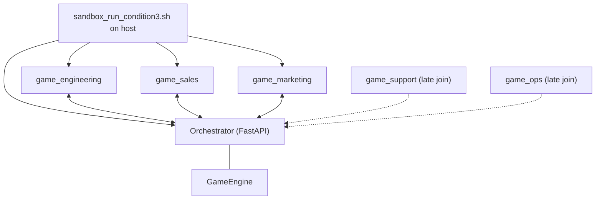
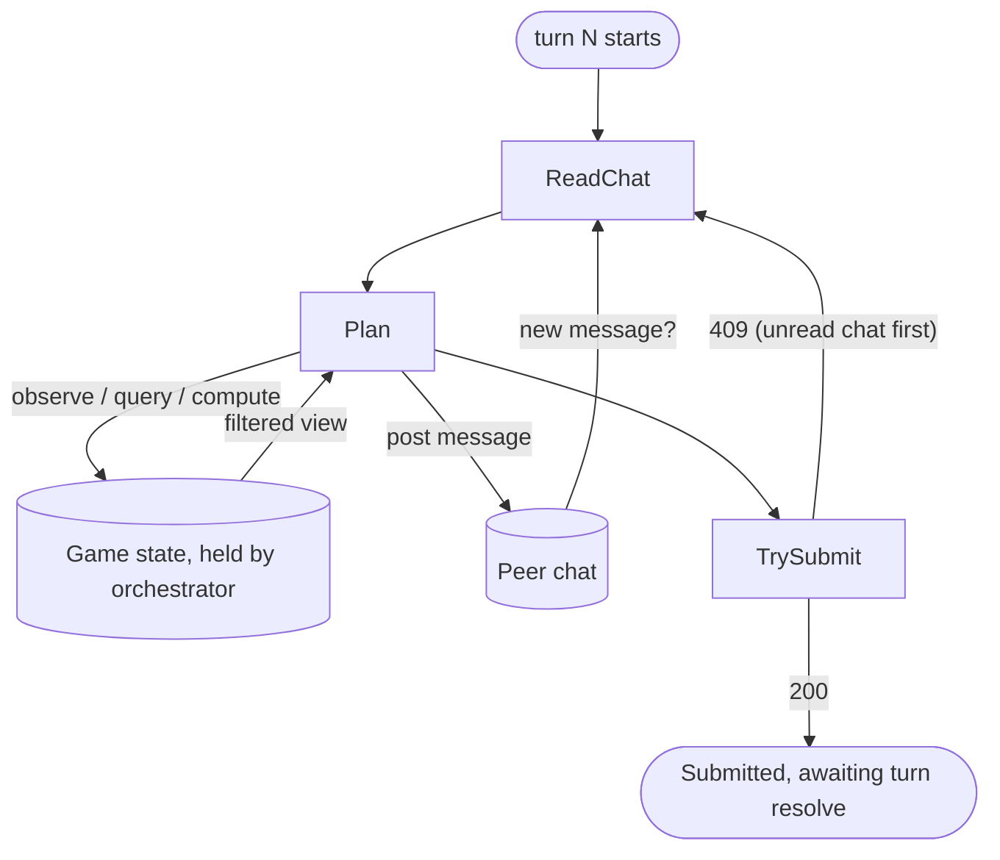

# AlignSim

A turn-based strategy game that benchmarks goal alignment. Players (AI or human) run a SaaS startup over 48 turns, allocating capacity across five functions: engineering, sales, customer success, marketing, and operations. The core research question: given the same game, goals, and starting conditions, does the coordination substrate affect goal attainment?

For the full design rationale, see [ALIGNSIM_IDEA.md](ALIGNSIM_IDEA.md). For the benchmark protocol, see [BENCHMARK.md](BENCHMARK.md).

## Scenarios

| Scenario | Description | Customers | Turns | MRR Target |
|----------|-------------|-----------|-------|------------|
| `seed_stage` | Blank-slate startup. Zero MRR, zero customers, 48-turn runway. Four market segments (startup / growth / mid_market / enterprise) with enterprise customers visible from turn 1 as a tech-tree anchor. | 48 | 48 | $40,000 |

`seed_stage` is the primary benchmark scenario. `playtest` is kept for fast smoke-testing and iteration.

## Quick Start

All commands run from the `experiments/` directory.

### Play as a Human (Web UI)

```bash
uv run python -m alignsim play
```

Opens at http://localhost:8420. No API key needed. Use `--port N` to change the port.

### Run with an LLM (Condition 1: Single Agent)

A single LLM receives all observations and submits all actions each turn.

```bash
uv run python -m alignsim run --seed 42 --max-turns 12
```

Requires `ANTHROPIC_API_KEY` in your environment or `.env` file.

| Flag | Default | Description |
|------|---------|-------------|
| `--seed` | 42 | RNG seed (deterministic: same seed + same actions = identical results) |
| `--max-turns` | 48 | Turns to play (12 is good for fast iteration) |
| `--model` | claude-sonnet-4-6 | Override the LLM model |
| `--scenario` | `playtest` | Scenario to use (`playtest` or `seed_stage`) |

### Run with Claude Code (Condition 2: Agentic)

Claude Code plays the game autonomously using the game CLI as tools. Requires the Lima sandbox to be set up first.

**One-time sandbox setup** (from the repo root):

```bash
cd ../app
make sandbox          # provision the Lima VM (~5 min first time)
cd ../experiments
```

**First-time only** — make the run script executable:

```bash
chmod +x alignsim/scripts/sandbox_run_condition2.sh
```

**Run a game**:

```bash
uv run python -m alignsim run-sandbox --seed 42 --max-turns 48 --scenario seed_stage
```

Or call the script directly:

```bash
alignsim/scripts/sandbox_run_condition2.sh --seed 42 --max-turns 48 --scenario seed_stage --model claude-opus-4-6
```

**Parallel runs**: Each run gets its own isolated game directory in the sandbox (`~/game/<run_id>/`), so you can launch multiple runs simultaneously without interference:

```bash
alignsim/scripts/sandbox_run_condition2.sh --seed 42 --scenario seed_stage --model claude-opus-4-6 &
alignsim/scripts/sandbox_run_condition2.sh --seed 99 --scenario seed_stage --model claude-opus-4-6 &
```

Runs on the same branch share a code worktree at `~/worktrees/<branch>`; mutable game state, agent memory, and transcripts are fully isolated per run. Parallel runs should be launched from the same commit — pushing between launches will overwrite the worktree underneath any in-flight run.

| Flag | Default | Description |
|------|---------|-------------|
| `--seed` | 42 | RNG seed |
| `--max-turns` | 48 | Maximum turns |
| `--scenario` | `playtest` | Scenario to use (`playtest` or `seed_stage`) |
| `--model` | (default) | Claude model slug, or `gemma-4` for local Gemma via Pi |
| `--harness` | auto-detect | Agent harness: `claude-code` or `pi` (see compatibility table) |
| `--interactive` | false | Drop into sandbox shell instead of autonomous run |
| `--skip-db` | false | Skip DB persistence after the run (useful for quick tests) |
| `--thinking` | auto | Pi thinking level (`off`/`minimal`/`low`/`medium`/`high`/`xhigh`). Pi-only — ignored by claude-code. Auto-defaults to `off` for `*opus-4-8*` models to work around a Pi 0.78.1 bug (Pi sends the legacy `thinking.type.enabled` field that opus-4-8 rejects); explicit value always wins. |

#### Model / Harness Combinations

By default, the harness is auto-detected from `--model` (Claude models use Claude Code, `gemma-4` uses Pi). Use `--harness` to override this and decouple model from harness — this is needed for variance attribution in the scoring/formal-modeling work.

| Model | Harness | Default? | API Key | Notes |
|-------|---------|----------|---------|-------|
| `claude-opus-4-6` | `claude-code` | Yes | Required | Primary benchmark config |
| `claude-opus-4-6` | `pi` | No | Required | Controls for harness effects |
| `claude-sonnet-4-6` | `claude-code` | Yes | Required | |
| `claude-sonnet-4-6` | `pi` | No | Required | Controls for harness effects |
| `gemma-4` | `pi` | Yes | No | Local open model via llama-server |
| `gemma-4` | `claude-code` | — | — | Not supported (Claude Code only uses Anthropic models) |

```bash
# Pi harness with Claude model — Condition 2 (controls for harness effects)
alignsim/scripts/sandbox_run_condition2.sh --model claude-opus-4-6 --harness pi --seed 42 --scenario seed_stage

# Pi harness with Claude model — Condition 3 (multi-agent, uses claude-hooks-bridge)
alignsim/scripts/sandbox_run_condition3.sh --model claude-opus-4-6 --harness pi --seed 42 --scenario seed_stage

# Default (auto-detect): same as --harness claude-code
alignsim/scripts/sandbox_run_condition2.sh --model claude-opus-4-6 --seed 42 --scenario seed_stage
```

#### Local model (Gemma 4 via Pi)

Passing `--model gemma-4` switches the agent harness from Claude Code to [Pi](https://github.com/badlogic/pi-mono) backed by a local Gemma 4 model served via `llama-server`. This costs nothing (no API key needed) and lets you benchmark a local open model against Claude on the same task.

**Setup:**

1. Download the GGUF from Hugging Face: [gemma-4-26b-a4b-it-Q8_0.gguf](https://huggingface.co/google/gemma-4-26b-a4b-it-GGUF)
2. Start the model server on the host:
   ```bash
   llama-server -m ~/models/gemma-4-26b-a4b-it/gemma-4-26B-A4B-it-Q8_0.gguf --port 8080
   ```
3. Run the game:
   ```bash
   alignsim/scripts/sandbox_run_condition2.sh --model gemma-4 --seed 42 --max-turns 48 --scenario seed_stage --skip-db
   ```

The sandbox VM reaches the host model server via `host.lima.internal:8080`. Pi and its permissions extension are installed automatically inside the sandbox on first run.

Results from an **autonomous** run are saved to `alignsim/results/<run_id>/` — `final_status.json`, `game_log.jsonl`, `turn_record.jsonl`, and `transcript.jsonl` — and the run is persisted to PostgreSQL at the end (unless `--skip-db`). To persist an autonomous run manually:

```bash
uv run python -m alignsim persist-results --results-dir alignsim/results/<run_id>
```

#### Interactive / human-guided runs (Condition 2.5)

`--interactive` drops you into the sandbox shell instead of running autonomously, so you can watch the agent or **guide its decisions**. You land directly in the run dir with the game already initialized — just run `claude` (or `pi`) to start; no `cd` needed.

Interactive runs are a distinct point on the **player-type** dimension (`human` = fully human · `human_guided` = human-in-the-loop · `llm_agent` = autonomous). Two things differ from autonomous runs:

- **They don't auto-persist.** No end-of-run wrap-up runs, so nothing is scored, collected, or written to the DB — the game state stays in the sandbox at `~/game/<run_id>/state`. (There's also no transcript, so no token usage.)
- **They must be tagged**, so a human-in-the-loop run is never pooled with the autonomous grid.

Recover and persist one with:

```bash
# human-in-the-loop (you influenced decisions) — the default
uv run python -m alignsim persist-interactive <run_id>

# agent played, you only watched
uv run python -m alignsim persist-interactive <run_id> --player-type llm_agent
```

This pulls the state out of the sandbox, **scores it on the host** (so the composite uses the current scoring code, not the sandbox's possibly-older checkout), assembles the results dir, and persists it with `player_type` set and `config.run_mode = interactive`. `<run_id>` is the `~/game/<run_id>` directory name (same as `results/<run_id>`), e.g. `seed_stage_c2_seed220_turns48_claude-sonnet-4-6_20260720_114822_66205`.

### Run with Claude Code (Condition 3: Multi-Agent)

Each business function (engineering, sales, marketing, support, ops) is controlled by a separate Claude Code agent. Agents communicate through a shared chat room and see only their function's slice of the game state — information asymmetry is enforced server-side. An orchestrator server synchronizes turns: all agents must submit before the turn resolves.

#### Architecture



All processes run inside a single Lima VM under `~/game/<run_id>/`. The host script launches the orchestrator and the three starting agents as `setsid` daemons via `limactl shell`, then polls `/orchestrator/game-over` until the game ends. Each agent talks to the orchestrator over HTTP at `/agents/<function>/*`. The orchestrator owns the only `GameEngine` instance; agents only see what their permissions allow.

Engineering, sales, and marketing start at game-launch. Support and ops onboard mid-game once their capacity pool is hired up from zero.

#### Agent loop within a turn

Each agent runs this loop independently and concurrently. The orchestrator only advances to turn N+1 once **every registered agent** has reached `Submitted`.



Agents are free to interleave `observe`, `query/*`, `compute/*`, and `chat` calls from the `Plan` state in any order. The only required gating is that any chat message addressed to the agent must be read (`GET chat`) before a `submit` will succeed — otherwise the orchestrator returns `409 Conflict` and the agent has to loop back through `ReadChat`. Once the orchestrator has all submissions in hand it resolves the turn (engineering → sales → CS → marketing → discovery → ops → hiring → ...) and publishes new filtered observations.

Per-function action permissions (enforced server-side by `validate_function_actions`):

| Function | Core actions | Visible obs sections | Shared (all agents) |
|---|---|---|---|
| Engineering | `build`, `fix_bugs`, `infrastructure` | `global`, `product_eng` | `hire`, `sustain_hire`, `fire` (their own pool only) |
| Sales | `sell`, `discover`, `market_support` | `global`, `sales` | ↑ |
| Marketing | `market` | `global`, `marketing_history` | ↑ |
| Support | `support` | `global`, `cs` | ↑ |
| Ops | `ops_project` | `global`, `ops` | ↑ |

Out-of-pool actions are reported back in the submit response under `function_rejections` with a `reason`; out-of-bounds queries return `403 Forbidden`.

#### Running it

**First-time only** — make the run script executable:

```bash
chmod +x alignsim/scripts/sandbox_run_condition3.sh
```

**Run a game**:

```bash
alignsim/scripts/sandbox_run_condition3.sh --seed 42 --max-turns 48 --scenario seed_stage --model claude-opus-4-6
```

**Parallel runs**: Like condition 2, each run gets its own isolated directory (`~/game/<run_id>/`) and a unique orchestrator port, so multiple C3 runs (or mixed C2/C3 runs) can run simultaneously:

```bash
alignsim/scripts/sandbox_run_condition3.sh --seed 42 --scenario seed_stage --model claude-opus-4-6 &
alignsim/scripts/sandbox_run_condition3.sh --seed 99 --scenario seed_stage --model claude-opus-4-6 &
```

**Starting agents**: Engineering, sales, and marketing launch at game start. Support and ops agents are automatically onboarded when their capacity pool grows above 0 (via hiring).

Multi-agent runs (C3/C4) are autonomous-only — there is no interactive mode (a human hand-driving the turn barrier across 3–5 agents was never supported). For human-in-the-loop runs, use Condition 2 (`--interactive`).

| Flag | Default | Description |
|------|---------|-------------|
| `--seed` | 42 | RNG seed |
| `--max-turns` | 48 | Maximum turns |
| `--scenario` | `seed_stage` | Scenario to use |
| `--model` | (default) | Claude model slug |
| `--harness` | auto-detect | Agent harness: `claude-code` or `pi` |
| `--skip-db` | false | Skip DB persistence after the run |
| `--thinking` | auto | Pi thinking level (`off`/`minimal`/`low`/`medium`/`high`/`xhigh`). Pi-only. See the Condition 2 flags table for the opus-4-8 auto-default note. |

Results are saved to `alignsim/results/<run_id>/` with per-agent subdirectories (transcripts, notes) plus orchestrator-level files (`turn_record.jsonl`, `chat_log.jsonl`, `orchestrator.log`).

### Benchmark (Batch Runs)

Run multiple games with incrementing seeds. The script delegates to the appropriate condition script for each run.

```bash
# Run 5 condition 2 games with Opus, seeds 100-104
alignsim/scripts/benchmark.sh --condition c2 --runs 5 --model claude-opus-4-6 --scenario seed_stage

# Run 3 condition 3 games with Sonnet, seeds 200-202
alignsim/scripts/benchmark.sh --condition c3 --runs 3 --model claude-sonnet-4-6 --scenario seed_stage --seed-start 200

# Run in parallel (staggered 30s apart)
alignsim/scripts/benchmark.sh --condition c2 --runs 5 --model claude-opus-4-6 --scenario seed_stage --parallel

# Preview what would run without executing
alignsim/scripts/benchmark.sh --condition c2 --runs 5 --model claude-opus-4-6 --dry-run
```

Per-run logs are saved to `alignsim/results/benchmarks/bench_<session>/`. A summary table is printed at the end showing pass/fail, duration, and run ID for each seed.

| Flag | Required | Default | Description |
|------|----------|---------|-------------|
| `--condition` | Yes | — | `c2` or `c3` |
| `--runs` | Yes | — | Number of runs to execute |
| `--seed-start` | No | 100 | First seed; run *i* uses `seed_start + i` |
| `--parallel` | No | false | Launch all runs concurrently with staggered starts |
| `--model` | No | — | Passed through to the condition script |
| `--harness` | No | — | Passed through (`claude-code` or `pi`) |
| `--scenario` | No | — | Passed through (`seed_stage` or `playtest`) |
| `--max-turns` | No | — | Passed through |
| `--skip-db` | No | false | Passed through |
| `--thinking` | No | auto | Passed through. Pi thinking level (`off`/`minimal`/`low`/`medium`/`high`/`xhigh`); Pi-only. See the Condition 2 flags table for the opus-4-8 auto-default note. |
| `--dry-run` | No | false | Print commands without executing |

Compose the full benchmark matrix by running the script multiple times with different conditions, models, or harnesses.

### Visualize Runs

Plot metric progression for runs stored in PostgreSQL. Outputs a multi-page PDF:
- **Page 1 — Time series** (MRR, runway, cash, tech debt, customers, capacity). Individual lines for ≤8 runs; mean ± std bands per group when >8.
- **Page 2 — Scatter** (MRR vs Churn score, Composite vs Pareto) with Pareto frontiers. Shown when ≥2 scored runs.
- **Page 3 — Distributions** (box plots of composite/sub-scores, function scores bar with error bars). Shown when any group has ≥2 runs.

Runs are grouped and colored by condition + model (e.g. "C2 Opus 4.6").

```bash
# All runs from a specific commit + condition
uv run python alignsim/scripts/plot_runs.py --commit 3e46d9 --condition c2

# Filter by commit, seed range, and model
uv run python alignsim/scripts/plot_runs.py --commit 3e46d9 --seeds 100,104 --model opus

# Specific runs by UUID
uv run python alignsim/scripts/plot_runs.py --run-ids abc123 def456

# Last 20 condition 3 runs
uv run python alignsim/scripts/plot_runs.py -n 20 --condition c3
```

| Flag | Default | Description |
|------|---------|-------------|
| `--commit` | — | Engine commit prefix to match (recommended — don't compare across commits) |
| `--condition` | — | Filter by condition (`c2` or `c3`) |
| `--model` | — | Filter by model name (substring match) |
| `--seeds` | — | Seed range inclusive (e.g. `100,105`) |
| `--run-ids` | — | Specific run UUIDs (overrides other filters) |
| `-n`, `--num-runs` | 10 / 200 | Max runs (default 10 without filters, 200 with) |
| `-o`, `--output` | `run_comparison.pdf` | Output PDF path |

Requires PostgreSQL with persisted runs (see **Run Persistence** below). Install script deps: `uv sync --group scripts`.

### Run Tests

```bash
uv run pytest
```

Runs the full test suite (207 tests, ~2 seconds). No API key or database required — all tests are fast and offline. Use `uv run pytest -q` for a compact summary or `uv run pytest -k test_name` to run a specific test.

### Engine Smoke Test (No LLM)

```bash
uv run python -m alignsim test-engine --seed 42 --max-turns 48 --verbose
```

Runs with random valid actions. Verifies no crashes and confirms determinism. Zero cost.

## Requirements

- Python 3.12+
- Dependencies managed via `uv` (run `uv sync` from the repo root `experiments/` directory)
- **Condition 1 / web UI**: `ANTHROPIC_API_KEY` in environment or `.env`
- **Condition 2 (sandbox, Claude)**: Lima VM provisioned via `make sandbox` in `../app/`. Requires `ANTHROPIC_API_KEY` in `../app/.env.sandbox`.
- **Condition 2 (sandbox, Gemma)**: Lima VM + `llama-server` running on host port 8080. No API key needed.
- **Condition 3 (multi-agent)**: Same sandbox requirements as Condition 2. Claude-only (no Gemma support).
- **Subscription auth (C2/C3, claude-code harness)**: To bill a claude.ai subscription instead of the Anthropic API, pass `--auth subscription`. Generate a long-lived token once on the host with `claude setup-token` and add `CLAUDE_CODE_OAUTH_TOKEN=...` to `../app/.env.sandbox`. The launcher strips `ANTHROPIC_API_KEY` from the VM's env so the OAuth token isn't outranked (Claude Code ranks the API key above the OAuth token). API key remains the default (`--auth api-key`); Pi runs always use the API key.
- **Run persistence** (optional): PostgreSQL running locally. If Postgres isn't available, everything still works — runs just aren't saved to the database

## Game Goals

Goals vary by scenario (see `./game status` for the current targets). The active benchmark scenario (`seed_stage`) targets:

- **MRR**: $40,000/month
- **Churn rate**: below 2% per turn
- **Runway**: above 60 turns remaining

Scoring sums three uncapped per-goal scores (1.0 = par): MRR is the ratio to target; churn is bounded retention (`1 - avg_churn_rate`); runway is `log2(1 + runway / min_runway)` capped at 4× the threshold. A Pareto score (min of the three) penalises neglecting any one goal. See [GAME_MECHANICS.md](GAME_MECHANICS.md) for all mechanics and formulas.

## Run Persistence

Every game run (human or LLM) is persisted to PostgreSQL for post-hoc comparison. The database is auto-created on first use.

**Tables** (all prefixed `alignsim_`):

| Table | What it stores |
|-------|---------------|
| `runs` | One row per game: seed, condition, model, final scores, alignment scores |
| `turn_snapshots` | Per-turn metrics: MRR, runway, budget, debt, bug/churn counts |
| `turn_actions` | Every action submitted (valid and rejected), with type and capacity |
| `turn_events` | Narrative events: deals won/lost, churn, feature ships, bugs |
| `llm_traces` | Full system + user prompts, structured response, latency (LLM runs only) |
| `customer_snapshots` | Per-customer state each turn: stage, health, engagement, deal value |

**Manual migration for existing DBs**: the game-tune-v5 change adds an `alignment_scores` JSONB column to `alignsim_runs`. Existing databases need:

```sql
ALTER TABLE alignsim_runs ADD COLUMN alignment_scores JSONB NULL;
```

Fresh databases get the column automatically.

Example cross-run queries:

```sql
-- Compare runs
SELECT seed, model, condition, score_composite, final_mrr
FROM alignsim_runs ORDER BY score_composite DESC;

-- MRR trajectory across runs
SELECT r.seed, r.condition, ts.turn, ts.mrr
FROM alignsim_turn_snapshots ts
JOIN alignsim_runs r ON r.id = ts.run_id
ORDER BY r.seed, ts.turn;

-- Action distribution per run
SELECT r.seed, ta.action_type, COUNT(*) as count, SUM(ta.capacity) as total_cap
FROM alignsim_turn_actions ta
JOIN alignsim_runs r ON r.id = ta.run_id
WHERE ta.was_valid = true
GROUP BY r.seed, ta.action_type ORDER BY r.seed, total_cap DESC;
```

DB config defaults to `postgres@localhost:5432/alignsim`. Override via environment variables or `.env`:

```
POSTGRES_USER=postgres
LOCAL_POSTGRES_PASSWORD=
LOCAL_POSTGRES_HOST=localhost
LOCAL_POSTGRES_PORT=5432
LOCAL_POSTGRES_DB=alignsim
```

## Code Map

```
experiments/alignsim/
├── __main__.py                 # Entry point
├── ALIGNSIM_IDEA.md            # Design rationale
├── BENCHMARK.md                # Benchmark protocol
├── GAME_MECHANICS.md            # All mechanics, formulas, diagrams
├── src/
│   ├── main.py                 # CLI: test-engine, run, play
│   ├── settings.py             # Pydantic Settings (API keys, DB config, game params)
│   ├── models/
│   │   ├── entities.py         # Customer, Feature, Bug, Competitor, ProcessProject (Pydantic)
│   │   ├── game_state.py       # GameState, TurnRecord, ResourcePool, PendingHire, ActiveProcessBonus
│   │   ├── actions.py          # 11 action types (discriminated union)
│   │   ├── observations.py     # Role-specific views (Sales, Product, CS, Ops, Global)
│   │   ├── goals.py            # PrimaryGoal, GoalAttainmentScore (composite + pareto)
│   │   └── scenario.py         # ScenarioDefinition, CalibrationParams
│   ├── engine/
│   │   ├── game.py             # GameEngine — turn orchestrator, public API
│   │   ├── resolver.py         # TurnResolver — 11-step resolution pipeline
│   │   ├── validator.py        # ActionValidator — legality checks, per-pool tracking
│   │   ├── observer.py         # ObservationGenerator — state → role views
│   │   ├── customer_logic.py   # Pipeline, rubric satisfaction, health, churn, sales momentum
│   │   ├── product_logic.py    # Build progress, tech debt, bug injection
│   │   ├── market_logic.py     # Marketing awareness (per-feature stock/channels/decay), reveal-state, radar, Sales-gated pipeline progression, discovery, competitive events
│   │   ├── ops_logic.py        # Ops bonus computation, degradation, maintenance cost
│   │   └── scoring.py          # Goal attainment, per-function scores, pareto score
│   ├── scenarios/
│   │   ├── playtest.py         # Hand-designed 30-customer scenario
│   │   └── seed_stage.py       # Blank-slate seed startup: 48 customers, 16 features, 4 segments
│   ├── harness/
│   │   ├── base.py             # PlayerHarness protocol
│   │   ├── condition1.py       # SingleLLMHarness (one model plays all roles)
│   │   ├── condition3_orchestrator.py  # FastAPI server: turn sync, chat, info asymmetry
│   │   └── condition3_filters.py       # Per-function observation/event/action filtering
│   ├── persistence/
│   │   ├── models.py           # Tortoise ORM models (6 tables)
│   │   ├── database.py         # DB init/close, graceful degradation
│   │   └── run_logger.py       # RunLogger — writes structured data per turn
│   ├── web/
│   │   ├── app.py              # FastAPI routes
│   │   ├── game_session.py     # GameSession wrapper for web play
│   │   └── templates/          # Jinja2 templates (turn, rules, results, etc.)
│   ├── analysis/
│   │   └── metrics.py          # Post-game metric computation
│   └── prompts/                # Jinja2 prompt templates for LLM harness
├── player_condition2/          # Condition 2 single-agent workspace template
├── player_condition3/          # Condition 3 multi-agent workspace template
│   ├── CLAUDE.md               # Per-function instructions (sed-templated)
│   ├── game                    # HTTP CLI wrapper (talks to orchestrator)
│   ├── hooks/                  # Pre-tool-use hooks (bash allowlist, file access, curl scoping)
│   └── .claude/settings.json   # Hook wiring
├── scripts/
│   ├── benchmark.sh            # Batch runner: iterate seeds for a condition/model combo
│   ├── sandbox_run_condition2.sh  # Condition 2 sandbox orchestration (Lima VM)
│   ├── sandbox_run_condition3.sh  # Condition 3 multi-agent orchestration
│   └── plot_runs.py            # Multi-page PDF: time series, scatter/Pareto, distributions
└── output/                     # JSON results from LLM runs (gitignored)
```

## Key Concepts

**Turn resolution order** matters — engineering ships features *before* sales checks satisfaction. Building F05 and selling to C08 in the same turn works because build resolves first. Full order: Engineering → Sales → CS → Marketing → Discovery → Ops Projects → Hiring & Firing → Competitive → Bugs → Financial → Metrics.

**Rubric satisfaction** determines whether deals close. Four weighted components: feature coverage (breadth + depth), price sensitivity, product maturity (global across all shipped features), and support (health-based). Deals require satisfaction >= 75%.

**The debt spiral**: Build at MVP → debt rises → bugs increase → health drops → churn → must fix bugs instead of building → fall behind → can't close deals → MRR stalls.

**Emergent customer needs**: Active customers develop new feature needs over time. They are hidden until CS runs a `health_check` (the CS discovery gate) — until then, decline shows only as `undiagnosed_decline`. Unmet needs bleed health after a grace window and eventually become churn drivers; meeting one requires Engineering to build the feature (pausing the bleed while building). This routes a retention signal held by CS into the shared build queue, the cross-functional fight the benchmark is built to surface. The three CS verbs are distinct: `health_check` (discover needs + churn drivers), `onboard` (accelerate onboarding), `churn_intervention` (costly stochastic save below a health threshold); all also give baseline health attention on a diminishing-returns curve.

**Determinism**: Same seed + same actions = byte-identical results. The engine uses a dedicated `random.Random(seed)` instance, never the global RNG.

See [GAME_MECHANICS.md](GAME_MECHANICS.md) for the complete reference with all formulas and interaction diagrams.
