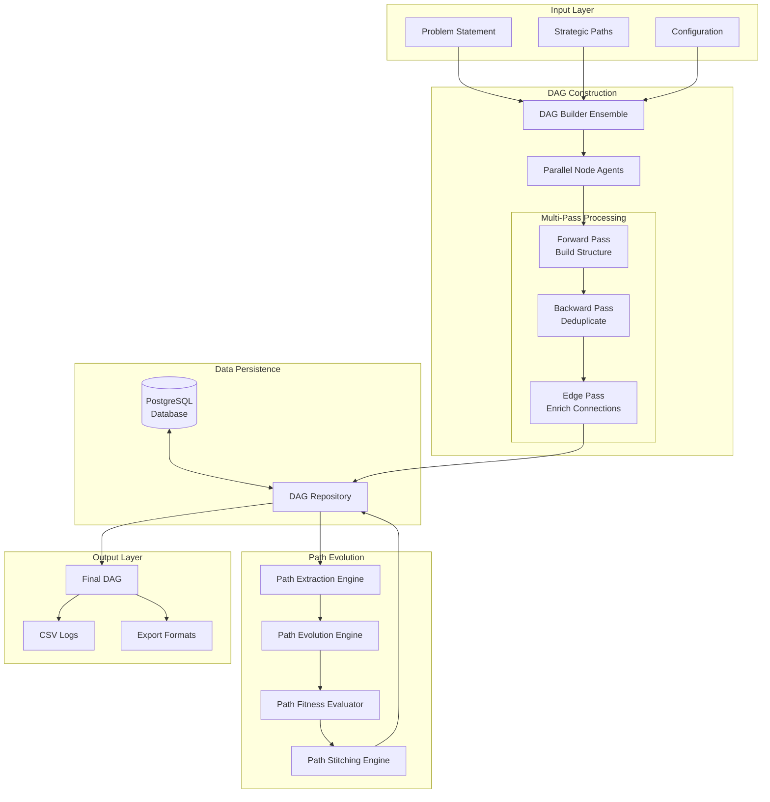
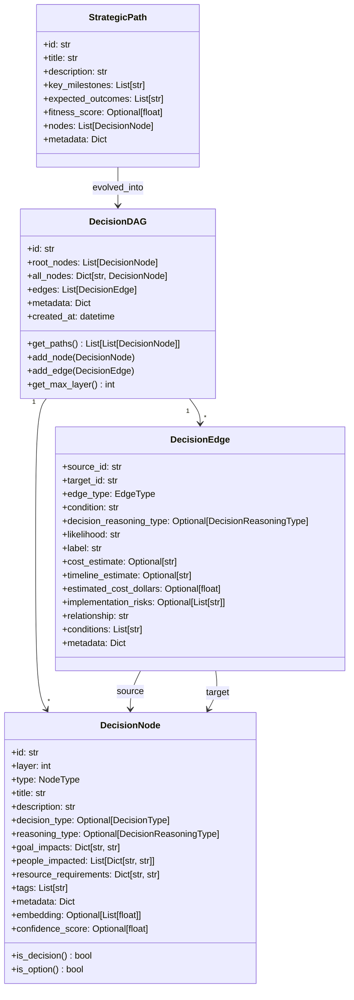
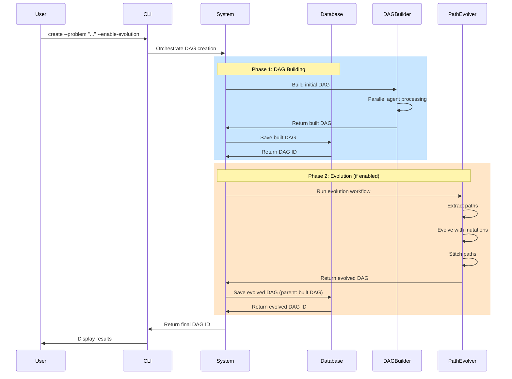
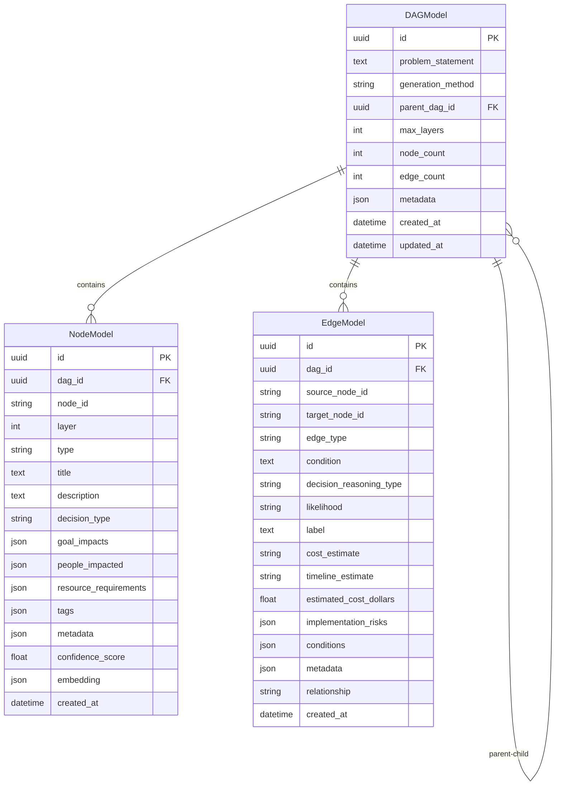
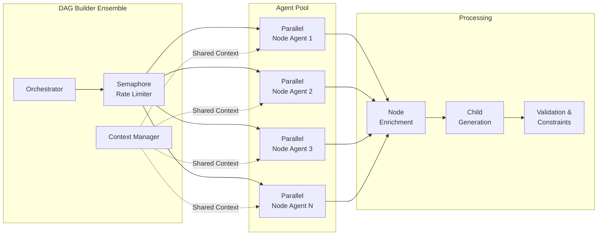
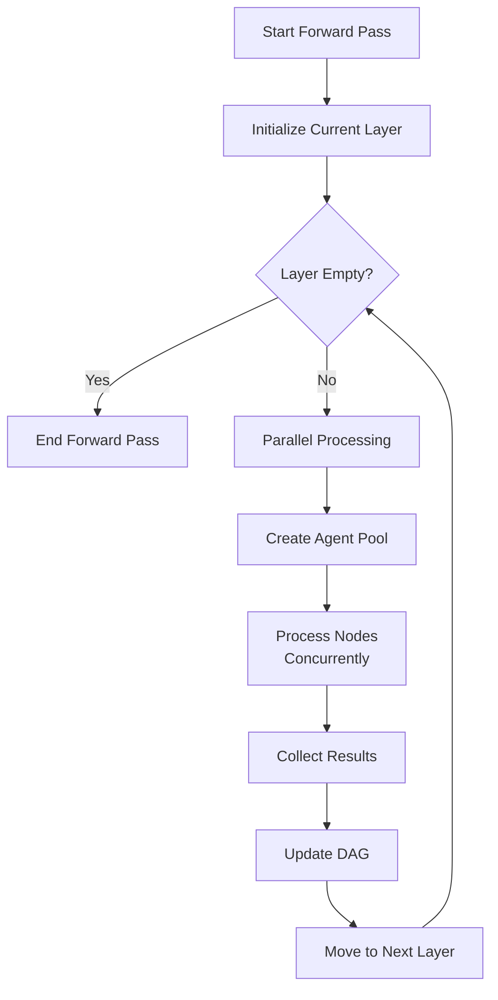
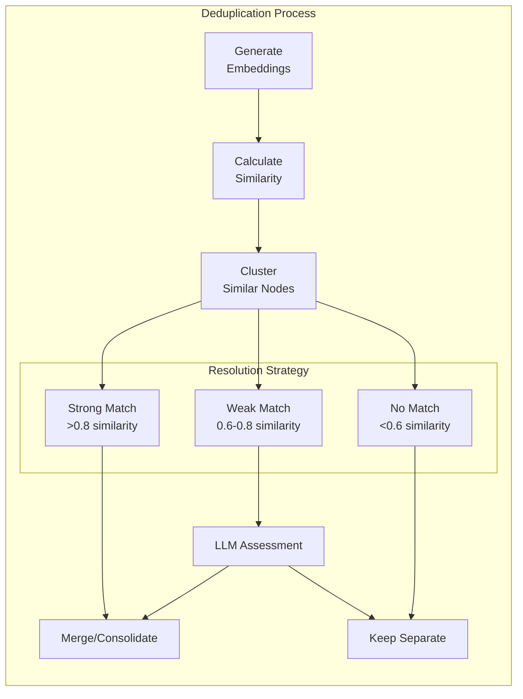
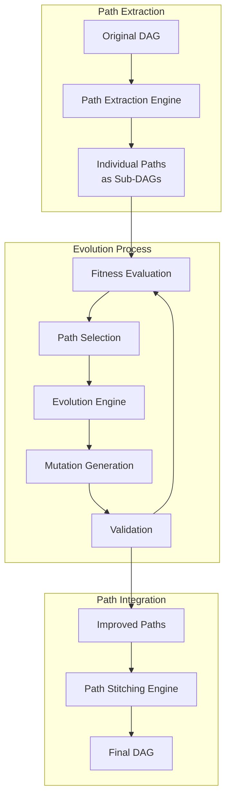
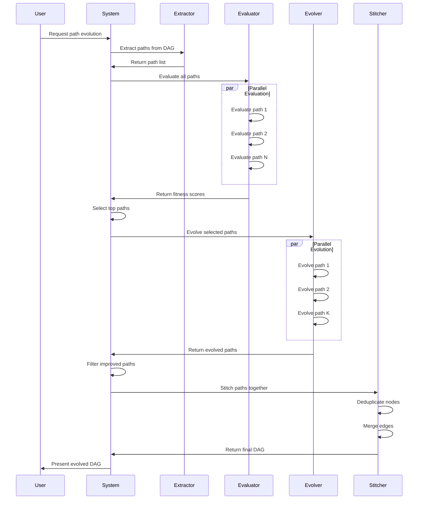

# Decision DAGs - Technical Documentation

> For quick start and usage, see [README.md](./README.md). For project journey and learnings, see [LEARNINGS.md](./LEARNINGS.md).

## System Overview

Decision DAGs is a strategic planning system that transforms problem statements into explorable decision trees. It uses LLMs to generate decision nodes, evaluates strategic paths, and optimizes them using genetic algorithms. The system features persistent storage, parallel processing, and interactive visualization.

**Key Capabilities:**
- 🌳 Builds decision trees with alternating decision/option nodes
- 🧬 Evolves paths using genetic algorithms with warm-up learning
- 💾 Persists all data in PostgreSQL with parent-child relationships
- 🚀 Processes nodes in parallel for performance
- 📊 Provides interactive web visualization with three viewing modes
- 🔄 Supports full pipeline: Build → Extract → Evolve → Stitch

## Table of Contents

### System Overview & Architecture
- [System Overview](#system-overview) - Key capabilities and core concepts
- [System Architecture](#system-architecture) - Design principles and data flow
- [Core Data Models](#core-data-models) - Data structures and validation

### Database & Persistence
- [Database Persistence Layer](#database-persistence-layer) - PostgreSQL configuration and setup
- [Tortoise ORM Models](#tortoise-orm-models) - Database schema and models
- [DAG Repository API](#dag-repository-api) - Data access layer

### Core Functionality
- [DAG Building with Parallel Agents](#dag-building-with-parallel-agents) - Concurrent DAG construction
- [Path Evolution](#path-evolution) - Genetic algorithm optimization and warm-up learning
- [Path Extraction](#path-extraction) - Strategic path identification
- [Path Stitching](#path-stitching) - Merging evolved paths back into DAGs

### User Interfaces
- [Command-Line Interface (CLI)](#command-line-interface-cli) - All available commands and workflows
- [Web Visualization Interface](#web-visualization-interface) - Interactive DAG exploration
- [Human-in-the-Loop (HITL)](#human-in-the-loop-hitl) - Interactive decision refinement

### Implementation & Production
- [Production Implementation Considerations](#production-implementation-considerations) - Deployment and performance
- [Performance Optimizations](#performance-optimizations) - Caching and monitoring
- [Security Considerations](#security-considerations) - Input validation and privacy

### Core Concepts

**Decision DAG**: A hierarchical graph structure representing strategic decisions and their potential options/outcomes. The DAG alternates between decision nodes (what needs to be decided) and option nodes (possible choices).

**Strategic Paths**: Individual routes through the DAG from root to leaf, representing complete strategic narratives that can be independently evaluated and evolved.

**Parallel Agent Architecture**: A concurrent processing system where multiple AI agents work simultaneously to build different parts of the DAG, improving performance and context management.

### System Architecture


```
experiments/decision_dags/
├── README.md                           # Quick start guide and CLI reference
├── DOCUMENTATION.md                    # This comprehensive technical documentation
├── __main__.py                         # Entry point for CLI execution
├── src/
│   ├── __init__.py
│   ├── settings.py                     # Pydantic settings with environment config
│   ├── models.py                       # Comprehensive Pydantic models
│   ├── main.py                         # Main orchestration logic
│   ├── cli.py                          # Enhanced CLI with database commands
│   ├── schemas.py                      # Structured LLM output schemas including diff-based mutations
│   ├── utils/
│   │   ├── validation.py               # DAG validation utilities
│   │   └── csv_logger.py               # CSV logging infrastructure
│   ├── context/
│   │   └── database_context.py         # Organizational context from database
│   ├── persistence/                    # Database persistence layer
│   │   ├── __init__.py
│   │   ├── database.py                 # Database connection and initialization
│   │   ├── models.py                   # Tortoise ORM models
│   │   └── dag_repository.py           # DAG persistence operations
│   ├── prompts/                        # Comprehensive Jinja2 template library
│   │   ├── node_generation_system.txt.jinja
│   │   ├── node_generation_user.txt.jinja
│   │   ├── node_enrichment_system.txt.jinja      # Node impact analysis
│   │   ├── node_enrichment_user.txt.jinja        # Resource requirements
│   │   ├── fitness_evaluation_system.txt.jinja
│   │   ├── fitness_evaluation_user.txt.jinja
│   │   ├── edge_enrichment_system.txt.jinja
│   │   ├── edge_enrichment_user.txt.jinja
│   │   ├── dag_layer_validation_system.txt.jinja
│   │   ├── dag_layer_validation_user.txt.jinja
│   │   ├── dag_coherence_assessment_system.txt.jinja
│   │   ├── dag_coherence_assessment_user.txt.jinja
│   │   ├── dag_feasibility_assessment_system.txt.jinja
│   │   ├── dag_feasibility_assessment_user.txt.jinja
│   │   ├── dag_alignment_assessment_system.txt.jinja
│   │   ├── dag_alignment_assessment_user.txt.jinja
│   │   ├── mutation_proposal_system.txt.jinja      # AlphaEvolve mutation proposals
│   │   ├── mutation_proposal_user.txt.jinja
│   │   ├── mutation_execution_system.txt.jinja     # AlphaEvolve mutation execution
│   │   ├── mutation_execution_user.txt.jinja
│   │   ├── mutation_self_correction_system.txt.jinja # AlphaEvolve self-correction
│   │   └── mutation_self_correction_user.txt.jinja
│   ├── dag_builder/                    # DAG construction system
│   │   ├── context.py                  # Build state management
│   │   ├── parallel_agent.py           # Individual node processing
│   │   ├── node_enricher.py            # Node enrichment with people/resources
│   │   ├── deduplicator.py            # Node deduplication with embeddings
│   │   ├── edge_enricher.py           # LLM-assisted edge enrichment
│   │   ├── context_validator.py       # Context-aware comprehensive validation
│   │   └── ensemble.py                # Complete construction orchestration
│   ├── hitl/                           # Human-in-the-Loop integration
│   │   ├── interface.py                # User interaction and prompt display
│   │   ├── manager.py                  # Workflow coordination and session tracking
│   │   └── workflows.py               # Specific HITL workflows (layer approval, etc.)
│   ├── path_evolution/                 # Path optimization system
│   │   ├── extractor.py               # Path extraction with DFS
│   │   ├── evaluator.py               # Fitness evaluation with ensemble LLM
│   │   ├── evolver.py                 # AlphaEvolve genetic algorithm implementation
│   │   ├── mutation_engine.py         # JSONMutationEngine with diff-based mutations
│   │   └── stitcher.py                # Path merging and deduplication
│   ├── analysis/                       # DAG analysis and comparison
│   │   ├── __init__.py
│   │   └── dag_analyzer.py            # LLM-powered DAG comparison analysis
│   └── visualization/                 # Web-based visualization
│       ├── __init__.py
│       └── web_app.py                 # Panel-based interactive DAG viewer
├── output/                            # Generated CSV logs and metrics
└── exports/                           # Exported DAGs (JSON, CSV formats)
```

### Key Design Principles

1. **Alternating Decision-Option Pattern**: The DAG strictly alternates between decision layers (even indices: 0, 2, 4) and option layers (odd indices: 1, 3, 5). This ensures logical flow and prevents structural ambiguity.

2. **Parallel Processing with Rate Limiting**: All computationally intensive operations (node generation, fitness evaluation) are parallelized with configurable concurrency limits to balance performance and API constraints.

3. **Reusable Components**: Path evolution leverages the existing DAG evolution infrastructure by representing paths as sub-DAGs, maximizing code reuse and consistency.

4. **Multi-Stage Quality Control**: The system employs multiple passes (forward construction, backward deduplication, edge enrichment) to ensure high-quality, coherent results.

### Core Data Models

The system uses Pydantic models for data validation and structured representations:



#### Key Enumerations

```python
class NodeType(str, Enum):
    DECISION = "decision"  # Even layers (0, 2, 4...)
    OPTION = "option"      # Odd layers (1, 3, 5...)

class DecisionType(str, Enum):
    """Types of decisions (only for decision nodes)."""
    IMPLEMENTATION = "implementation"
    RESOURCE = "resource"
    TIMING = "timing"
    RISK = "risk"
    MARKET = "market"
    PRODUCT = "product"
    STRATEGIC = "strategic"

class EdgeType(str, Enum):
    """Edge types for the alternating pattern."""
    DECISION_TO_OPTION = "decision_to_option"
    OPTION_TO_DECISION = "option_to_decision"

class DecisionReasoningType(str, Enum):
    """Types of reasoning for option-to-decision edges."""
    REACTIVE = "reactive"      # Responding to external events
    PROACTIVE = "proactive"    # Planned internal decision
    LOGICAL = "logical"        # Based on data and analysis
    STRATEGIC = "strategic"    # Based on long-term goals
    INTUITIVE = "intuitive"    # Based on experience/gut feeling
    PRACTICAL = "practical"    # Based on feasibility/resources
```

#### Validation Rules

1. **Node Type Alternation**: Decision nodes must be on even layers, option nodes on odd layers
2. **Decision Type Requirement**: All decision nodes must have a `decision_type`
3. **Reasoning Type for Edges**: Option-to-decision edges must have a `decision_reasoning_type`
4. **Edge Type Consistency**: Edges must respect the alternating pattern

### Two-Phase Orchestration Process

The system now implements a two-phase orchestration approach:

**Phase 1: DAG Building**
- Construct the initial DAG from strategic paths
- Save the built DAG to database
- Return DAG ID for future operations

**Phase 2: Evolution Workflow** (Optional)
- Extract paths from the built DAG
- Save extracted paths as individual DAGs
- Evolve paths using genetic algorithms with diff-based mutations
- Save evolved paths with proper parent references to extracted paths
- Stitch evolved paths back together
- Save final evolved DAG with parent reference to built DAG



---

## Database Persistence Layer

The Decision DAG system uses PostgreSQL for persistent storage of DAGs, nodes, edges, and their relationships. This enables:

- **DAG History Tracking**: Parent-child relationships between original and evolved DAGs
- **Reusability**: Load existing DAGs for further evolution or analysis
- **Scalability**: Efficient storage and retrieval of large DAG structures
- **Querying**: Filter and search DAGs by various criteria

### Database Architecture



### Tortoise ORM Models

The persistence layer uses Tortoise ORM for async database operations:

```python
# persistence/models.py
class DAGModel(Model):
    """Model for storing Decision DAG metadata."""
    id = fields.UUIDField(pk=True, default=uuid4)
    problem_statement = fields.TextField()
    generation_method = fields.CharField(max_length=50)  # 'build', 'extracted', 'evolved'
    parent_dag = fields.ForeignKeyField('models.DAGModel', null=True, related_name='children')

    # Metrics
    max_layers = fields.IntField()
    node_count = fields.IntField()
    edge_count = fields.IntField()

    # Metadata and timestamps
    metadata = fields.JSONField(default=dict)
    created_at = fields.DatetimeField(auto_now_add=True)
    updated_at = fields.DatetimeField(auto_now=True)

    class Meta:
        table = "decision_dags"
        ordering = ["-created_at"]
```

### DAG Repository API

The `DAGRepository` class provides high-level operations for DAG persistence:

```python
# persistence/dag_repository.py
class DAGRepository:
    async def save_dag(
        self,
        dag: DecisionDAG,
        problem_statement: str,
        generation_method: str = "build",
        parent_dag_id: Optional[UUID] = None,
        metadata: Optional[Dict[str, Any]] = None
    ) -> UUID:
        """Save a Decision DAG to the database."""

    async def load_dag(self, dag_id: UUID) -> DecisionDAG:
        """Load a Decision DAG from the database."""

    async def list_dags(
        self,
        filter_by: Optional[str] = None,
        limit: int = 10,
        offset: int = 0,
        sort_by: str = "created_at",
        ascending: bool = False
    ) -> List[DAGModel]:
        """List DAGs with optional filtering."""

    async def update_dag_metadata(
        self,
        dag_id: UUID,
        generation_method: Optional[str] = None,
        metadata_update: Optional[Dict[str, Any]] = None
    ) -> None:
        """Update DAG metadata."""

    async def delete_dag(self, dag_id: UUID, cascade: bool = True) -> None:
        """Delete a DAG and optionally its children."""
```

### Database Configuration

Database settings are managed through Pydantic settings:

```python
# settings.py
class Settings(BaseSettings):
    # PostgreSQL connection settings
    local_postgres_host: str = "localhost"
    local_postgres_port: int = 5432
    local_postgres_user: str = os.getlogin()  # Current system user
    local_postgres_password: str = ""
    local_postgres_db: str = "decision_dags_experiment"
```

### JSON Serialization

The system handles datetime serialization for JSON fields:

```python
def serialize_for_json(obj: Any) -> Any:
    """Recursively serialize objects for JSON storage, handling datetime objects."""
    if isinstance(obj, datetime):
        return obj.isoformat()
    elif isinstance(obj, dict):
        return {key: serialize_for_json(value) for key, value in obj.items()}
    elif isinstance(obj, (list, tuple)):
        return [serialize_for_json(item) for item in obj]
    else:
        return obj
```

### Database Initialization

The database and tables are automatically created when needed:

```python
# persistence/database.py
async def ensure_database_exists():
    """Ensure the database exists, create it if not."""
    # Connect to postgres database to check/create our database
    conn = await asyncpg.connect(database='postgres', ...)

    exists = await conn.fetchval(
        "SELECT EXISTS(SELECT 1 FROM pg_database WHERE datname = $1)",
        settings.local_postgres_db
    )

    if not exists:
        await conn.execute(f'CREATE DATABASE "{settings.local_postgres_db}"')
```

---

## DAG Building with Parallel Agents

The DAG building process uses a parallel agent architecture to construct decision graphs efficiently while maintaining coherence and quality.

### Parallel Agent Architecture



### Core Components

#### DAGBuilderEnsemble

The main orchestrator responsible for coordinating the DAG construction process.

```python
class DAGBuilderEnsemble:
    def __init__(self, config: DAGBuilderConfig):
        self.config = config
        self.semaphore = asyncio.Semaphore(config.max_concurrent_agents)
        self.context_manager = ContextManager()
        self.deduplicator = NodeDeduplicator()

    async def build_dag(self, problem_statement: str, strategic_paths: List[StrategicPath]) -> DecisionDAG:
        # Initialize DAG with root nodes from strategic paths
        dag = self._initialize_dag(problem_statement, strategic_paths)

        # Multi-pass processing
        dag = await self._forward_pass(dag)
        dag = await self._backward_pass(dag)  # Deduplication
        dag = await self._edge_enrichment_pass(dag)

        return dag
```

#### Key Components

**ParallelNodeAgent**: Individual agent processing a single node
- Enriches current node with detailed information
- Generates child nodes based on node type
- Validates structural constraints
- Uses structured LLM output (ChildNodesSchema)

**NodeEnricher**: Analyzes nodes for impacts and requirements
- Identifies people/roles affected
- Determines resource requirements
- Uses templates: `node_enrichment_system.txt.jinja` and `node_enrichment_user.txt.jinja`
- Returns structured `NodeEnrichmentSchema`

See [`src/dag_builder/agents.py`](src/dag_builder/agents.py) and [`src/node_enricher.py`](src/node_enricher.py) for implementations.

### Forward Pass Algorithm



### Parallel Processing Implementation

The forward pass processes each layer in parallel:

1. **Layer-by-layer traversal**: Process nodes at current layer
2. **Concurrent agent execution**: Up to 10 agents run simultaneously
3. **Semaphore-based rate limiting**: Prevents API overload
4. **Error resilience**: Failed nodes get empty children, DAG continues
5. **Termination**: Stops at max_layers or when no more nodes

See [`src/dag_builder/builder.py`](src/dag_builder/builder.py) for the complete parallel processing implementation.

### Backward Pass: Deduplication

The backward pass identifies and consolidates similar nodes to maintain DAG coherence.



### Deduplication Implementation

**NodeDeduplicator** consolidates semantically similar nodes:

- **Embedding generation**: Creates semantic embeddings for all nodes
- **Similarity clustering**: Groups nodes by cosine similarity
- **Resolution strategy**:
  - Strong match (>0.8): Automatic merge
  - Weak match (0.6-0.8): LLM assessment
  - No match (<0.6): Keep separate

### Edge Enrichment Pass

The final pass enriches edges with implementation details:

- **Batch processing**: Process edges in groups of 10
- **Concurrent enrichment**: Parallel LLM calls for efficiency
- **Added information**:
  - Implementation conditions
  - Cost estimates ($)
  - Timeline estimates (days)
  - Implementation risks
  - Success factors

See [`src/dag_builder/deduplicator.py`](src/dag_builder/deduplicator.py) and [`src/edge_enricher.py`](src/edge_enricher.py) for implementations.


### Configuration and Tuning

The `DAGBuilderConfig` dataclass controls DAG construction behavior:

**Key Parameters**:
- `max_concurrent_agents`: 10 (parallel agent limit)
- `agent_timeout`: 30s (per-agent timeout)
- `max_layers`: 6 (DAG depth limit)
- `similarity_threshold`: 0.8 (deduplication threshold)
- `enable_self_correction`: True (retry on validation failures)

See [`src/dag_builder/config.py`](src/dag_builder/config.py) for all configuration options.

### Error Handling and Resilience

The system implements comprehensive error handling:
- **Retry Logic**: Exponential backoff for rate limits
- **Validation Errors**: Retry with conservative parameters
- **Fallback Generation**: Minimal valid children on complete failure
- **Structured Error Types**: RateLimitError, ValidationError, etc.

See [`src/dag_builder/builder.py`](src/dag_builder/builder.py) for resilient DAG building implementation.

---

## Path Evolution

Path evolution optimizes strategic paths using genetic algorithms inspired by [DeepMind's AlphaEvolve](https://deepmind.google/discover/blog/alphaevolve-a-gemini-powered-coding-agent-for-designing-advanced-algorithms/). The system extracts paths from DAGs, evolves them independently, then stitches improved versions back together.

### Path Evolution Architecture



### Path Extraction

Path extraction uses depth-first search to identify all root-to-leaf paths, converting each into an independent sub-DAG for evolution.

**Key Steps:**
1. DFS traversal to find all complete paths
2. Convert each path to a standalone DAG
3. Preserve original node and edge properties
4. Track source DAG relationship

See [`src/path_evolution/extractor.py`](src/path_evolution/extractor.py) for implementation.

### Path Fitness Evaluation

Fitness evaluation combines organizational goal alignment with quantitative metrics to score each path's strategic value.

**Components:**
- **Goal Alignment** (40%): How well the path addresses organizational objectives
- **Cost Efficiency** (20%): Resource requirements and budget impact
- **Timeline Efficiency** (20%): Speed of implementation
- **Risk Mitigation** (10%): Handling of identified risks
- **Complexity** (10%): Simplicity and manageability

**Evaluation Process:**
1. Fetch active organizational goals from database
2. Calculate quantitative metrics from path structure
3. Use ensemble LLM voting (3 perspectives) for qualitative assessment
4. Apply weighted scoring to combine all factors
5. Add uniqueness bonus to encourage diversity

### Ensemble LLM Evaluation

Three LLM perspectives evaluate each path to reduce bias:

1. **Conservative Analyst** (temp=0.5): Focuses on proven, incremental approaches
2. **Optimistic Analyst** (temp=0.8): Values innovation and bold moves
3. **Balanced Analyst** (temp=1.0): Weighs all factors equally

Results are aggregated with variance checking to ensure consistency. High variance (>0.3) triggers warnings for manual review.

### Quantitative Metrics Extraction

The system extracts metrics directly from DAG structure and edge data:

- **Total Cost**: Sum of `estimated_cost_dollars` from all edges
- **Timeline**: Critical path calculation considering parallelization
- **Risk Count**: Total number of `implementation_risks` across edges
- **Complexity Score**: Based on node count and branching factor (lower is better)
- **Resource Efficiency**: Calculated from resource requirements vs. expected outcomes
- **Structure Metrics**: Node count, average branching factor

### Path Uniqueness Evaluation

Uniqueness scoring encourages diversity in the evolution population by comparing structural signatures using Jaccard similarity. Paths with unique decision sequences receive a small fitness bonus (5%) to maintain variety.

### Structured LLM Response Schemas

The system uses Pydantic schemas for reliable LLM responses:

- **MutationDiffSchema**: Node-centric operations (add/modify/delete) for efficient mutations
- **ComprehensiveEvaluation**: Structured fitness scoring across multiple dimensions
- **DAGComparisonAnalysis**: Strategic analysis of DAG differences
- **NodeEnrichmentSchema**: People impacts and resource requirements
- **EvolutionVariant**: Tracks mutation success/failure with learning metadata
- **MutationProposalsSchema**: Multiple mutation proposals with confidence scores
- **NodeOperation**: Atomic node operation in a mutation diff
- **SimplifiedDecisionNode**: Schema for LLM-generated nodes

See [`src/schemas.py`](src/schemas.py) for complete schema definitions.

### Mutation Engine Implementation

The mutation engine leverages structured schemas and dynamic learning:

- Accepts `dynamic_learning_context` parameter with evolution history insights
- Uses structured `MutationProposalsSchema` for reliable LLM responses
- Filters proposals by confidence threshold (default: 0.3)
- Passes learning context to Jinja templates for dynamic few-shot learning

See [`src/path_evolution/mutation_engine.py`](src/path_evolution/mutation_engine.py) for implementation.

```python
async def propose_mutations(
    self,
    dag_json: Dict[str, Any],
    objectives: List[str],
    current_scores: Dict[str, float],
    generation: int,
    context: str,
    fitness_scorecard: Any = None,
    inspiration_context: Optional[str] = None,
    dynamic_learning_context: Optional[str] = None,
    num_proposals: int = 3,
) -> List[MutationProposal]:
    """
    Use LLM to propose strategic mutations based on path weaknesses.

    Args:
        dag_json: JSON representation of the path DAG
        objectives: List of strategic objectives
        current_scores: Current fitness scores by dimension
        generation: Current generation number
        context: Domain/problem context
        organization_id: Organization ID for context
        fitness_scorecard: Detailed fitness scorecard
        inspiration_context: Formatted inspiration from successful variants
        dynamic_learning_context: Dynamic few-shot examples from evolution history
        num_proposals: Number of proposals to generate

    Returns:
        List of mutation proposals with confidence scores
    """

    # Build user prompt with dynamic learning context
    user_prompt = build_prompt(
        "mutation_proposal_user.txt.jinja",
        dag_json=dag_json,
        current_scores=current_scores,
        fitness_scorecard=fitness_scorecard,
        context=context,
        inspiration_context=inspiration_context,
        dynamic_learning_context=dynamic_learning_context,  # Passed to template
        num_proposals=num_proposals,
    )

    # Get mutation proposals from LLM using structured schema
    response = await ainstruct_llm(
        system_prompt=system_prompt,
        user_prompt=user_prompt,
        llm_model=settings.llm_model,
        temperature=0.8,
        max_tokens=6000,
        response_model=MutationProposalsSchema,  # Structured response
    )

    # Extract proposals from structured response
    proposals = response.proposals

    # Filter by confidence threshold (lowered from 0.5 to 0.3 for better evolution)
    confident_proposals = [p for p in proposals if p.confidence >= 0.3]
```

The mutation proposal template now includes the dynamic learning context:

```jinja

### Learning from Evolution History
{{ dynamic_learning_context }}

```

#### Diff-Based Mutation Implementation

The diff-based approach significantly reduces token usage:

```python
async def apply_mutation_diff(self, original_dag_json: Dict[str, Any], mutation_diff: MutationDiffSchema) -> Dict[str, Any]:
    """Apply a mutation diff to a DAG JSON to produce the mutated version."""
    dag_json = copy.deepcopy(original_dag_json)
    nodes_by_id = {node["id"]: node for node in dag_json["nodes"]}

    for op in mutation_diff.operations:
        if op.operation == "add":
            # Add new node with edge to parent
            new_node = op.node_data
            nodes_by_id[op.node_id] = new_node
            dag_json["nodes"].append(new_node)

            # Add edge to parent if specified
            if op.parent_id and op.edge_to_parent:
                dag_json["edges"].append(op.edge_to_parent)

        elif op.operation == "modify":
            # Modify existing node properties
            if op.node_id in nodes_by_id:
                nodes_by_id[op.node_id].update(op.node_data or {})

        elif op.operation == "delete":
            # Remove node and all connected edges
            if op.node_id in nodes_by_id:
                dag_json["nodes"] = [n for n in dag_json["nodes"] if n["id"] != op.node_id]
                dag_json["edges"] = [e for e in dag_json["edges"]
                                   if e["source_id"] != op.node_id and e["target_id"] != op.node_id]

    return dag_json
```

This approach eliminates parsing errors and ensures consistent, validated responses from the LLM while dramatically reducing token usage.

### Path Evolution Engine: AlphaEvolve Approach

The evolution engine implements the AlphaEvolve approach, using LLM-guided mutations with inspiration from successful variants to progressively improve path quality.

#### Key AlphaEvolve Features:
1. **LLM-Guided Mutations**: Uses Claude to propose strategic mutations based on path weaknesses and organizational context
2. **Generational Mixing**: Selects strong variants from evolution history as inspiration for addressing current path weaknesses
3. **Fitness-Based Selection**: Comprehensive fitness evaluation drives selection and breeding decisions
4. **Self-Correction**: Mutations include validation and self-correction capabilities
5. **Plateau Detection**: Automatically detects stagnation and triggers exploration bursts

```python
class PathEvolutionEngine:
    def __init__(self, config: AlphaEvolutionConfig):
        self.config = config
        self.mutation_engine = JSONMutationEngine()  # LLM-guided mutations
        self.fitness_evaluator = PathFitnessEvaluator(config.fitness_config)
        self.selection_agent = SelectionAgent()
        self.evolution_history = []  # Track variants for inspiration
        self.semaphore = asyncio.Semaphore(config.max_concurrent_evolutions)
```

The PathEvolutionEngine implements a genetic algorithm with LLM-guided mutations:

**Core Evolution Process**:
1. Evaluate baseline fitness for all paths
2. Select paths for evolution based on fitness and strategy
3. Run multiple generations of:
   - **Mutation**: LLM proposes strategic changes based on weaknesses
   - **Crossover**: Learn from successful evolution history
   - **Selection**: Keep best performers (elitism + fitness-proportional)
4. Filter paths by improvement threshold
5. Track evolution history for future learning

**Key Methods**:
- `evolve_paths()`: Main entry point for evolving multiple paths
- `_mutate_path_llm_guided()`: Uses LLM to propose mutations based on weak areas
- `_crossover_with_inspiration()`: Learns from successful historical variants
- `_select_dynamic_examples()`: Extracts relevant examples from evolution history
- `_format_dynamic_learning_context()`: Creates rich context for LLM guidance
See [`src/path_evolution/evolver.py`](src/path_evolution/evolver.py) for complete implementation.

### Warm-up Period and Dynamic Learning

The evolution engine implements a sophisticated warm-up period that prevents premature convergence and builds knowledge from evolution history.

#### Key Concepts

**Warm-up Period** (default: 50% of generations):
- Continues mutations regardless of fitness improvement
- Tracks both successful and unsuccessful mutations
- Maintains selection pressure while exploring
- Accumulates diverse examples for learning

**Dynamic Few-Shot Learning**:
- Selects relevant examples from evolution history
- Groups mutations by success, failure, and relevance
- Adapts to each path's specific weaknesses
- Limits examples per category for focused learning

**Learning Context Formation**:
- Provides rich context to guide LLM mutations
- Includes successful mutations (what worked)
- Includes unsuccessful mutations (what to avoid)
- Shows mutations that addressed similar weaknesses
- Extracts and presents high-level patterns

#### Benefits of the Warm-up Approach

1. **Prevents Premature Convergence**: Ensures sufficient exploration before exploitation
2. **Builds Knowledge Base**: Creates a rich set of examples for learning
3. **Adapts to Problem Space**: Learns what works for specific types of paths
4. **Improves Later Generations**: Later mutations are more informed and targeted
5. **Balances Exploration/Exploitation**: Natural transition from exploration to refinement

#### Configuration

The `AlphaEvolutionConfig` class controls evolution behavior:

**Core Parameters**:
- `max_generations`: 10 (number of evolution iterations)
- `population_size`: 8 (paths per generation)
- `mutation_rate`: 0.7 (70% chance of mutation)
- `crossover_rate`: 0.3 (30% chance of crossover)
- `elite_preservation`: 0.25 (keep top 25%)

**Warm-up Configuration**:
- `warmup_generations_ratio`: 0.5 (50% warm-up period)
- `track_failed_mutations`: True (learn from failures)
- `max_examples_per_category`: 3 (focused learning)

**Fitness Weights**:
- Goal alignment: 40%
- Cost efficiency: 20%
- Timeline efficiency: 20%
- Risk mitigation: 10%
- Simplicity: 10%

See [`src/models.py`](src/models.py) for complete configuration details.

### Path Stitching

After evolution, improved paths are merged back into a unified DAG:

**Process**:
1. Process nodes layer by layer
2. Deduplicate semantically similar nodes using embeddings
3. Reconstruct edges from source paths
4. Merge edge information when multiple paths share connections
5. Maintain node mapping for accurate edge reconstruction

**Key Components**:
- `PathStitchingEngine`: Main orchestrator
- `NodeDeduplicator`: Semantic deduplication using embeddings
- `EdgeMerger`: Intelligent edge information merging

See [`src/path_evolution/stitcher.py`](src/path_evolution/stitcher.py) for implementation details.


### Complete Path Evolution Flow



---

## Command-Line Interface (CLI)

The Decision DAG system provides a comprehensive CLI for all operations, from DAG creation to evolution and export.

### CLI Architecture

The CLI uses Python's `argparse` library with subcommands for different operations:

```python
# Entry point: __main__.py
from decision_dags.src.cli import run

if __name__ == "__main__":
    run()
```

### Available Commands

#### Database Management

```bash
# Initialize database tables (creates database if needed)
python -m decision_dags db init

# Drop all database tables (WARNING: deletes all data)
python -m decision_dags db drop
```

#### DAG Creation

```bash
# Create a new Decision DAG with full pipeline
python -m decision_dags create \
    --problem "How to expand our business internationally?" \
    --max-layers 6 \
    --timeout 180 \
    --enable-evolution \
    --stitching-strategy balanced
```

Options:
- `--problem` (required): Problem statement to solve
- `--max-layers`: Maximum DAG depth (default: 6)
- `--timeout`: Agent timeout in seconds (default: 30)
- `--enable-hitl`: Enable Human-in-the-Loop workflows
- `--enable-evolution` / `--no-evolution`: Enable/disable path evolution
- `--stitching-strategy`: Path stitching strategy (balanced/conservative/aggressive)

#### DAG Management

```bash
# List all saved DAGs
python -m decision_dags list \
    --filter-by evolved \
    --limit 20 \
    --sort-by created_at \
    --ascending

# Show detailed information about a specific DAG
python -m decision_dags show \
    --dag-id 12345678-1234-1234-1234-123456789012 \
    --include-nodes \
    --include-edges \
    --include-metrics

# Delete a DAG and its children
python -m decision_dags delete \
    --dag-id 12345678-1234-1234-1234-123456789012 \
    --cascade
```

#### Path Operations

```bash
# Extract strategic paths from a DAG
python -m decision_dags extract-paths \
    --dag-id 12345678-1234-1234-1234-123456789012 \
    --min-length 3 \
    --max-length 10 \
    --include-incomplete

# Evolve paths using genetic algorithms
python -m decision_dags evolve \
    --dag-id 12345678-1234-1234-1234-123456789012 \
    --generations 20 \
    --population-size 10 \
    --mutation-rate 0.8 \
    --top-k 5 \
    --debug  # Enable debug logging for troubleshooting

# Output includes warm-up statistics:
# Selected Paths: 5
# Evolved Paths Generated: 5
# Generations Run: 8 (warm-up: 4)
# Best Fitness: 0.823
# Average Fitness: 0.756
# Mutation Success Rate: 62.5%
# Successful Mutations: 10
# Failed Mutations: 6

# Stitch evolved paths back into a unified DAG
python -m decision_dags stitch \
    --dag-id 12345678-1234-1234-1234-123456789012 \
    --strategy aggressive
```

#### Export Operations

```bash
# Export DAG to JSON format
python -m decision_dags export \
    --dag-id 12345678-1234-1234-1234-123456789012 \
    --format json \
    --output-dir ./exports

# Export to CSV (creates separate files for nodes and edges)
python -m decision_dags export \
    --dag-id 12345678-1234-1234-1234-123456789012 \
    --format csv \
    --output-dir ./exports
```

### CLI Implementation Details

The CLI implementation (`cli.py`) follows these patterns:

1. **Async Command Handlers**: Each command has an async handler function
2. **Database Initialization**: All commands ensure database connection
3. **Error Handling**: Comprehensive error messages with optional verbose output
4. **Progress Feedback**: Real-time status updates during long operations

See [`src/orchestration.py`](src/orchestration.py) for complete workflow implementation.

### Workflow Examples

**Complete DAG Creation and Evolution**:
```bash
python -m decision_dags create --problem "How should we optimize our supply chain?" --max-layers 8 --enable-evolution
```

**Manual Evolution Workflow**:
1. Create DAG: `python -m decision_dags create --problem "Market expansion strategy" --no-evolution`
2. Extract paths: `python -m decision_dags extract-paths --dag-id <uuid>`
3. Evolve paths: `python -m decision_dags evolve --dag-id <uuid> --generations 30 --top-k 5`
4. Visualize: `python -m decision_dags visualize --dag-id <uuid>`

**Analysis and Export**:
- List DAGs: `python -m decision_dags list --filter-by evolved --limit 5`
- Show details: `python -m decision_dags show --dag-id <uuid> --include-metrics`
- Export: `python -m decision_dags export --dag-id <uuid> --format json`

---

## User Experience (UX): Human-in-the-Loop and Visualization

The system provides both human-in-the-loop (HITL) workflows for DAG construction and a comprehensive web-based visualization interface for exploring and comparing DAGs.

### Web Visualization Interface

The visualization system (`src/visualization/web_app.py`) provides an interactive Panel-based web application with three viewing modes:

#### 1. Single View Mode
- View any individual DAG (build, extracted, or evolved)
- Interactive graph visualization using Plotly
- Hierarchical layout with proper spacing to prevent node overlap
- Node details on hover showing type, description, and metadata

#### 2. Comparison Mode
- Side-by-side comparison of any two DAGs
- **LLM Analysis Button**: Get strategic insights about differences between DAGs
- Synchronized pan/zoom between views
- Visual highlighting of differences

#### 3. Evolution Journey Mode
- Trace the complete evolution path: Build DAG → Extracted Path → Evolved Path
- Three synchronized views showing the transformation
- Pre-filtered selectors showing only valid evolution relationships
- Comprehensive view of the optimization process

### Implementation Details

The visualization system uses Panel and Plotly for interactive web-based DAG exploration. Key features include:

- **DecisionDAGVisualizer**: Main web application class
- **DAGAnalyzer**: LLM-powered strategic analysis of DAG differences
- **Hierarchical layout**: Prevents node overlap with proper spacing
- **Real-time updates**: Reactive interface responds to user selections

See [`src/visualization/web_app.py`](src/visualization/web_app.py) for implementation.

### Human-in-the-Loop (HITL)

**Current Status**: Partially implemented with basic infrastructure in place.

**Core Concept**: Users guide DAG construction at each layer by reviewing and selecting generated options.

**Implemented Components**:
- Basic HITL flag in CLI (`--enable-hitl`)
- HITLOrchestrator class structure
- Layer-by-layer construction framework

**Benefits When Fully Implemented**:
- Targeted DAGs focused on relevant options
- Domain expertise integration
- Better evolution starting points
- Reduced computational cost
- Increased user trust

**Note**: Full interactive HITL workflow requires additional UI work. See [LEARNINGS.md](./LEARNINGS.md) for design challenges encountered.
        # without disrupting flow
        pass

```python
    async def apply_feedback_to_regeneration(self, feedback: RegenerationGuidance):
        """
        Use feedback to improve next generation attempt.

        Challenges:
        - Translating user intent to LLM instructions
        - Avoiding over-correction
        - Maintaining diversity while respecting constraints
        """
        pass
```

#### 3. Progress Visualization

```javascript
// Conceptual progress tracking for HITL workflow
class HITLProgressTracker {
    constructor() {
        this.layers = [];
        this.decisions = [];
        this.backtrackStack = [];
    }

    visualizeProgress() {
        // Challenge: Show both:
        // - Vertical progress (how deep in the DAG)
        // - Horizontal progress (how many branches explored)
        // - Backtracking history
        // - Time invested vs. estimated remaining

        return {
            currentDepth: this.layers.length,
            totalNodes: this.countTotalNodes(),
            activePaths: this.countActivePaths(),
            decisionPoints: this.decisions.map(d => ({
                layer: d.layer,
                selected: d.selected.length,
                rejected: d.rejected.length,
                feedback: d.feedback
            }))
        };
    }
}
```

### Implementation Considerations

#### Async State Management

```python
class HITLSessionManager:
    """Manage stateful HITL sessions across multiple interactions."""

    def __init__(self):
        self.active_sessions = {}
        self.session_timeout = 3600  # 1 hour

    async def create_session(self, user_id: str, problem_statement: str) -> str:
        """Create a new HITL DAG building session."""
        session = HITLSession(
            id=generate_session_id(),
            user_id=user_id,
            problem_statement=problem_statement,
            current_layer=0,
            dag=DecisionDAG(),
            history=[]
        )

        self.active_sessions[session.id] = session
        return session.id

    async def process_layer_selection(
        self,
        session_id: str,
        selections: List[NodeSelection]
    ) -> LayerResult:
        """Process user selections for current layer."""
```

See [`src/hitl/`](src/hitl/) directory for HITL implementation stubs and conceptual interfaces.

---

## Production Implementation Considerations

The Decision DAG system has evolved from experimental to a functional prototype with many production-ready components. Here's the current state and remaining considerations:

### Implemented Features

#### ✅ Database Persistence Layer
- PostgreSQL-based storage using Tortoise ORM
- Parent-child DAG relationships for tracking evolution
- Automatic database and table creation
- JSON serialization for complex fields
- Comprehensive repository API for CRUD operations
- Proper relationship tracking: Build DAG → Extracted Path → Evolved Path

#### ✅ Command-Line Interface
- Full argparse-based CLI with subcommands
- Database management commands
- Complete DAG lifecycle support (create, list, show, evolve, export, delete)
- Progress feedback and error handling
- Export to JSON and CSV formats
- Debug logging flag for troubleshooting evolution issues

#### ✅ Two-Phase Orchestration
- Separate build and evolution phases
- Ability to evolve existing DAGs
- Path extraction and stitching pipeline
- Configurable evolution strategies
- Top-K path selection for focused evolution

#### ✅ Structured LLM Responses
- Pydantic schemas for all LLM interactions
- Eliminated fragile text parsing
- Consistent error handling
- Self-correction capabilities
- Diff-based mutations reducing token usage by 90%+

#### ✅ Web Visualization
- Interactive Panel-based web application
- Three viewing modes: Single, Comparison, Evolution Journey
- LLM-powered strategic analysis for DAG comparisons
- Proper hierarchical layout preventing node overlap
- Evolution relationship tracking and filtering

### Integration Considerations for Main Codebase

**Missing Production Features**:

1. **Workspace Isolation**: Add workspace foreign key to DAG models
2. **Background Job Processing**: Convert sync CLI operations to async jobs
3. **User Authentication & Permissions**: Add user context and access controls
4. **Search Integration**: Index DAGs for full-text search

These can be implemented using the existing application patterns and infrastructure.

### Performance Optimizations

#### 1. Caching Strategy
- Add Redis caching for frequently accessed DAGs
- Cache LLM responses for similar prompts
- Implement embedding cache for deduplication

#### 2. Batch Operations
- Batch database writes during DAG construction
- Parallel path evaluation with configurable limits
- Streaming exports for large DAGs

### Monitoring & Observability

#### 1. Metrics to Track
- DAG construction time by layer
- Evolution improvement rates
- LLM token usage per operation
- Database query performance

#### 2. Logging Enhancements
- Structured logging with correlation IDs
- LLM prompt/response logging for debugging
- Performance profiling for bottlenecks

### Security Considerations

#### 1. Input Validation
- Sanitize problem statements
- Validate DAG size limits
- Rate limiting for LLM calls

#### 2. Data Privacy
- Ensure DAGs don't leak across workspaces
- Implement data retention policies
- Secure storage of embeddings

### Summary

The current implementation provides a solid foundation with:
- Database persistence and relationship tracking
- Comprehensive CLI tooling
- Robust LLM integration with structured responses
- Path evolution with warm-up period and dynamic learning
- Web-based visualization with multiple viewing modes

The main integration work involves adding workspace isolation, user context, and aligning with existing application patterns. See [LEARNINGS.md](./LEARNINGS.md) for future enhancement ideas.
