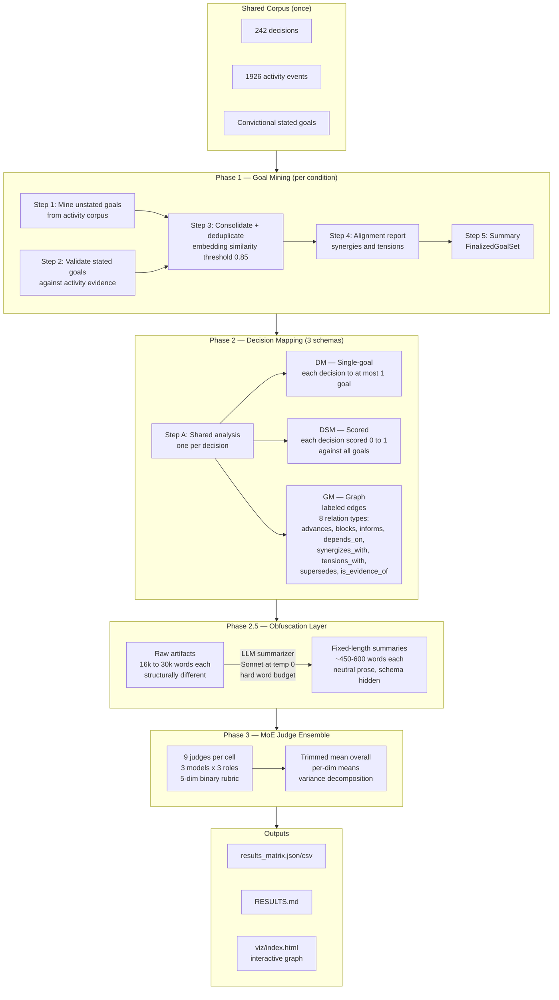
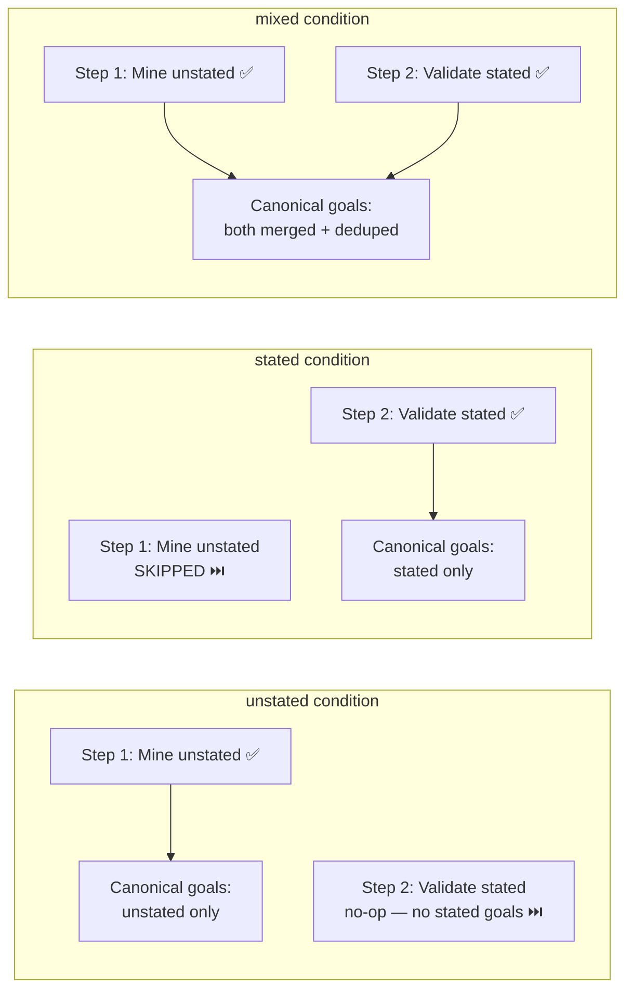
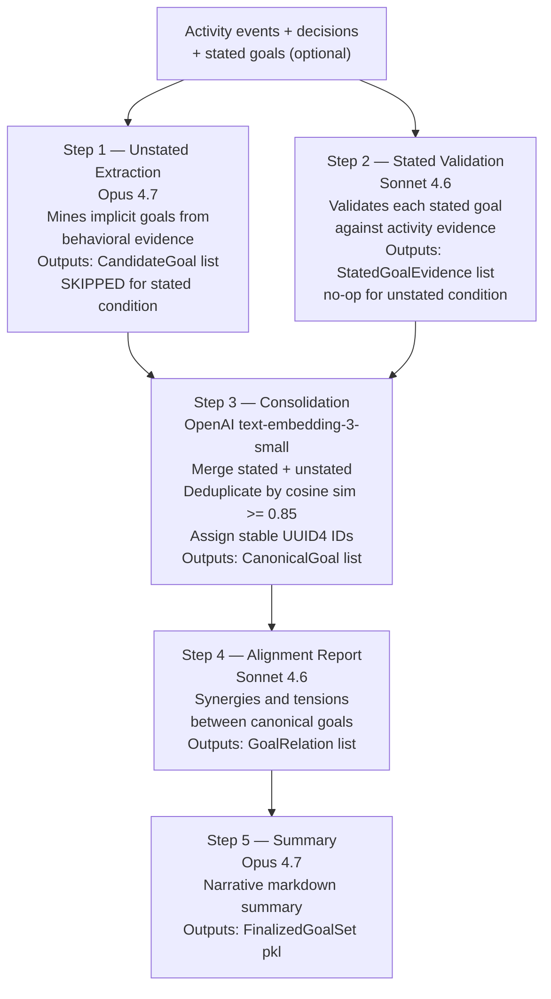
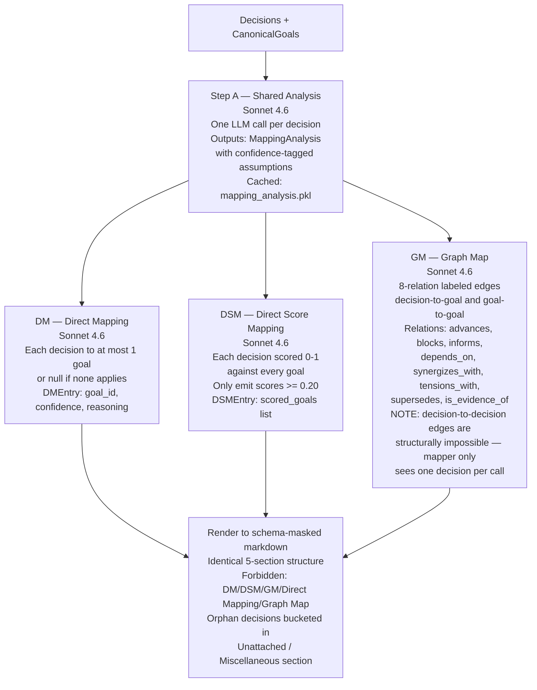
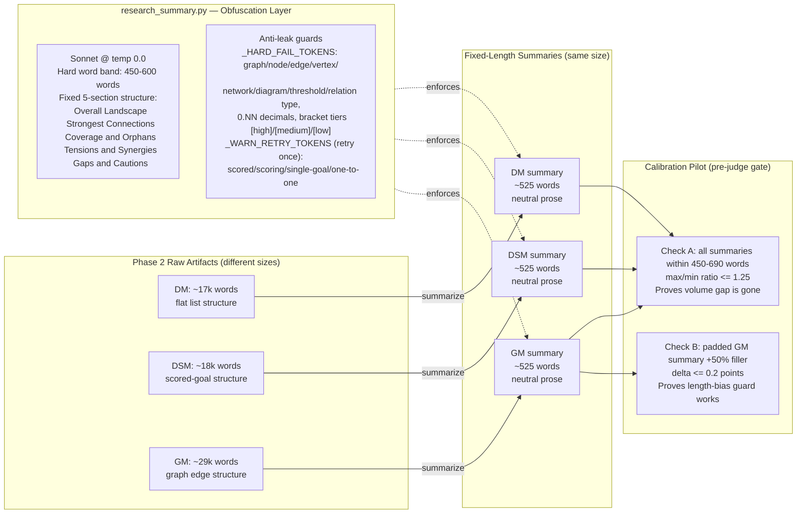
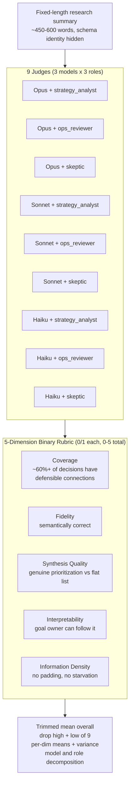
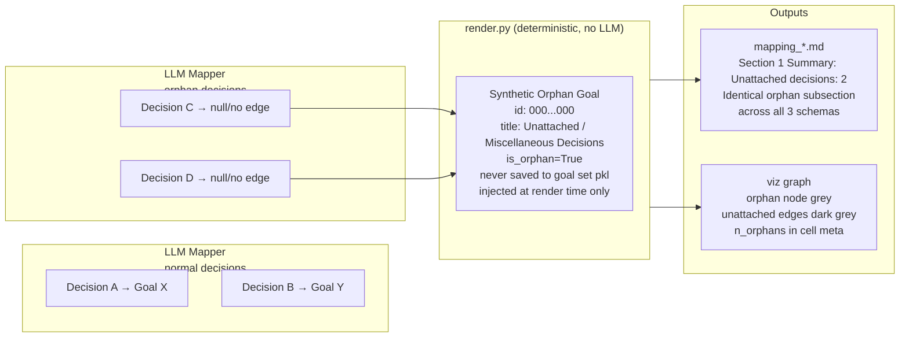
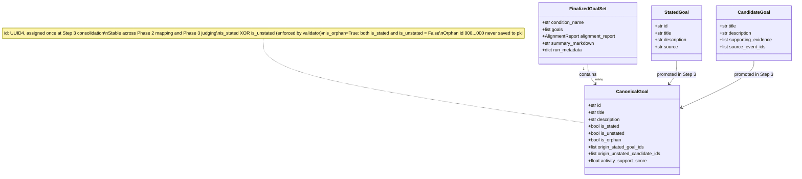

# decisions\_to\_goals

An experiment that evaluates three different **decision→goal mapping schemas** by compressing each mapping into a fixed-length neutral summary, then scoring the summaries with a 9-judge MoE LLM ensemble.

**Models:** Claude Opus 4.7 (mining + judging), Sonnet 4.6 (mapping + summarization + judging), Haiku 4.5 (judging).
**Corpus:** 242 decisions, 1,926 activity events, date-bounded 2025-04-29.
**Judges per cell:** 9 (3 models × 3 personas).
**Temperature:** single temperature (default 0.0); reported, not evaluated as a variable. Some judge models (e.g. Opus) run at their API default since they reject the temperature parameter.
**Scoring scale:** 5 dimensions binary 0/1; overall = sum (0–5); cell score = trimmed mean of 9 judges (drop high + low).

---

## End-to-End Flow



---

## Goal-Set Conditions

Three conditions vary the **provenance** of the goal set. The decision corpus is identical across all three.

| Condition | Scenario | Step 1 (mine unstated) | Step 2 (validate stated) | Goal set |
|-----------|----------|------------------------|--------------------------|----------|
| `unstated` | Fresh-onboarded company, 0 written goals | run | no-op | unstated only |
| `stated` | Has written goals, no approved unstated corpus | skip | run | stated only |
| `mixed` | Future platform combining both | run | run | both, merged |



---

## Goal Mining Pipeline (Phase 1)



---

## Three Mapping Schemas (Phase 2)

All three schemas share Step A (analysis) to isolate schema-level effects.



---

## Obfuscation Layer — Key Diagram

The core fix for the apples-to-oranges judging problem.

**Problem:** GM artifacts are ~29k words, DM/DSM ~17-19k. LLM judges bias toward volume, so GM wins unfairly not because it is a better schema, but because it presents more text.

**Fix:** Compress every artifact to a fixed-length, schema-neutral prose summary before judging.



---

## MoE Judge Ensemble (Phase 3)



**Anti-bias controls:**
- Cell ID never passed to any judge prompt
- Schema identity is never written into the raw artifact — masked *by construction* in `render.py` (the dm/dsm/gm label lives only in filenames/cache keys; no blacklist is applied). The generated summary is additionally guarded by `_HARD_FAIL_TOKENS` (hard-fail) and `_WARN_RETRY_TOKENS` (warn-and-retry once) in `research_summary.py`
- `information_density` dimension actively penalizes length/repetition
- Calibration pilot checks: (A) cross-schema length normalization, (B) padding-bias delta ≤ 0.2

---

## Orphan Goal Handling



**Why visible orphans matter:** Without this, decisions with no goal match disappear — GM drops them entirely. A large orphan bucket signals goal-set coverage gaps and correctly lowers the Coverage dimension score.

---

## CanonicalGoal Data Contract



---

## Data Ingress

The experiment's input corpus (decisions, activity events, stated goals) is read
from the **local Postgres DB that `make research_load` populates**, not from a
remote/production database.

**Step 0 — load the research bundle (prerequisite, run once):**

```bash
# From app/web — downloads the latest research export from GCS and loads it into
# the local decide_<env>_decide DB (requires GCP auth). The experiment never
# invokes this for you.
cd app/web && make research_load
```

The experiment then connects automatically on the first data-loading command
(`build_dataset`, `mine_all`, or `run_all`) using `settings.postgres_dsn`
(default `postgresql://127.0.0.1:5432/decide_<env>_decide`; override with
`POSTGRES_DSN` in `.env`). The corpus is cached to `output/shared/*.pkl`, so the
DB is only hit on the first run.

## Run Order

```bash
# Whole experiment end to end (all phases, with a progress bar)
make run_experiment ARGS='decisions_to_goals run_all'
```

Or run each phase individually:

```bash
# Phase 1 — goal mining (once per condition)
make run_experiment ARGS='decisions_to_goals mine_all'

# Phase 2 — decision mapping (3 schemas x 3 conditions = 9 cells)
make run_experiment ARGS='decisions_to_goals map_all'

# Phase 2.5 — obfuscation layer (compress artifacts to fixed-length summaries)
make run_experiment ARGS='decisions_to_goals summarize_all'

# Calibration gate (MUST pass before judging)
make run_experiment ARGS='decisions_to_goals calibration_pilot'

# Phase 3 — MoE judging at a single temperature (default 0.0)
make run_experiment ARGS='decisions_to_goals judge_all --temperature 0.0'

# Assemble results
make run_experiment ARGS='decisions_to_goals build_matrix'
```

**Machine-readable results:** `output/results_matrix.{csv,json}`
**Human-readable summary:** `RESULTS.md`
**Phase 3 judge caches:** `output/{unstated,stated,mixed}/judge_{dm,dsm,gm}_T0.0.pkl`
**Research summaries:** `output/{unstated,stated,mixed}/summary_{dm,dsm,gm}.md`

---

## Output Directory Layout

```
output/
├── shared/
│   ├── activity_events.pkl     # condition-independent
│   ├── decisions.pkl           # identical across all conditions
│   └── c1_stated_goals.pkl     # Convictional stated goals (cache)
├── unstated/                   # LLM-mined unstated goals only
│   ├── step1_candidates.pkl
│   ├── step3_canonical_goals.pkl
│   ├── step5_final_goal_set.pkl
│   ├── mapping_{dm,dsm,gm}.pkl
│   ├── mapping_{dm,dsm,gm}.md  # schema-masked raw artifact
│   ├── summary_{dm,dsm,gm}.md  # obfuscation layer output (~525 words)
│   └── judge_{dm,dsm,gm}_T0.0.pkl
├── stated/                     # human-written stated goals only
│   └── ...
├── mixed/                      # both sources merged
│   └── ...
├── results_matrix.{csv,json}
└── calibration_pilot.pkl
```
