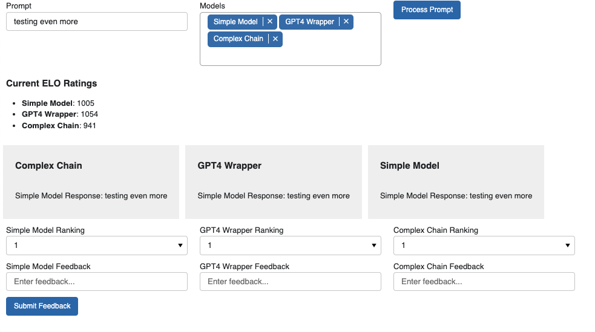

# LLM ElO Arena

**Author:** Adam McCabe

Taken from the well known public LLM ELO Arena, this idea leverages ELO to provide us with a quantifiable performance metric for any models or chains we want to introduce.

ELO, is a formula for calculating ratings of competitors in a game based on their pair-wise wins and losses. Here, we use human judgement to rank at least 2 model outputs in order to then modify each model's ELO. 


## Running the Panel App

Navigate to the `/experiments` directory and enter the following in your terminal:
```bash
poetry install
poetry shell
python -m ui.panel_ui
```

This should launch a localhost in your browser with the UI for the app, looking like the below:


