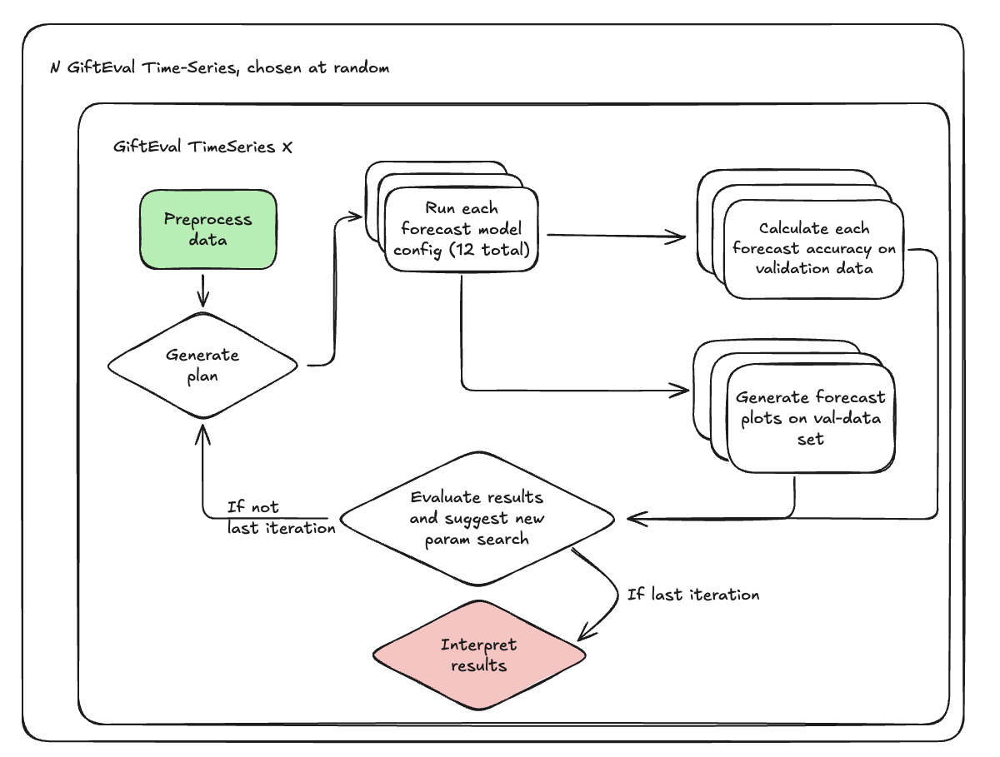
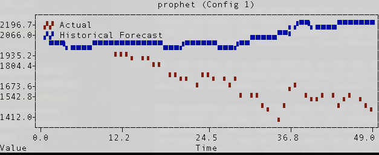
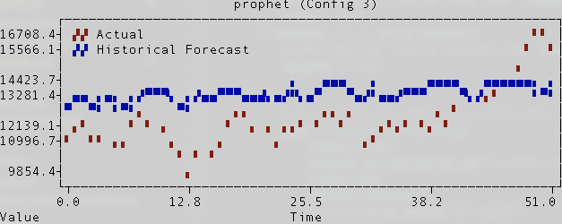
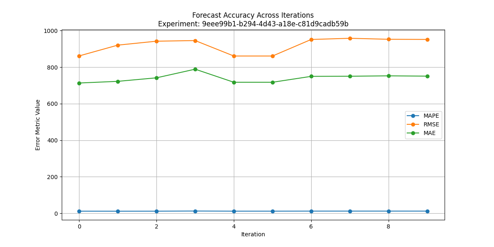
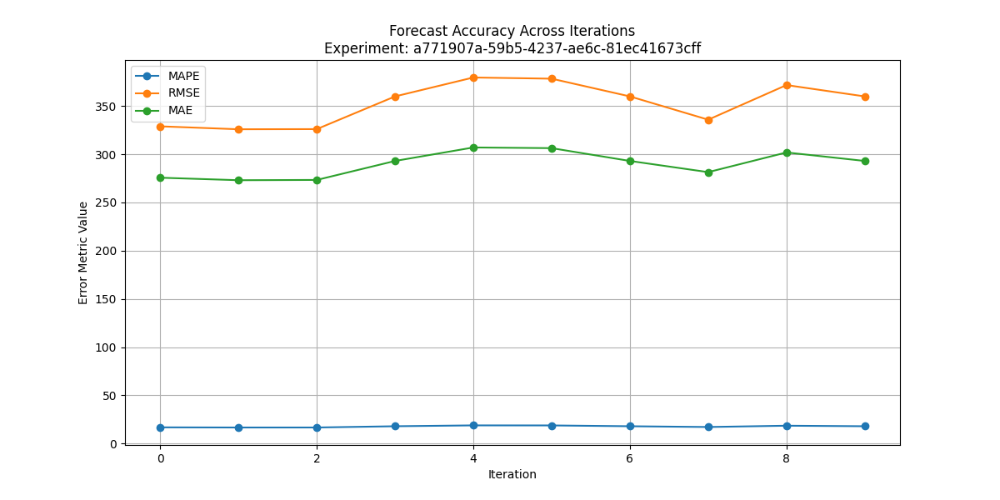
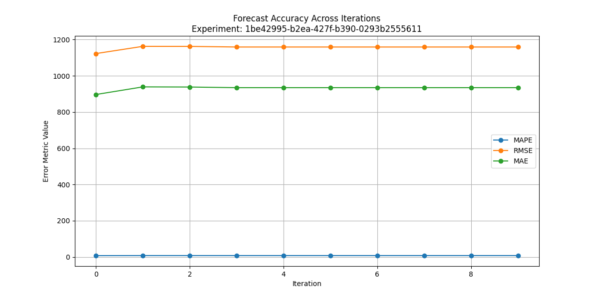
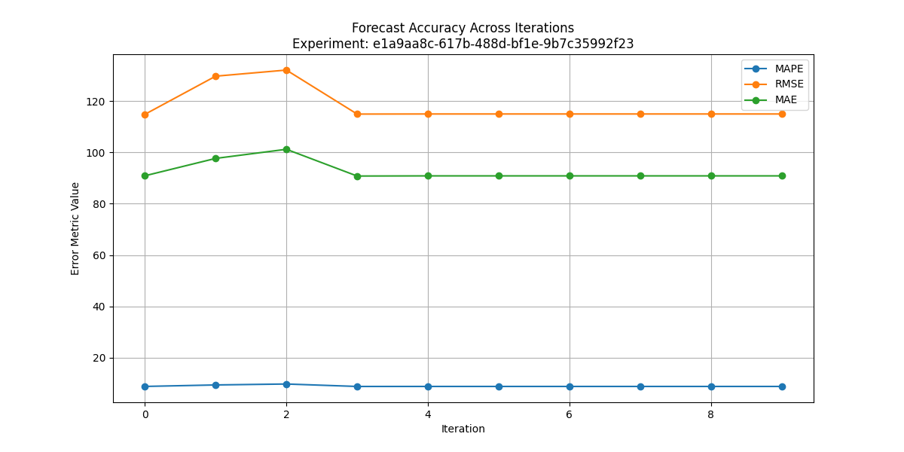
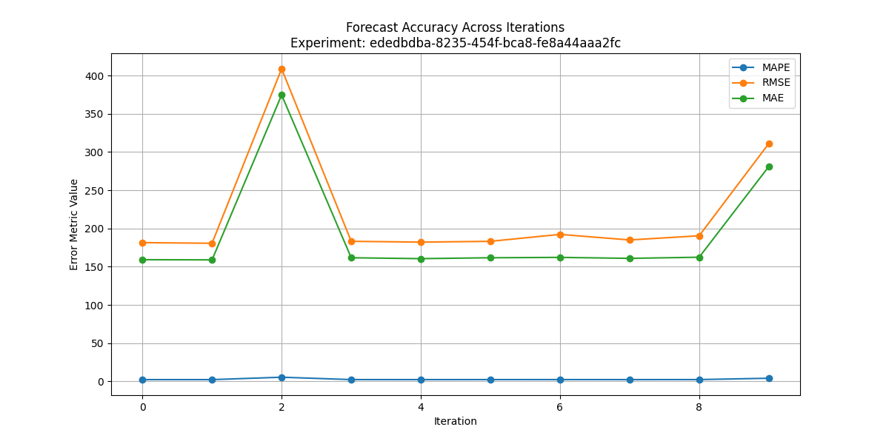

# Financial Model Forecasting Pipeline

An experimental prototype for automated financial forecasting using multiple forecast models and LLM-driven analysis. This pipeline combines traditional forecasting techniques with LLM-based reasoning to produce both quantitative predictions and qualitative insights. Effectively we are using the LLM as a hyper parameter optimizer and results interpreter. We can break the chain down into four key jobs which are executed in an iterative loop.

## What you can learn
1. This experiment uses an agentic chain with tool use. LLMs are given access to parameterized tools, which when combined with structured output allows them to effectively iteract with these tools.
2. Multi-modal: This experiment uses a multi-modal prompt to use both text and images in prompting Claude (see `forecast_tools/plan_generator.py`).
3. This experiment makes use of public benchmark data, pulling it down from [HuggingFace](https://huggingface.co/datasets/Salesforce/GiftEval) (see `utils/gifteval_data.py`)
4. This experiment represents a POC feature or tool that could be made available within Convictional, fulfilling the `future<>known<>systematic_forecasting` context map quadrant.


## Overview

This experiment can be run on one of two data sources:
1. Local CSV: Upload a CSV with a `date_id` column and a `target` column to `src/config/input`
2. Benchmark Data: We use GiftEval a Salesforce developed dataset used to benchmark models for single-variable time-series forecasting.
  - GiftEval data is broken out by domain; we target the `m4_daily` data, a collection of ~4,200 economic and financial time-series. No context is provided with the data, which is perfect for our purposes as it represents the 'worst-case' for any productized version where we'd expect to have context on the goal, task and underlying business model that produced the data.
  - The number of experiments to run can be set by setting the number of series to run on. Default is set to 5 and are chosen randomly (although we have set a random seed for reproducibility).


The pipeline for a given experiment is as follows:
1. **Data Pre-processing:** Mostly a placeholder at this point, but light pre-processing of the data is performed when the source is CSV.
    - We do some datetime massaging (on the `date_id` column) and group by the date index to provide a total per date.
    - Currently we try to infer the periodicity, but assume a default of daily.
    - Finally we split into train and validation sets using a 80/20 split.
    - When we use benchmark data, we use their train/test split and can assume clean data. However, we do need to process the wide arrow file into individual long format dataframes (for each time series in the source).
2. **Plan and Execute:** An LLM, with the provided business context and data summary is asked to provide 4 parameter configurations for each of the three forecasting models. Run each model <> configuration combo and log results of both validation and forecast periods.
3. **Evaluate:** We calculate MAPE, RMSE and MAE, along with confidence intervals and trend. These are sent to the an LLM as a structured dict for it to evaluate. The LLM identifies the best performing model and makes suggestions for more refined hyper parameter search spaces.
    - First Pass: We return to step 2 with this information and allow it to select a new set of 4 configurations for each forecasting model.
    - ...
    - N^th Pass: We choose the best performing model of the `N * 12` model configurations evaluated
4. **Interpret Results:** Finally we send the business context, data context and best model context to the results interpreter to the LLM and ask for an interpretation of the results and recommendations given the context.

We use `Instructor` (same as the app) for managing structured, async, llm calls represented with the diamonds below:




## Findings

### Overview
Using a set 5 random time series from the `m4_daily` dataset, we see interesting results. As we know that these forecasting models are simple, we don't expect SOTA performance, but we also know that they 'work' so this problem effectively shifts into a hyper parameter search problem where we try to get to the best performance possible with these models (Prophet, Holt-Winters, Linear Regression on time based features).

The time-series we are experimenting on from the dataset are financial in nature so show strong seasonlity in a lot of cases, but also unexpected change-points which these models can struggle with.  I've seen a good number of cases where these three models struggle with a certain time-series that sees a trend-reversal right around train/test cutoff



For other, more 'regular' series, Prophet actually does alright:



### Hyper-parameter Search
Hyper-parameter search problems have existed for as long as models have, ML or otherwise. Using an LLM like this is just another technique that allows for more autonomous searches. While Data Scientists are able to set up hyper-parameter search spaces (effectively some bounded subspace of all possible paramters) and run searches using techniques such as Baysien Search where the parameter selction for each iteration is based on previous best performing combinations, they would still be responsible for setting these search spaces, using the findings to think of new areas to search (or to halt), and interpreting the results. In this experiment, we effectively replace the role of that Data Scientist with a semi-agentic chain (agentic tool use, iterative self-relection). For this experiment we used Claude-Sonnet 3.5 (Oct 10, 2024 version).

You can see one iteration output (to the terminal) to get an idea of what information is being passed around and how the LLM's approach the reasoning in the file at `src/one_iteration_output.md`. This was iteration 7 of 10 for a particularly tricky series.

The iterative back and forth between the plan generator and the model evaluator is not perfect, but does show that the LLMs use suggestions and observations on overall search space coverage to look for new promising configurations.

We frame the problem as an explore<>exploit problem in which we guide the LLM to make use of the best performing models thus far, while also looking broad. The use of 4 parameter configs per model iteration means that the LLM has space to try these different strategies.

Adding the below helped the LLM to avoid falling into a local maximum, building only off of a single promising model (although it is clear it still does at times).
```
For each forecasting method, provide FOUR different parameter configurations that explore different aspects:
        1. Conservative/baseline configuration
        2. Aggressive/complex configuration
        3. Balanced configuration
        4. Experimental configuration

        Base your new configurations on any previous results if provided.

        Return a structured plan with reasoning for each step.

        Exploration Strategy:
        1. For each method, ensure your configurations include:
           - One configuration close to the previous best (exploitation)
           - One configuration that explores new parameter ranges (exploration)
           - One configuration that combines successful parameters from different methods
           - One configuration that tests extreme parameter values

        2. When previous results are available:
           - Analyze which parameter ranges haven't been well explored
           - Identify parameters that show high sensitivity to performance
           - Consider combining successful parameters from different iterations
           - Avoid repeating exactly the same configurations

        3. Balance the trade-off between:
           - Exploiting known good parameters (70% of suggestions)
           - Exploring new parameter combinations (30% of suggestions)
```

### Multi-modal
As Claude is multi-modal, we are able to [send it images](https://docs.anthropic.com/en/api/messages#:~:text=Starting%20with%20Claude%203%20models%2C%20you%20can%20also%20send%20image%20content%20blocks%3A). To help the plan generator and model evaluator, we pass images of the forecast plots to the LLM along with the meta-data on performance and accuracy. More on forecast performance below and inclusion of this, but it was clear that the LLM was using the images in its reasoning:

> The plan addresses the observed downward trend and volatility in the data through varied parameter ranges and feature combinations.

### Tool Use
The ultimate forecasts had varying accuracy, but the premise seems sound. The LLM was able to effectively use these tools when the structured output included fields for their parameters that the LLM would complete. This pattern could be replicated for other places where the use of some deterministic tool set can provide an 'artifact'. Note, as the job to be done was constrained, LLM errors on structure or return formats were not a blocker or noticed concern.


### Forecast Performance
Alright, how did it actually do in trying to forecast these benchmark time-series? We plot the best-model's accuracy metrics by iteration for each of the five-time series and show those below. As you can see below, often only 2-3 iterations are needed for the LLM to find (near) best performing models (note, cases like series 4 below deviate during exploration, coming back on iteration 4 when exploitation starts to take over). The parameter search follows our explore/exploit instructions, so it is not a matter of simply falling into a single local maximum but likely a combination of the LLM's ability to select decent initial param configs, and the limitations of the tools themselves.








## Running the Pipeline

### Basic Usage

From the decide root:

```bash
cd experiments
make install // Intall experimental dependencies
make run_experiment ARGS="financial_model"
```

### Customizing the Pipeline

#### Entry Points

- **`forecast.py`**: Main entry point for this experiment. Modify params in `main()`. Iteration is handled in `run_forecast_pipeline()`
- **`forecast_tools/data_preprocess.py`**: Handles the data pre-processing we perform
- **`forecast_tools/plan_generator.py`**: Uses LLMs to generate model configurations, evaluate results, and provide business insights
- **`forecast_tools/forecasting_models.py`**: Implements Prophet, Holt-Winters Exponential Smoothing, and Linear Regression
- **`forecast_tools/model_evaluation.py`**: Handles step 3 in the above overview including all the calculations of accuracy metrics.
- **`forecast_tools/results_interpreter.py`**: Handles the final step in the overview
- **`utils/logging_utils.py`**: Handles our logging classes, including plotting of experiment performance.
- **`utils/gifteval_data.py`**: Uses HuggingFace hub to handle the fetching of benchmark data.

#### Input Data

**CSV**
1. Place your CSV file in `src/config/input/`
2. The CSV should contain:
   - A datetime column named 'date_id'
   - The target value column (e.g., 'buyer_gmv_usd')
   - Data should be in chronological order
3. In `forecast.py` adjust the `run_multiple_experiments()` to use your CSV.
```python
# Example usage with CSV - be sure to either call your data `sample_data.csv` or adjust the `DATA_PATH` variable
DATA_PATH = Path(__file__).parent.parent / "src/config/input/sample_data.csv"
BUSINESS_CONTEXT = """
This data represents buyer-seller transaction GMV (Gross Merchandise Value) over time.
We want to forecast future GMV trends for specific buyer-seller pairs.
"""
Run experiments
csv_results = asyncio.run(
    run_multiple_experiments(
        data_source="csv", data_path=DATA_PATH, target_column="buyer_gmv_usd", business_context=BUSINESS_CONTEXT
    )
)
```

**Benchmark Data**
1. In `forecast.py` adjust the `run_multiple_experiments()` to use GiftEval:
```python
run_multiple_experiments(
  data_source="gifteval",
  business_context="Forecasting time series from GiftEval M4 Daily dataset.",
  n_series=5,
  num_iterations=10,
  target_horizon=0,
)
```

#### Configuration

To modify the pipeline parameters, edit `main.py` in `src/forecast.py`:

- Forecast horizon: The number of periods to forecast into the future. Note for benchmark data, this should be 0 so that we only evaluate the 'test' set provided.
- Target column: The column to forecast
- Business context: Context to be provided to the LLMs in the chain
- LLM Model: `claude-3-5-sonnet-20241022`. This can be changed or parameters modified in `src/config/experiment_settings.py`
- Prompts live directly in the respective files (currently), but all leverage an identity:
```
You are an expert data scientist specializing in time series forecasting.
You are a student of Nate Silver and have a knack for translating data into actionable insights for business.
You have also had a long and varied career forecasting just about everything in business, from
stock prices, inventory levels, buying patterns, product growth, etc.
```

#### Output

The pipeline generates:
1. Terminal-based visualizations during execution
2. Saved plots in `src/config/output/plots/`
3. Detailed experiment metrics logging the experiment, iteration and forecast grain metadata and results saved as CSVs to `src/config/output/experiment_logs/`
4. Plots of experiment accuracy progression saved to `src/config/output/experiment_logs/visualizations`


## Implementation Details

### Forecasting Models

1. **Prophet**
   - Handles multiple seasonality patterns
   - Configurable change points and holiday effects
   - Both additive and multiplicative seasonality

2. **Exponential Smoothing ('Moving Average')**
   - Holt-Winters implementation
   - Configurable trend and seasonal components
   - Automatic frequency detection

3. **Linear Regression**
   - Time-based feature engineering
   - Scaled inputs for stability
   - Multiple feature combinations

### LLM Integration

The pipeline uses LLMs for:
1. Generating model configurations based on data characteristics
2. Iterating on initial configurations
3. Evaluating model performance and selecting optimal configurations
4. Interpreting results and providing business recommendations

### Evaluation Metrics

- MAPE (Mean Absolute Percentage Error)
- RMSE (Root Mean Square Error)
- MAE (Mean Absolute Error)
- Uncertainty measures
- Trend analysis

The model evaluator calls the LLM with this context to both suggest iterations for further hyper-parameter configurations to evaluate, as well as selecting the best model when iterations are complete. Currently we set a fixed number of iterations (currently 2).

## Best Practices

1. **Data Quality for CSVs**
   - Ensure consistent datetime formatting
   - Handle missing values before input
   - Provide sufficient historical data (minimum 2x forecast horizon)
   - Note: More automated cleaning of data was not in scope for this experiment

2. **Business Context**
   - Provide detailed context in the configuration
   - Include known seasonality patterns
   - Specify any business-specific constraints
   - Provide context for the reason for the forecast (recommended)

3. **Forecast models**
   - Although the current three are relatively simple, they were selected for exactly that reason. Time series forecasting can be frought with issue, so rather than over-complicating it, we focus on using models we can easily defend with techniques that are tried and tested (just accelerated with LLMs). This also provides us with a starting point for iterations.

## Limitations and Future Work

- Currently supports single target variable forecasting
- Requires regular time series data
- Limited to three forecasting models
- No direct support for external regressors
