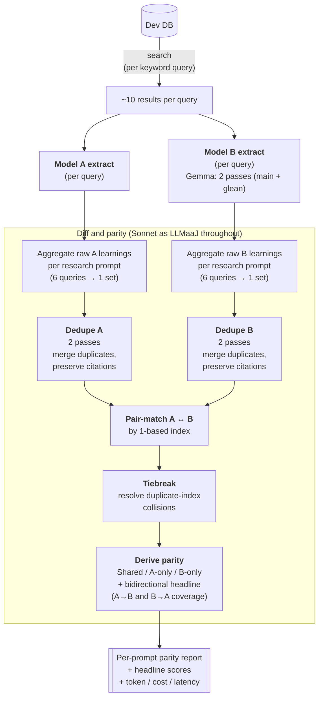

# Gemma-4 26B A4B for Learning Extraction

**Date:** June 9, 2026
**Experimenter:** Adam McCabe

**Hypothesis:** _Small light models have come a long way - Gemma 4 represents a real leap in intelligence density based on benchmarks and personal use. Gemma-4 26B A4B can match the performance of Claude Sonnet 4.6 (latest) on the learning extraction task in our productionized Deep Research feature — operationalized as Gemma's extracted set covering ≥80% of Sonnet's extracted learnings across our test prompts._

**Conclusion tldr:** On a held-out set of 8 prompts run across 3 independent trials, Gemma covers a mean of **76% of Sonnet's learnings (range 72–83% across trials)** — **just below** the 80% target, with the bar landing inside the trial-to-trial variance envelope. Gemma does this at roughly **1/6th the cost of Sonnet-4.6**, and on a clean single extraction pass its latency (**~20s p50**) roughly ties Haiku and is **~2× faster than Sonnet** (~42s) — noting Gemma is measured through a throttled public-preview MaaS endpoint, so that figure is an upper bound on real model speed. The reverse direction (Gemma → Sonnet coverage) is a stable **~61% across trials**: Gemma extracts a substantially larger raw set than Sonnet, which may or may not materially affect downstream research report quality.

**Recommended Next Steps:** The 76% coverage is close enough to the bar that a downstream-quality check would now be the decisive experiment, not a "validate the coverage number" check. Generate human-eval research reports using the v6.1 Gemma prompt + 2-pass extraction config on the held-out prompt set, and grade resulting reports against the prod (Sonnet) versions. This would test the substantive question — *does the ~24% coverage gap actually degrade downstream research report quality?* — which is what we'd ultimately need to know before any production substitution.

_**Note:** Throughout this report you will see the notation `Model A → Model B`. This reads "fraction of A's learnings also found in B" — i.e., B's coverage of A's content._

## Introduction

**Background:**
A coming-together of the below factors motivated investigation into Gemma 4 as a potential production model for use cases in Convictional. Learning extraction was targeted given the Deep Research feature's importance to customer value.
- **[On-the-fly Compression](../deep_research_on_the_fly_compression/README.md)** will be productionized (timing, tbd pending June 30, 2026 launch priorities) and can be shipped using Haiku 4.5 (latest) for secondary content sources summarization. Haiku was compared against Sonnet via the experimenter's ratings on resulting research reports. Secondary content search (the on-the-fly compression part) summarizes ~100 docs per query - Haiku 4.5 handles this as total tokens used vs. baseline deep research (no otfc) is approx. 10x
- **Closed model pains** have been felt with Anthropic as they scale their offerings. Real regressions in Opus 4.6 were acknowledged by Anthropic in [April 2026](https://www.anthropic.com/engineering/april-23-postmortem). Lack of model pinning for 4.6 models and beyond make API calls somewhat unpredictable as models drift (somewhat of an open question as these models are still new).
    - Claude Sonnet 4.6 is priced at $3/$15 per million input/output tokens respectively.
    - Claude Haiku 4.5 is priced at $1/$5 per million input/output tokens respectively.
- **Gemma 4 released April 2, 2026** and began to both [benchmark well](https://blog.google/innovation-and-ai/technology/developers-tools/gemma-4/), as well as 'feel' good in the personal vibes test while running it locally in pi (open source agent coding harness). Google offers [Gemma 4 as a managed endpoint through GCP](https://console.cloud.google.com/agent-platform/publishers/google/model-garden/gemma-4-26b-a4b-it-maas) at $0.15/$0.60 per million input/output tokens respectively.
    - 20x/25x cheaper than Sonnet 4.6; 6.7x/8.3x cheaper than Haiku 4.5 (input/output tokens)
- **The GCP security promise** is something we think customers will still appreciate, but is admittedly less of a concern given ICP familiarity with Anthropic.

**Description:**
Gemma 4 is clearly not as capable a model as Sonnet 4.6 broadly; however, not all tasks require the same intelligence or agentic capability, and the learning extraction task was chosen for these reasons. My hypothesis is that learning extraction requires more reasoning than summarization, but should be approachable for a small model.

I include Haiku 4.5 as a third comparison point because it's the candidate model for the on-the-fly compression secondary-summarization step (see Background) and represents the "cheap-tier closed-model" alternative against which Gemma's open-weight, deeper-discount profile should be measured. This lets us situate Gemma against both the prod model (Sonnet) and the planned cheap-tier model (Haiku) in the same run.

The [README.md](README.md) provides more detail on the experiment codebase as well as CLI instructions, but broadly the experiment pipeline is structured to mimic the production content query + learning extraction prompt, except standalone so that we can easily swap out models and prompts being used. Real deep research questions (drawn from an internal human-eval question library, not included in this repository), and their generated keyword queries (generated by running each in the dev server and peeking the relevant research tables in the dev db) are used. Each prompt has ~6 associated keyword queries (q7 has 4; the others 6), returning 10 results each.

The results come from a **held-out set of 8 prompts** (46 queries × 10 results = 460 content items per model per trial), run across **3 independent trials** to characterize variance. A separate **iteration set of 5 prompts** (30 queries) was used during v4–v6.1 Gemma prompt tuning — numbers measured on that set are tuning artifacts, not results (the v6.1 few-shots were sourced from those same prompts), but they're compared side-by-side with the held-out numbers in the Few-Shot Contamination appendix to quantify the few-shot leakage effect. See the Keyword Queries appendix for the full query lists in both sets.

### Methodology

In order to compare results, I use a pipeline that leverages LLMaaJ to de-duplicate extracted learning sets and compare individual learnings across models from each extracted set:
1. Seed db
2. For each research question and keyword query, retrieve relevant results
3. Extract learnings for each model. For Sonnet, I use the production extraction prompt; for Gemma and Haiku I use custom prompts. In the below, when I say 'model' I mean 'model + specific prompt version'.
    - Gemma and Haiku are allowed multiple passes with the understanding that increasing passes dilutes the cost savings. Default for the v6.1 prompt runs are one additional pass (sometimes called 'gleans'), so 2 passes total for Gemma. Note, I didn't bother with a second pass for Haiku.
4. Aggregate the extracted learnings across all keyword queries within a research prompt (~6 per prompt; 4 for q7), then de-duplicate that combined set (per model × research prompt) using LLMaaJ to find the unique set of learnings for comparison. Note that in production we also aggregate (but not de-dupe) learnings prior to report writing.
    - I perform a de-duplication step knowing that it's a trade-off: we naturally may lose out on some information if the LLMaaJ makes a poor call, but attempting to compare coverage of learnings across the de-duplicated sets both posed attention problems for the LLMaaJ and made reported statistics overly noisy.
    - I manually reviewed a subset of de-duplicated learnings and was not concerned with performance
    - I use Sonnet for de-duplication.
5. Per research prompt, use LLMaaJ (Sonnet) to pair learnings across the two models' de-duplicated sets as containing the same information.
    - Note that I observed Sonnet at times associating n:1 learnings, which implies that it believes the 'n' learnings are duplicates; we send these candidates to the de-duplicate judge again to ask if they are legitimate duplicates so that we can report clean 1:1 stats.
6. Write to output report capturing shared learnings and unique learnings per model at the research question level, as well as shared score per research question and average overall: total_shared / (total_shared + baseline_model_unique)
    - Note, as Sonnet is our production model, it becomes the interesting baseline, but I also tested Gemma against Haiku, where Haiku is the baseline.

The dedupe and learnings-diff steps are where most of the comparison logic lives — the diagram below visualizes those in the bottom subgraph:

#### Gemma Specific Changes

Gemma, being a small model, has some small-model quirks, most notably that out of the gate with the production sonnet prompt, it:
1. produced shallow very topical learnings (e.g. "The team shipped notifications..." vs. "a principal engineer with help from another engineer and the design engineer shipped notifications on April X...")
2. extracted only the most obvious learnings
3. high tool-call failure rate due to malformed tool responses

I addressed points 1 and 2 above using prompt iteration and few-shot selections. The first run of the pipeline produced shallow (Gemma) vs. deeper (Sonnet) learnings that became a strong few-shot example source. In the last version of the Gemma prompt, v6.1, I use 7 few shots, each containing a content snippet and a good + bad example of an extracted learning.

The prompt iterations I made beyond the few-shots for Gemma was to include more 'checklist' or step by step structural guidance around how to identify learnings worth extracting.

See the appendix for more information on the prompt evolution and the final prompts used (or see them in code at `[src/prompts/gemma](src/prompts/gemma/)`).

On point 3 above, tool call failures, I moved from Tools mode to JSON mode in Instructor and found a slight improvement, however **I am still seeing an approximately 3-6% failure rate** (even with Instructor retries) for the extraction task with Gemma. As an additional mitigation I raised Instructor's `max_retries` to 5 for Gemma calls (the library default is 1, i.e. no retry on validation failure; Sonnet/Haiku calls run at the default). Note I did not analyze per-attempt validation-failure rates — only overall call success — and these retries are full API roundtrips that roll into Gemma's measured per-call latency (see Latency).

**Multiple Passes:** Given how inexpensive Gemma-4 is, multiple passes over the same content results is feasible while still presenting cost savings vs Sonnet and Haiku. Each subsequent pass includes the previously extracted learnings from prior passes.

Single-trial measurement comparing 1 vs 2 passes for Gemma on the **iteration set** (5 prompts × 6 queries = 30 queries, one observation each, no error bars — the 1-vs-2-pass comparison was done before the held-out set was constructed; the pass-count effect is what's being measured here, so it stays informative):

- **Raw learnings:** 240 → 498 (+108%) — consistent with the "second pass roughly doubles raw output" intuition.
- **Unique learnings post-dedupe:** 109 → 160 (+47%) — meaningful but sub-linear in raw, as expected since dedupe absorbs most of the duplication.
- **Sonnet → Gemma coverage:** 62% → 80% (+18pp). This is the lift that pushes Gemma to the 80% headline target — the 1-pass version falls below it. The glean pass is doing real work here, not just inflating the set.
- **Gemma → Sonnet coverage:** 71% → 59% (−12pp). Drops because Gemma's larger total set means a larger denominator; this is a denominator effect, not a quality regression.
- **Cost:** $0.0982 → $0.1782 across the suite (+81%). Roughly doubles in absolute terms but still ~11× cheaper than Sonnet's $1.97.

The takeaway: the second pass is what gets Gemma over the 80% target, and the absolute cost lift is still small relative to Sonnet. If we wanted to push further, a 3rd pass would be the next experiment (with diminishing returns expected as dedupe absorbs increasingly redundant new content).

#### Deduplication Step

I chose to include a deduplication step for this experiment as I found that initially trying to compare raw learnings was (i) less reliable (the same LLMaaJ would choose different representatives from each duplicate class on different runs), and (ii) degraded the LLMaaJ pairing process due to the additional noise.

The de-duplication step takes place with Sonnet-4-6 as a judge asked to review the extracted learnings from one model x keyword query set and de-duplicate learnings that carry the same information. See the `DEDUPE_SYSTEM_PROMPT` in `[src/dedupe_diff.py](src/dedupe_diff.py)` for the exact task description.

#### Learnings Diff Step

I again use Sonnet 4.6 as a judge for identifying shared learnings and producing the learnings diff. The learnings diff for a given keyword query is the set of shared learnings, sonnet/haiku only learnings, and gemma only learnings. These are output to a .md report for easy review.

I manually reviewed its pairings and felt good about it after a few prompt iterations. That said, I did not do extensive rigorous testing here.

The sizes of the sets in the learning diff allow us to calculate shared learnings scores between pairs of models.

#### Caveats and Known Limitations

- **Trial-to-trial variance is real, and not uniform across directions.** Across 3 held-out trials, the *anything-→-Gemma* directions swing 6–12 percentage points trial-to-trial (Sonnet→Gemma: 72–83%; Haiku→Gemma: 79–85%; Sonnet→Haiku: 66–78%), while the *Gemma-→-anything* directions are tight at 2–4pp (Gemma→Sonnet 59–63%; Gemma→Haiku 59–63%). This is consistent with Gemma extracting at **temperature 1.0** (variance baked in by design — diverse sampling across passes is the point), while Sonnet and Haiku extract at temperature 0. The 3pp ±5pp judge-noise floor stacks on top.
    - **Reader implication:** treat any single-trial coverage number ±~6pp; the 76% S→G headline overlaps the 80% bar within trial variance, so any "above/below 80%" reading on one trial is noise-sensitive.
- **Per-prompt sample sizes are small, and q7 is structurally smaller.** Each prompt averages ~6 keyword queries — for q7_intern_summer the planner only generated 4. The smaller per-prompt denominator amplifies noise on q7 in particular (Sonnet→Haiku range 33–67% across trials, Haiku→Gemma 44–100%). Read q7's numbers with extra skepticism.
- **Gemma latency measurements are confounded by the public-preview endpoint.** All Gemma calls go through the Vertex MaaS *public preview*: shared capacity, 429 backoff, 12s enforced pacing between queries, and Instructor JSON-validation retries all leak into the measured numbers (and explain the large trial-to-trial spread in measured latency). The only figure that approximates real model speed is the wall-clock of a single successful extraction pass — **~20s p50 on the cleanest trial** — and even that is an upper bound. Pipeline wall-clock comparisons against Sonnet/Haiku's concurrent pipelines are not meaningful; provisioned throughput is what a production-latency decision should be based on. The cost story is unaffected by any of this.
- **The LLMaaJ judge sees model names.** All judge prompts (dedupe, match, tiebreak) label the learning sets with their source model — including "Sonnet," which is also the judge model, and "(2-pass)" on the Gemma label, which cues the dedupe judge to expect duplicates. Since no judge step asks "which is better," the classic self-preference channel has no obvious payoff here; the more plausible channel is label-primed dedupe aggressiveness (merging Gemma's set harder because the label advertises multiple passes), which would shift unique counts asymmetrically. Risk judged low for an equivalence-pairing task, but unquantified — anonymizing labels to "List A / List B" in judge-facing prompts is the cheap fix for a future run.

## Results

Evaluating the hypothesis requires knowing what percent of learnings must be shared for downstream report quality to not suffer. A separate experiment can be gated based on scores here. **The target overlap I aimed for was 80%.**

Full results follow, however the top-line findings are:
1. On 3 held-out trials × 8 prompts (46 queries each), Gemma hits a **76% mean Sonnet→Gemma coverage rate (range 72–83% across trials)** — **just below** the 80% target, with the 80% bar landing inside the trial-to-trial variance band. On a per-prompt mean basis, **3 of 8 prompts clear 80% against Sonnet** (q5 bio recommendations: 93%, q13 recent sales conversations: 88%, q11 recent personal work: 85%); of those, only q5 clears 80% in every individual trial (q11 and q13 each dip into the low 70s on their weakest trial).
2. **Gemma → Sonnet coverage is stable at 61% (range 59–63%).** Gemma extracts a substantially larger raw set than Sonnet; the coverage asymmetry is structural, not trial noise (it's the tightest number in the suite).
3. Gemma's tool-call failure rate: 3, 3, and 0 failures out of 46 queries across the trials (mean 4.3%, range 0–7%) — consistent with the ~3–6% rate noted in Methodology. Sonnet and Haiku were 46/46 in all 3 trials.
4. **Cost:** there are three lenses, worth keeping distinct. (a) *Posted per-token price:* Gemma is 20×/25× cheaper than Sonnet (input/output). (b) *Measured per extraction call* (one pass, one query): Gemma bills ~1/12th of Sonnet and ~1/4th of Haiku. (c) *Measured full pipeline run*, including Gemma's 2 passes and its larger 7-shot prompt: **~6× cheaper than Sonnet ($0.47 vs $2.99 across 46 queries), ~2× cheaper than Haiku ($0.93)**. The gap between (a) and (c) is Gemma spending tokens that Sonnet/Haiku don't — see Token Usage for the breakdown.
5. **Latency:** the only number that matters is wall-clock for one successful extraction pass on one query — **~20s p50 for Gemma** (cleanest trial), roughly tied with Haiku (~21s) and ~2× faster than Sonnet (~42s). All other Gemma latency measurements are confounded by the throttled public-preview MaaS endpoint — see Latency.

### Full Results, Held-Out Set (3-Trial Mean + Range)

Shared learning scores across all three pairwise comparisons, both per-prompt and overall. Reminder, the notation `A → B` reads "fraction of A's learnings also found in B" — i.e., B's coverage of A's content.

Each cell shows the mean across the 3 trials, with the [min-max] range in brackets. Bolded mean entries clear the 80% target. Source: the 9 parity reports under `output/` generated 2026-06-09; raw extractions in `output/trial_{1,2,3}/`.

**Overall** (8 prompts, 46 queries per trial, 3 trials):

| Pair | A → B (mean [range]) | B → A (mean [range]) |
| --- | --- | --- |
| Sonnet (A) vs Haiku v1 (B) | 71% [66–78%] | 78% [77–79%] |
| Sonnet (A) vs Gemma v6_1 (B) | 76% [72–83%] | 61% [59–63%] |
| Haiku v1 (A) vs Gemma v6_1 (B) | **82%** [79–85%] | 62% [59–63%] |

The Sonnet → Gemma direction — the relevant headline since "can Gemma replace Sonnet in prod?" is the substitution question driving this experiment — lands at **76% mean with the 80% bar inside the trial-to-trial variance band (the 83% trial cleared it; the 72% and 74% trials did not)**. The honest reading is "just below target, with single-trial readings on either side of the line."

The reverse, Gemma → Sonnet at 61%, is the tightest number in the suite (59–63% across trials): Gemma extracts a substantially larger set than Sonnet, and that asymmetry is structural, not noise.

- Not all of Gemma's additional learnings are signal — some are on-topic-adjacent but ultimately off-topic content, i.e. noise. See the [Unique Learning Examples appendix](#unique-learning-examples-sonnet-only-vs-gemma-only) for concrete examples of unique learnings on both sides. However, it is unknown whether these additional learnings impact (negatively or positively) downstream research reports.

**Haiku → Gemma at 82% mean exceeds Sonnet → Gemma at 76%.** Two contributing factors: Haiku produces a smaller raw set that's structurally easier for Gemma's larger set to fully cover, and Gemma's v6.1 few-shot tuning (built from Sonnet-vs-Gemma comparisons) appears to generalize at least as well to covering Haiku's extraction style as Sonnet's.

- I included Haiku to provide another 'small' model watermark vs. Sonnet. I did not spend time optimizing prompts or gleans for Haiku however as it was not the main focus of this experiment.

**Per prompt** (S = Sonnet, H = Haiku v1, G = Gemma v6_1; mean across 3 trials, [min–max] range in brackets; bolded mean ≥ 80%):

The chart below shows the headline S↔G pair only. Note the rough anti-correlation: the prompts where Gemma covers Sonnet best are the ones where Sonnet covers Gemma worst — high S→G prompts are the ones where Gemma extracts the most, and a bigger Gemma set mechanically covers more of Sonnet while being harder for Sonnet to cover back.

*(Regenerate with `scripts/plot_coverage.py`.)*

The full six-direction table (the chart's source of truth, plus trial ranges):

| Prompt | S→H | H→S | S→G | G→S | H→G | G→H |
| --- | --- | --- | --- | --- | --- | --- |
| q1_analytics_principles | 79% [77–83] | **94%** [89–100] | 67% [61–78] | 69% [64–78] | **87%** [77–95] | 59% [53–65] |
| q2_design_principles | 71% [69–74] | **83%** [73–93] | 71% [62–88] | 65% [58–69] | **83%** [69–91] | 68% [68–68] |
| q5_bio_recommendations | 79% [74–85] | **83%** [75–89] | **93%** [86–100] | 50% [44–53] | **92%** [90–95] | 58% [54–64] |
| q6_research_function_principles | 65% [62–71] | 72% [68–75] | 73% [73–74] | 65% [59–73] | 71% [68–77] | 66% [64–71] |
| q7_intern_summer | 52% [33–67] | 76% [60–100] | 59% [56–60] | 67% [45–100] | 76% [44–100] | 52% [30–80] |
| q9_research_posts | 68% [53–87] | **86%** [79–100] | 71% [65–78] | 75% [65–82] | **82%** [71–88] | 70% [69–70] |
| q11_recent_personal_work | 77% [65–85] | 71% [62–76] | **85%** [75–93] | 60% [54–63] | **84%** [74–96] | 62% [56–69] |
| q13_recent_sales_conversations | 77% [57–88] | 72% [65–81] | **88%** [76–100] | 52% [42–66] | **90%** [82–96] | 54% [48–58] |
| **Overall mean** | **71%** | **78%** | **76%** | **61%** | **82%** | **62%** |

Standouts:
- **q5_bio_recommendations** is the highest S→G prompt by a wide margin (93% mean, with one trial at 100%). Bio recommendations are tightly anchored to a specific person's work artifacts — short, named, fact-dense — and both models converge on essentially the same set. Note though that G→S on q5 is the *lowest* of any prompt (50% mean) — Gemma extracts roughly twice as many bio-relevant items as Sonnet, but the half Sonnet finds is a strict subset of Gemma's.
- **q11_recent_personal_work and q13_recent_sales_conversations** are the next-strongest S→G prompts (85% and 88% mean). Recent-events prompts are concrete and date-anchored — easy convergence on what happened.
- **q6_research_function_principles** is the lowest-agreement prompt on a S↔G bi-directional basis (73% / 65% mean; both below target). Research-function principles are spread across long-horizon strategy posts with subtle conversational context — long-horizon, principle-level synthesis is where Gemma trails Sonnet most, consistent with Sonnet's depth on softer signal mattering more on this prompt style.
- **q7_intern_summer** has the widest swings across trials of any prompt (S→H 33–67%, H→G 44–100%, G→S 45–100%). Only 4 keyword queries (vs 6 for every other prompt) — the small denominator amplifies every single-learning shift into a big percentage swing. Read q7's numbers as illustrative, not robust.
- **Haiku ↔ Sonnet on q1_analytics_principles** is the strongest both-ways pair (S→H 79%, H→S 94% mean) — analytics principles are concrete, well-scoped, easy to extract overlap on.

#### How does Gemma stack up vs Haiku as a coverage benchmark?

Two ways to read the overall table — both should temper how stark the 76% / 80% comparison sounds:

1. **Haiku → Gemma at 82% mean is actually *higher* than Sonnet → Gemma at 76%** on held-out, despite Gemma being ~2× cheaper than Haiku. Gemma's v6.1 prompt iteration paid off, *and* it generalized further on the Haiku axis than the Sonnet axis. Haiku runs the same zero-shot production prompt as Sonnet, with no equivalent few-shot tuning — partly an apples-to-oranges comparison. But it again suggests prompt-engineering effort can close (or exceed) the model-size gap on this task; we could likely lift Haiku's number with similar iteration if we wanted to.

2. **No pair clears 80% in *both* directions on held-out.** The closest is Haiku → Gemma at 82% / 62%, then Sonnet → Haiku at 71% / 78%, then Sonnet → Gemma at 76% / 61%. Even Sonnet vs Haiku — same provider, same prompt template, just two different models — only achieves ~71% / 78% mean in both directions. **Coverage asymmetry is a feature of this task, not a Gemma-specific gap.** It says the right downstream test isn't "does Gemma cover Sonnet perfectly?" but "do the gaps materially change downstream report quality?" — which is exactly the human-eval discussed here.

Each pipeline run produces a full parity report with per-prompt detail: shared / A-only / B-only learnings, dedupe stats, and citation-level traceability. One example report was originally committed as the reference — the trial-3 Sonnet-vs-Gemma report, chosen because trial 3 was both the cleanest extraction run (46/46 successful for all three models) and the trial closest to the mean headline (74% vs the 76% 3-trial mean). **That report, and all 9 reports (3 pairs × 3 trials) plus the raw extraction caches, were removed before open-sourcing — they contain extracted learnings from private internal documents.** The pipeline regenerates them from your own corpus.

While Gemma covers ~76% of Sonnet's learnings on average, the remaining ~24% can still be substantively meaningful — and Gemma's larger B-only set is a mix of real finds and topic drift. The [Unique Learning Examples appendix](#unique-learning-examples-sonnet-only-vs-gemma-only) pulls concrete examples of both from the reference report: **q6_research_function_principles** (lowest bidirectional S↔G agreement) turns out to be where Sonnet-only learnings matter most, and **q13_recent_sales_conversations** (high S→G but low G→S) is where Gemma's topic drift is most visible. The downstream-quality human eval is the experiment that actually settles whether these gaps are material or stylistic.

### Token Usage

Aggregated across the full 46-query held-out suite for each model, mean across the 3 trials. Pricing is from the EXPERIMENT background section above. Gemma runs 2 passes per query (initial extraction + 1 follow-up glean); Sonnet and Haiku run a single pass each. Sonnet and Haiku token counts are essentially deterministic across trials (temperature 0). Gemma varies trial-to-trial (temperature 1.0); the range is shown.

| Model            | Input tokens (mean) | Output tokens (mean) | Cost (USD, mean) | Cost range |
| ---              | ---                 | ---                  | ---              | ---        |
| Sonnet 4.6       | 601,536             | 78,925               | $2.9885          | $2.97–$3.01 |
| Haiku 4.5        | 601,490             | 65,982               | $0.9314          | $0.92–$0.94 |
| Gemma 4 26B A4B  | 2,524,459 (range 2.40M–2.61M) | 149,925         | $0.4686          | $0.45–$0.48 |

Observations:
- **Reconciling the three cost lenses from the top-line findings.** The posted per-token price gap is 20×/25× (input/output) vs Sonnet. The *realized* full-run gap is only ~6.4× because Gemma consumes more tokens per run than Sonnet does: ~4.2× the input tokens (2 passes per query × a 7-shot prompt vs the zero-shot production prompt) and ~1.9× the output tokens (2 passes). The per-call lens splits the difference: one Gemma pass on one query bills ≈ $0.005 ($0.47 / ~92 calls) vs Sonnet's ≈ $0.065 ($2.99 / 46 calls) — the ~1/12th figure — because a single pass only carries the 7-shot prompt premium, not the 2-pass multiplier.
- **Per run, Gemma is ~6.4× cheaper than Sonnet and ~2.0× cheaper than Haiku** — this is the number that matters for "what would this config cost in production," since the 2-pass glean is part of the recommended config.
- Gemma's output tokens (150k mean) reflect both passes; per pass that's ~75k, roughly in line with Sonnet's single-pass 79k. Gemma's thinking-mode tokens land in `completion_tokens` with no separate breakdown on the Vertex MaaS endpoint — what we see is what we'd be billed for.
- Sonnet and Haiku input tokens are essentially identical (601.5k each) because they share the production prompt template and run a single pass each. Haiku writes ~16% fewer output tokens than Sonnet, consistent with its slightly smaller per-call learning sets.
- These numbers exclude the LLMaaJ judge calls (dedupe + match + tiebreak); those are experiment-pipeline overhead and don't run in prod.

### Latency

The only latency comparison that matters here is **the wall-clock for one successful extraction pass on one query**. Gemma is served from the Vertex MaaS *public preview* endpoint, which is heavily throttled — shared capacity, 429 backoff, 12s enforced pacing between queries, and Instructor JSON-validation retries all leak into measured numbers. Everything beyond the single-pass figure (pipeline wall-clock especially) measures the preview endpoint, not the model.

Google offers [provisioned throughput](https://cloud.google.com/vertex-ai/generative-ai/docs/provisioned-throughput) based on pre-purchased compute credits for any non-experimental use.

**Single-pass p50:**

| Model            | Single-pass p50 | Basis |
| ---              | ---             | ---   |
| Sonnet 4.6       | ~42s            | deterministic across trials (±1s) |
| Haiku 4.5        | ~21s            | deterministic across trials (±0.6s) |
| Gemma 4 26B A4B  | **~20s**        | cleanest trial (trial 3: 46/46 successful, minimal retries); **upper bound** on real model speed |

Read: **on a clean call, Gemma's per-pass latency roughly ties Haiku and is ~2× faster than Sonnet** — consistent with its small active-parameter count. Gemma's measured per-query numbers are the sum of both passes; trial 3's measured p50 was 39.5s ≈ ~20s per pass.
  - Note: It is unclear if we still enter some queue on submission that results in a 200, meaning provisined throughput, particularly within GCP where the app is deployed, could be faster still.

**Measured per-query latency, all trials** (sum of both passes for Gemma; minutes; shown for transparency — Gemma's trial 1/2 inflation is endpoint congestion and retry compounding, not model speed):

| Model            | Trial 1 p50 / p95 / max | Trial 2 p50 / p95 / max | Trial 3 p50 / p95 / max |
| ---              | ---                     | ---                     | ---                     |
| Sonnet 4.6       | 0.72 / 0.94 / 0.96 | 0.69 / 0.89 / 1.06 | 0.70 / 0.94 / 1.04 |
| Haiku 4.5        | 0.35 / 0.47 / 0.55 | 0.34 / 0.44 / 0.49 | 0.36 / 0.48 / 0.62 |
| Gemma 4 26B A4B  | 1.76 / 2.97 / 3.36 | 1.12 / 10.78 / 16.03 | 0.66 / 1.37 / 1.57 |

Notes:
- Trial 2's 16-minute max is Instructor's JSON-validation retries (set to 5 for Gemma) compounding on malformed Gemma JSON output for individual queries — each retry is a full API roundtrip rolled into one per-query measurement.
- Pipeline wall-clock for the 46-query suite (Sonnet ~390–398s and Haiku ~193–196s, both concurrent at max_concurrent = 5; Gemma 2,472–6,371s, sequential with 12s pacing) is **not a meaningful model comparison** — Gemma's number is dominated by enforced pacing and preview throttling. As a sanity check: on trial 3, subtracting pure pacing (12s × 45 gaps = 540s) leaves ~1,932s across 92 sequential calls ≈ 21s per call, consistent with the single-pass figure above.
- Using the offered [provisioned throughput](https://cloud.google.com/vertex-ai/generative-ai/docs/provisioned-throughput) for Gemma, would removes the pacing, the shared-capacity variance, and the concurrency restriction.

## Conclusion

On a held-out set of 8 prompts across 3 trials, Gemma 4 26B A4B covers a mean of **76% of Sonnet 4.6's extracted learnings (72–83% across trials)** — just below the 80% target, with the bar sitting inside the trial-to-trial variance band. It does so at roughly **1/6th the full-pipeline cost** of Sonnet (2-pass config) and, on a clean single extraction pass, at latency that ties Haiku and is ~2× faster than Sonnet (with the caveat that all Gemma latency here is measured through a throttled public-preview endpoint). The reverse direction is stable at **~61% (Gemma extracts a meaningfully larger set than Sonnet)**, and that asymmetry is structural rather than noise. Coverage asymmetry is not Gemma-specific: even Sonnet vs Haiku — same provider, same prompt — clears 80% in neither direction both ways.

The central open question is unchanged by these numbers: **coverage is a proxy, not the thing we actually care about, which is downstream research-report quality.** This experiment cannot answer whether the ~24% of Sonnet learnings Gemma misses are load-bearing, or whether Gemma's larger set adds useful signal versus topic-and-time-scope noise (the [Unique Learning Examples appendix](#unique-learning-examples-sonnet-only-vs-gemma-only) shows it does both). Manual review found Sonnet-only learnings that look genuinely important (especially on synthesis-heavy prompts like q6) alongside Gemma-only learnings that are real finds — and alongside Gemma-only learnings that are simply off-scope facts a report writer would need to filter.

So if we wanted to move toward a production substitution, the decisive next step is **a downstream human eval**: generate research reports using the v6.1 Gemma + 2-pass extraction config and A/B them against the production Sonnet reports on the existing human-eval rubric, on a fresh held-out prompt set. That measures the thing coverage only approximates. Two smaller items would tighten a production read in parallel: standing up Gemma on Vertex **provisioned throughput** to get a real (un-throttled, concurrent) latency number, and — if the coverage methodology is rerun — anonymizing the judge-facing model labels to fully close the small same-model-judge bias channel noted in the caveats. None of these is started; this section documents what production-readiness would require, not a recommendation that we pursue it now.

## Appendix

### Gemma Specific Prompts

Versions 1–6.1 of the Gemma prompt can be found in code at [`src/prompts/gemma/`](src/prompts/gemma/) — v1, v2, and v3 were iterated in-place before being overwritten and are not in the repo; v4, v5, v6, and v6.1 are the versions still present.

- **Version 1:** Production (the same prompt used for Sonnet).
- **Version 2:** Production prompt + 3 few-shots in the form of a 'good' and 'bad' example for a given learning, selected from v1 extracted learnings.
- **Version 3:** Same few-shots as v2, but with a custom prompt body focused on more structural guidance for the task.
- **Version 4:** Custom rules-focused prompt (7 numbered extraction rules) with a single `## Example` section containing 4 abstract Bad/Good pairs — no real source excerpts.
- **Version 5:** Same 7-rule body as v4, but the abstract examples are replaced with 3 few-shots that include **real source excerpts** paired with Bad and Good extracted learnings. This is the version that introduces the content-snippet format.
- **Version 6:** 4 more few-shots on top of v5 (now 7 total) + a new "How to Identify a Learning" section with 6 numbered signals (the "checklist" structural guidance) + a new rule 7 about merging learnings when multiple search results describe the same event.
- **Version 6.1:** Same 7 examples as v6, but the example sources are reworked to use real UUIDs in citations end-to-end + tightened rule 2 on citation copying (v6 was hallucinating natural-language IDs like `409a_valuation_meeting` instead of copying the literal UUID from the source) + additional response-formatting guidance.

### Few-Shot Contamination

During prompt tuning, the same pipeline measured 80% Sonnet→Gemma on the **iteration set** — the same 5 prompts whose v1–v4 extractions sourced the 7 few-shots embedded in the v6.1 Gemma prompt. That number is contaminated by construction (the prompt was tuned toward patterns visible in those content sources), which is why it isn't a result. To quantify exactly how much the contamination flattered Gemma, here are the iteration-set numbers (single run, 2026-05-27) next to the held-out 3-trial means (2026-06-09):

| Pair | Iteration set (1 run, 5 prompts × 6q = 30q) | Held-out (3-trial mean, 8 prompts × ~6q = 46q) | Δ (held-out − iteration) |
| --- | --- | --- | --- |
| Sonnet → Gemma v6_1 | **80%** | 76% | **−4pp** |
| Gemma v6_1 → Sonnet | 59% | 61% | +2pp |
| Haiku → Gemma v6_1 | 78% | 82% | +4pp |
| Gemma v6_1 → Haiku | 69% | 62% | −7pp |
| Sonnet → Haiku | 70% | 71% | +1pp |
| Haiku → Sonnet | 68% | 78% | +10pp |

What changed:

- **Sonnet → Gemma drops 4pp.** Net effect of removing prompt-tuning leakage. The 80% headline did clear the target on the iteration set; with leakage removed it lands at 76% and just below. The 4pp is consistent with the "7 few-shots ≈ 4–6% of either side's extracted set" estimate noted in the original caveats — leakage was a real but bounded inflator.
- **Haiku ↔ Sonnet drifts ±1–10pp.** Sonnet → Haiku is essentially unchanged (70 → 71%); Haiku → Sonnet jumps 10pp. The held-out prompts produce smaller Sonnet sets (a Sonnet learning is more likely to find a Haiku counterpart when the Haiku set is structurally similar in size). Stylistic differences between the two prompt sets, not a model effect.
- **Haiku ↔ Gemma shifts in opposite directions** (H→G +4pp, G→H −7pp). Held-out content produces Gemma sets that are *bigger relative to Haiku's* than the iteration set did. The H→G "fraction of Haiku found in Gemma" goes up because Gemma's bigger set has more places to land a match; G→H drops because Gemma extracts proportionally more learnings that Haiku doesn't.
- **Gemma → Sonnet is stable at ~60%** (59 → 61%). The structural coverage-asymmetry finding from the iteration set replicates on held-out within ±2pp — Gemma extracting a larger raw set than Sonnet is not an iteration-set artifact, it's a real property of the pipeline.

Reader takeaway: the few-shot leakage was **real but quantitatively bounded** (~4pp on the Sonnet→Gemma direction). Tuning-set numbers flattered Gemma exactly where you'd expect them to — on the axis the prompt was tuned against — and nowhere else by a comparable margin.

### Unique Learning Examples (Sonnet-only vs Gemma-only)

The coverage percentages say *how much* the models overlap; this section shows *what kind* of learnings live in the gaps. All examples below are drawn from the trial-3 Sonnet-vs-Gemma reference report (not included — see above), focused on the two most informative prompts: **q6_research_function_principles** (lowest bidirectional S↔G agreement — where Sonnet-only learnings matter most) and **q13_recent_sales_conversations** (high S→G but low G→S — where Gemma's extra extraction is most visible, both signal and noise).

The summary judgment up front: informal review surfaced cases where Gemma extracted on-topic-adjacent but ultimately off-topic content — engineering and operational details bleeding into the principles and sales prompts. Not all of Gemma's extra ~40% is incremental on-topic signal; some fraction is noise Sonnet correctly filtered. Notably, the noise is **not hallucination** — the facts are real and the citations resolve — it's *scope drift*, on two axes: topical (analytics/product/ops content answering a sales prompt) and temporal (2024 events answering a "last few weeks" prompt). This is a prompt-tuning opportunity (a scope-discipline rule or topic-relevance check in a future Gemma prompt version) and a direct motivator for the human-eval follow-up — which tests whether this noise actually degrades downstream report quality or just inflates the raw learning set.

#### What Gemma misses — Sonnet-only learnings that matter (q6, research function principles)

- **The Context Compression RFC as the closest thing to a formal research-principles document.** Sonnet captures the research lead's 2025-11-25 RFC framing the team's core thesis ("Pre-Computed Understanding > Runtime Retrieval"), why standard RAG fails for high-entropy organizational topics, and the two codified criteria for all research outputs (measurable performance, subject to R&D/production/compute cost). This is arguably the single most important artifact for the prompt's stated goal — getting a new research hire up to speed — and it's absent from Gemma's set.
- **The stated / revealed / unstated goals framework.** Sonnet captures the foundational conceptual distinction (inspired by the garbage-can model of decision making, introduced by the analytics lead, the research lead, and a research colleague in May 2025) that established decisions and activity data as proxies for revealed organizational goals. Gemma carries downstream applications of the idea but not the framework itself.
- **Eval-methodology principles with their numbers attached.** Sonnet captures the 44.7% inter-rater agreement figure (Feb 2026), its acknowledgment as a known limitation, and the April 2026 Goal Alignment Eval RFC explicitly citing it as the reason to prefer simulation-based benchmarks over a human-annotated golden set. It also captures the CEO's March 2026 "novel cases to avoid gaming" / eval-fatigue feedback that reshaped the methodology. Gemma gets the eval activity but loses the quantitative anchors and the causal chain.

A pattern across these: Sonnet's unique q6 learnings are *synthesis* learnings — they connect an artifact to its role in the function's history ("closest thing to a formal principles doc," "the reason the RFC rejected golden sets"). Gemma's misses aren't random; they cluster on exactly this connective tissue.

#### What Gemma adds — real signal Sonnet missed

- **(q6) the analytics lead' topics-compression eval (Feb 2026).** Variant-vs-baseline across 7 research questions: no statistical difference overall, but compression better at capturing "poignant" qualitative sentiment and project finality, baseline better at structural meta-phase grouping and naming individuals. A genuinely useful prior-experiment result for a new research hire; Sonnet missed it.
- **(q6) a research colleague's open-decisions-as-proxies hypothesis.** That potential/open decisions may be better goal-alignment proxies than classifying unstated goals — extract decisions, analyze criteria and options, "backward into revealed goals." Core research-direction thinking, absent from Sonnet's set.
- **(q13) Two named outbound campaigns.** From the March 9, 2026 sales kickoff: campaign timing, and an operational detail about why one campaign slipped. Concrete, current, sales-relevant; Sonnet missed it.
- **(q13) the chief of staff's CRM opt-in list.** Including her rationale for 1:1 rather than scalable outreach (differing original conversation contexts). On-topic pipeline-management detail.

#### What Gemma adds — noise / scope drift (q13, recent sales conversations)

All of these are real, correctly-cited facts that simply don't answer a "summarize recent sales conversations" prompt:

- **Analytics-infrastructure decisions:** using Stripe (not the raw usage table) as the source for token-usage ingestion; filtering `meeting_updated` events out of activity metrics; the dbt Cloud pipeline-tracking ROI investigation (May 11, 2026). Three separate analytics-engineering learnings in a sales prompt.
- **Product-engineering details:** mobile UX work — PWA icons, swipe-to-archive ergonomics, long-press chat UI for iOS.
- **Temporal drift:** a September 2024 partner deal-acceptance decision and the November 2024 EDI onboarding pause — real company history, but the prompt asks for "the last few weeks," and these are ~18 months stale.

The same pattern shows up on q6 at lower intensity (an August 2024 mobile-demo recap and December 2024 customer-feedback sessions surfacing in a research-function-principles prompt). Sonnet respects the prompt's topical and temporal scope constraints more tightly; Gemma treats scope as softer guidance. Whether that materially hurts a downstream report — where the report-writer model gets another chance to filter — is exactly what the human-eval follow-up measures.

### Keyword Queries

Source: `ITERATION_PROMPTS` and `HOLDOUT_PROMPTS` in [`src/research_prompts.py`](src/research_prompts.py). `Search Terms` is the full-text search string sent to the dev DB; `Title` is the planner-generated heading used in logs and intermediate artifacts.

#### Iteration prompts (v4–v6.1 few-shot tuning set, 5 prompts × 6q = 30 queries)

These are the 5 prompts whose v1–v4 Gemma extractions sourced the 7 few-shots embedded in the v6.1 Gemma prompt. Numbers measured on this set are tuning artifacts, not results — see the Few-Shot Contamination appendix above.

##### q3_software_capitalization
> *"I'm writing a software capitalization analysis for our financial audit. I need to determine our major phases of development in 2025. Can you propose 2-4 developmental phases we were in with our product last year? These should be extremely broad (i.e. application development phase), and with the audience of an accounting memo."*

| ID | Title | Search Terms |
| --- | --- | --- |
| q3_0 | 2025 product development phases and roadmap | product development phases roadmap |
| q3_1 | Engineering milestones and releases in 2025 | engineering milestones releases shipped |
| q3_2 | 2025 strategic pivots and company direction | strategic pivot company direction goals |
| q3_3 | Q2 2025 technical architecture and feature development | Q2 technical architecture features |
| q3_4 | 2025 infrastructure architecture technical platform | infrastructure architecture platform |
| q3_5 | Q3 and Q4 2025 feature deliveries and product milestones | Q3 Q4 features shipped delivered |

##### q4_icp_decision_history
> *"How did we decide on the current ICP? Can you point me to the decisions and discussions we had surrounding the ICP? I'm especially curious on any tradeoffs we made, and the why behind our decision."*

| ID | Title | Search Terms |
| --- | --- | --- |
| q4_0 | ICP decision-making and strategy | ICP decision target customer |
| q4_1 | ICP tradeoffs and constraints | ICP tradeoffs constraints criteria |
| q4_2 | Target market and customer profile discussions | target market customer profile remote 50-200 |
| q4_3 | ICP evolution from enterprise to SMB | 100+ person pivot downmarket |
| q4_4 | ICP market size addressable market tradeoffs | addressable market TAM narrow ICP |
| q4_5 | ICP definition evolution and rationale | `"ideal customer profile"` definition attributes criteria |

##### q8_product_launches
> *"I want to know more about the product launches Convictional has had over the past 2 years. For each one, I want to know what products we launched, what was the company activity surrounding the launch, and what was the date/time period of the launch."*

| ID | Title | Search Terms |
| --- | --- | --- |
| q8_0 | Convictional product launches (2024-2026) | product launch |
| q8_1 | Product announcements and releases | announcement release shipped |
| q8_2 | Roadmap execution and feature delivery | roadmap shipped features |
| q8_3 | Posts feature development timeline and stabilization | `"Posts"` feature bugs shipped |
| q8_4 | Winter 2025 launch features and positioning | `"Winter Launch"` January 2025 features capabilities |
| q8_5 | October 2025 launch event and release details | October 2025 launch release shipped |

##### q10_work_alignment
> *"How well has work across the company within the last few weeks aligned to the goals of the organization? Anything we should spend more or less time on?"*

| ID | Title | Search Terms |
| --- | --- | --- |
| q10_0 | Recent work on financial sustainability and GTM execution | revenue GTM deals sales financial |
| q10_1 | Recent work on thought leadership and research outputs | research essays speaking events book proposal goal alignment evaluation |
| q10_2 | Recent work on Slack migration and replacement goals | Slack migration replacement |
| q10_3 | AI tool costs and adoption | AI costs Anthropic Gemini Claude spending budget |
| q10_4 | Q2 roadmap progress and blockers | Q2 roadmap blockers |
| q10_5 | Q2 roadmap progress and feature tracking | Q2 roadmap features shipped |

##### q12_recent_product_work
> *"Give me an update about recent product work and activity around the company within the last week."*

| ID | Title | Search Terms |
| --- | --- | --- |
| q12_0 | Recent product work and development | product development roadmap features |
| q12_1 | Customer and deal progress | customer deals pipeline revenue |
| q12_2 | Company activity and team updates | updates activity decisions team |
| q12_3 | Workspace migration PR status and merge timeline | workspace migration PR merge |
| q12_4 | Q2 roadmap priorities and timeline | `"Q2 roadmap"` priorities timeline |
| q12_5 | TurboQuant production deployment and chat workspace PRs | `"TurboQuant"` production deployment `"PR 4"` `"PR 5"` workspace |

#### Held-out prompts (headline evaluation set, 8 prompts × ~6q = 46 queries)

These 8 prompts were drawn from an internal human-eval question library, not included in this repository (q1, q2, q5, q6, q7, q9, q11, q13 — disjoint from the iteration set q3/q4/q8/q10/q12). Keyword queries were generated by running each prompt through the production Deep Research planner in dev and reading the resulting `researchquery.content_search` JSON. q7 has 4 queries instead of 6 because the planner generated fewer for that prompt; all others have 6.

##### q1_analytics_principles
> *"What's the history of our analytics principles at Convictional? Everything that a new senior analytics engineer would need to get up to speed."*

| ID | Title | Search Terms |
| --- | --- | --- |
| q1_0 | Analytics architecture and data modeling decisions | analytics data modeling |
| q1_1 | Analytics principles and philosophy at Convictional | analytics principles |
| q1_2 | Analytics onboarding and standards documentation | analytics standards onboarding |
| q1_3 | Drivetrain deprecation and removed dbt models | `"Drivetrain"` dbt removed deprecated |
| q1_4 | dbt CI/CD and environment promotion practices | dbt environment promotion CI/CD |
| q1_5 | Analytics conversion funnel dbt schema and lineage | conversion funnel dbt model |

##### q2_design_principles
> *"What's the history of our design principles at Convictional? Specifically looking for the original principles for 2024 relating to the decide project and in the time since. Everything that a new senior design engineer would need to get up to speed."*

| ID | Title | Search Terms |
| --- | --- | --- |
| q2_0 | Decide project design principles 2024 | `"decide"` design principles |
| q2_1 | Design principles evolution post-2024 | design principles guidelines |
| q2_2 | UI/UX design decisions and rationale | design decisions UI |
| q2_3 | Amish Mode design process origin | `"Amish Mode"` design |
| q2_4 | Information architecture and navigation structure evolution | navigation sidebar routing goals decisions |
| q2_5 | the design engineer design principles documentation | `"the design engineer"` design principles system |

##### q5_bio_recommendations
> *"Can you recommend updates I can make to my bio in the app based on things I actually work on, make decisions about, and the nature of my work based on the context you have?"*

| ID | Title | Search Terms |
| --- | --- | --- |
| q5_0 | the research lead's research decisions and priorities | `"the research lead"` research decisions |
| q5_1 | the research lead's experiments and prototypes | `"the research lead"` experiments prototypes |
| q5_2 | the research lead ML research contributions | `"the research lead"` ML research |
| q5_3 | the research lead's formal goal ownership and research bets | `"the research lead"` goals ownership bets |
| q5_4 | the research lead's AlignSim and academic collaboration outputs | `"the research lead"` `"an external collaborator"` publication collaboration |
| q5_5 | the research lead AlignSim goal alignment benchmark | `"AlignSim"` goal alignment benchmark |

##### q6_research_function_principles
> *"What's the history of our research function principles at Convictional? Specifically looking for the original principles for 2024 relating to the decide project and in the time since. Everything that a new research team member would need to get up to speed."*

| ID | Title | Search Terms |
| --- | --- | --- |
| q6_0 | Research function principles 2024 - Decide project | research principles `"decide"` |
| q6_1 | Research principles evolution and updates | research principles guidelines |
| q6_2 | Research team onboarding and direction | research onboarding direction |
| q6_3 | Decision extraction research prior work | decision extraction research |
| q6_4 | Research function principles 'decide' project history | research principles `"decide"` `"Context Graph"` WAT WDT evolution |
| q6_5 | Context Compression RFC embedder fine-tuning eval results | embedder fine-tuning eval results |

##### q7_intern_summer
> *"What did the summer intern work on summer 2025?"*

| ID | Title | Search Terms |
| --- | --- | --- |
| q7_0 | the summer intern's projects and work | `"the summer intern"` projects work |
| q7_1 | the summer intern's updates and contributions | `"the summer intern"` |
| q7_2 | ColBERT dimensionality analysis results | ColBERT dimensionality analysis results |
| q7_3 | the summer intern ColBERT dimensionality analysis findings | `"the summer intern"` dimensionality analysis ColBERT |

##### q9_research_posts
> *"There's been a number of posts for the research group sharing papers touching on different techniques or experiments we might be interested. I want a report comparing what has been shared, and want to prioritize the report by expected impact and experiment effort trade-offs."*

| ID | Title | Search Terms |
| --- | --- | --- |
| q9_0 | Research group paper shares | research papers shared |
| q9_1 | ML/AI techniques and experiments discussed | experiment technique LLM |
| q9_2 | Research priorities and impact assessments | research priority impact |
| q9_3 | Research group paper shares and experiment candidates | research group paper shared |
| q9_4 | GraphRAG embedder fine-tuning context compression eval results | GraphRAG embedder fine-tuning compression eval |
| q9_5 | Goals alignment production route and judge prompt status | goals_alignment judge prompt rubric production |

##### q11_recent_personal_work
> *"What work have I done in the last week? I want to know about major things that relate to goals of the organization and moving those goals forward."*

| ID | Title | Search Terms |
| --- | --- | --- |
| q11_0 | the research lead's recent research activity | `"the research lead"` research |
| q11_1 | Recent ML/AI evaluation experiments | LLM evaluation experiment |
| q11_2 | Goal alignment research progress | goal alignment decision context |
| q11_3 | the research lead's essay and Alignment Moonshot thought leadership | essay thought leadership |
| q11_4 | the research lead's essay feedback and publishing timeline | `"Slack MCP"` essay feedback |
| q11_5 | Alignsim condition 3, Slack+MCP essay, and Gemma write-up status | `"Alignsim"` `"Slack MCP"` `"Gemma"` research sync |

##### q13_recent_sales_conversations
> *"Give me a summary of recent sales conversations and notes from within the last few weeks."*

| ID | Title | Search Terms |
| --- | --- | --- |
| q13_0 | Recent Sales Conversations | sales conversations |
| q13_1 | Sales Notes & Deal Updates | sales notes deals |
| q13_2 | Prospect Outreach & Follow-ups | prospect outreach follow-up |
| q13_3 | ICP objections and conversion blockers in recent deals | objections blockers pipeline conversion |
| q13_4 | YC Spring Social handshake deal onboarding & pipeline next steps | `"YC Spring Social"` onboarding deal pipeline |
| q13_5 | Montreal dinner and Toronto Tech Week pipeline events | Montreal dinner Toronto Tech Week pipeline |
