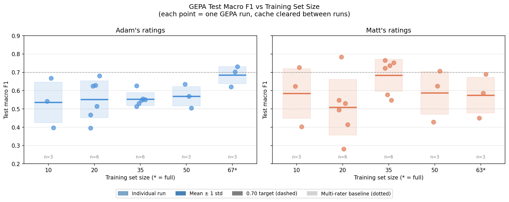

# Goal Alignment Scoring — Experiment Report

> **Note for the published version.** The two human raters are referred to as **Rater A** (the
> experimenter) and **Rater B** (a colleague) rather than by name. The findings below characterise
> individual raters' judgement and inter-rater agreement, which is not something to attach real
> names to. The underlying rating data is not included in this repository.

## Intro and TLDR:
### Problem

Users of a goal-tracking product can **pin** (confirm), **delete** (reject), or **leave** (neutral) content items that the system surfaces as relevant to their organizational goals. The existing production scorer (Haiku with few-shot examples) provides near-zero class-discriminative signal: scores are compressed into a narrow range (0.55-1.0) with overlapping distributions across all three action classes (macro F1 = 0.38-0.49 even with optimal thresholds).

We want an automated scorer that reliably _replicates individual users' pin/delete/neutral judgments_, targeting test macro F1 >= 0.70 representing 'strong' agreement.

#### Production Baseline

The existing production scorer (Haiku with few-shot pins/deletes) achieves — based on single evaluation runs:
- Against Rater A's ratings: macro F1 = 0.380 (optimal thresholds)
- Against multi-rater production: macro F1 = 0.493 (optimal thresholds)
- Deleted class F1 = 0.00-0.24 across all configurations

Our GEPA single-rater approach represents a **55-100% relative improvement** over the production baseline at the cost of a lot of compute and initial (and somewhat ongoing) accumulation of user 'pin' and 'delete' actions.

### Key Finding

**Goal alignment is a highly individual judgment. Per-user prompt optimization is required.**

A scorer trained on a single rater's data achieves test macro F1 = 0.68-0.73 (mean across fresh runs) with occasional runs reaching 0.76+. The same pipeline trained on multi-rater data caps at ~0.50. Cross-rater prompt transfer fails (F1 drops to 0.22-0.41). Inter-rater agreement is low (Cohen's kappa = 0.19-0.38). The bottleneck was never the model or the optimization method — it was contradictory training signal from multiple raters.

### Experiment TLDR
- Hand-rolled optimization loops (exploratory) grew into a [DsPY](https://dspy.ai/) pipeline making use of the [GEPA](https://dspy.ai/api/optimizers/GEPA/overview/) ("Genetic Pareto") algorithm included in DsPY
- GEPA uses a train and dev set of human rated 'pinned', 'deleted' or 'neutral' (user didn't pin, but also didn't delete - they did see it though). We also hold out a test set that is not used at all during the training pipeline and only used for post-hoc evaluations.
- Attempting to train a cross-rater prompt proved to hit a ceiling at around the measured inter-rater-agreement
    - This makes sense - if we as goal owners disagree on what exactly goal alignment means, then the prompt should at most, only be able to learn what we agree on.
- I rated all retrieved goal<>content pairs as pinned, deleted or neutral and trained on that which proved to be a small breakthrough
    - My internal understanding of goal alignment eliminates inter-rater variance, leaving only my own internal variance in my application of my mental model for judging goal alignment
    - **Led to a > 0.70 test F1 score on the held out samples** in a subset of runs
    - Uses 67 train + 35 dev = 102 total sample pairs of goal and rated content (along with an additional 38 held out test pairs)
- Optimization for the above took ~84 minutes, using Opus as Optimizer and Sonnet as scorer
    - Note, writing this, I realized I didn't measure tokens - but looking at platform.anthropic.ai, it looks to be 'more than a million, less than 10 million'... Another run with token logging would be needed.
- Rater B contributed their own ratings of (mostly) the same goal <> content pairs, providing a second single-rater set
   - Overlapping cases: 63 train, 28 dev; same 38 held-out test cases. Differences from seed data status + goal_alignments LLM call to retrieve initial cases.
   - **Replicated >0.70 test F1 score** on Rater B's data for a subset of runs.
- Remainder of experiment worked on ablating away either intelligence or training cases to see if we could improve on latency/cost and/or human effort. Five studies performed, but main findings:
    - Opus<>Sonnet seems to be a sweet spot; although given learnings on run-to-run variance in GEPA (below) means Sonnet<>Sonnet could be a good fast follow.
    - Prompts optimized via Opus<>Sonnet appear to work for Haiku during test inferrence with fairly minimal degredation
        - What's more, prompts optimized by Opus<>Sonnet appear to work better for Haiku than prompts optimized by Opus<>Haiku or Sonnet<>Haiku
    - More training data loosely = better results, but the learning curve is very noisy and we would need ~60-80 reps per training sample subset to find statistical significance - this experiment performed 3 reps for each subset, with 3 additional for the 20 and 35 pairs subsample
        - With repeated runs at 35 training samples + 30 dev (~2-3 rated goals), well performing prompts sometimes get found. However, at least 3 but probably 5 runs are needed
        - DsPY allows for disk caching which allows for easier boot-strapping as more train samples are collected. For study-5, train sub-sample ablation, this was turned off.
    - Prompts don't generalize across raters - using either a 'best' prompt for Rater A on Rater B, or a slimmed down manually tuned 'generic best prompt' (general guidelines for structure really), perform worse for Rater B than starting with a blank slate. Hypothesis is that the pre-optimized prompts drop the algorithm into a local min that it has to climb out of first (due to subjectiveness of goal alignment).
    - Prompts that are found are heavily over-fit to the individual rater and, to a lesser degree, the specific goals that are being rated
        - This implies that with every refresh of goals, we'd run 'refreshes' with updated pinned, neutral and deleted samples. With disk cache between runs, we should see these refreshes mostly producing new tokens for the net new samples
- This technique as a production solution is a discussion for another venue, but included here would be the 'settings' that this experiment found.

## Background: Pre-DSPy Work (Phases 1-4)

Before DSPy, we explored hand-rolled rubric discovery and pairwise ranking approaches. These established the difficulty of the problem and motivated the switch to automated prompt optimization. See `notes/research-log.md` for additional detail.

### Phase 1: Inter-Rater Agreement (ICC = 0.624)

Eight raters evaluated 47 A/B comparison cases. ICC(2,1) = 0.624 — moderate agreement. "Goal alignment" is partly subjective: easy pairs ICC = 0.688, hard pairs ICC = 0.540.

### Phase 2: Pairwise LLM-as-a-Judge and Bradley-Terry Ranking

Pairwise comparison ("which content is more aligned?") reached **0.74 test accuracy** with a generalization outer loop — the strongest pre-DSPy result. However, converting pairwise rankings back to pointwise classes failed badly in two different ways.

**Bradley-Terry ranking:** Scored boundary pairs with the pairwise rubric, then fit per-goal BT models. Model capability matters — Sonnet dramatically outperforms Haiku on the same rubric. BT scores provide natural class separation when the judge is accurate, but thresholds learned on dev achieved 0.700 dev F1 but only 0.356 test F1. N-choose-2 scaling is also prohibitive for production.

Despite pairwise comparison being a more learnable signal than direct class labeling, the conversion to ranked classes did not generalize. There may be other ways to translate a pairwise ranking into actionable classes, but we did not explore them.

### Phase 3: Pointwise LLM-as-a-Judge (test F1 = 0.644)

Hand-rolled rubric discovery with iterative refinement. Best result: test macro F1 = 0.644 after 20 rounds with generalization outer loop. The inner loop consistently overfits — dev keeps climbing while test plateaus after 3-5 rounds. Rubric size correlates with overfitting (v5: 40 signals, v18: 135 signals).

Key lessons:
1. Minimal prompts generalize better than elaborate ones
2. The inner loop always overfits
3. Embedding similarity provides zero signal for pin/delete — see section below
4. Rubrics from this technique are coupled to the scorer model they were optimized for; we later see that DSPy produces prompts for Sonnet that translate with small loss to Haiku.

### Embedding Similarity Provides No Signal

One of the clearest and most important findings from this work: **semantic embedding similarity between content and goal text is uncorrelated with human pin/delete decisions.** The histogram distributions of cosine similarity are essentially identical across pinned, neutral, and deleted items — there is no separating threshold.

This matters because it directly contradicts the intuition that "relevant content = aligned content." Goal owners are not simply asking "is this about my topic?" — they are exercising judgment about strategic fit, timing, organizational priorities, and personal relevance criteria that are invisible to embeddings. Semantic similarity is a necessary but far-from-sufficient condition for goal alignment as judged by goal owners.

This finding justified the move away from similarity-based approaches and toward LLM-as-a-judge with goal-specific calibration.

## Phase 5: DSPy GEPA Optimization

### Motivation

The hand-rolled pipeline hit a ceiling at 0.644 test F1, with persistent overfitting. **DSPy's GEPA (Generative Evolutionary Prompt Approach) offers automated prompt optimization with Pareto-front candidate selection** — a natural regularizer against dev overfitting. This is much more complicated than our hand-rolled linear inner + outer loop approach. GEPA explores prompt evolution across many Pareto trajectories, only merging or pulling from prompts that appear in the Pareto set.

### First GEPA Run (March 20, 2026)

Initial run on the multi-rater production data (5 goals, 32 train / 21 dev). Sonnet scorer, Opus optimizer, medium auto.

**Result: dev F1 = 0.591, test F1 = 0.545.** Below the hand-rolled pipeline's best (0.644) but with a much smaller dev-test gap (0.046 vs 0.15-0.35). GEPA produced interpretable calibration rules — the refined prompt read like a human-written rubric with specific scoring guidelines per goal.

### Expanded Data (12 goals, Haiku scorer)

Ran on the full 12-goal dataset with Haiku as scorer. **Test F1 = 0.486** — barely above majority-class baseline. Zero critical errors on test though, and Spearman 0.474 — the ranking quality was reasonable even with weak classification.

## The Single-Rater Breakthrough (March 24)

**This was the key turning point.** Rater A rated all goal alignments themselves (134 items across 12 goals), creating a single-rater dataset. Ran GEPA on Rater A's ratings vs the multi-rater production ratings on the same 134 items.

| Dataset | Dev F1 | Test F1 | Gap | Spearman |
|---------|--------|---------|-----|----------|
| **Rater A (single rater)** | **0.724** | **0.700** | **0.024** | **0.675** |
| Production (multi-rater) | 0.612 | 0.500 | 0.112 | 0.578 |

Rater A's ratings hit the 0.70 target for the first time. The production dataset overfits (gap 0.112 vs 0.024). Cross-rater analysis on the same 134 items: Cohen's kappa = 0.188, agreement rate = 46.3%. The raters agree on *relevance* but disagree on *what action to take*.

### Replication with Second Rater (Rater B)

Rater B independently rated goal alignments (125 items). **Test F1 = 0.791** (default thresholds) — even better than Rater A's, reinforcing the hypothesis that the single-rater advantage generalizes. Although more repetitions across different rater types/profiles would be needed to confirm that single-rater performance replicates broadly.

- Cross-rater agreement between Rater A and Rater B: kappa = 0.384.
- Rater A's best prompt applied to Rater B's data: test F1 = 0.216-0.409.

**Per-user optimization is not optional — warm-starts from one rater's best program do not translate to another rater under GEPA.**

## Scorer Model Comparison

Tested Sonnet, Opus, and Haiku as GEPA scorers on Rater A's data (Opus optimizer in all cases).

| Scorer | Test F1 | Gap | Spearman | Duration | Prompt style |
|--------|---------|-----|----------|----------|-------------|
| **Sonnet** | **0.700** | **0.024** | **0.675** | **84 min** | Goal-specific calibration tables (2,128 words, 43 score ranges) |
| Opus | 0.600 | 0.065 | 0.767 | 98 min | Abstract principles (4,631 words, 8 score ranges) |
| Haiku | 0.438 | 0.076 | 0.359 | 41 min | Compact rules (1,281 words, 23 score ranges) |

**Sonnet wins.** GEPA naturally calibrates prompt specificity to scorer capability — concrete tables for Sonnet, abstract principles for Opus. The deleted class is the discriminator: Sonnet 0.82 F1, Opus 0.73, Haiku 0.00.

Two interesting things pop out from this study:

1. **Opus as a scorer doesn't work as well as Sonnet.** Knowing what we know now about run-to-run variance this may be better stated as "Opus doesn't always work as well as Sonnet," but the implication is the same: use Opus for optimization only. My hypothesis is that with limited examples, general principles (which Opus seems to favor when it's also the scorer) don't fully capture the distribution. We need to "overfit" to the goal owner's judgment with so few examples, and Sonnet's lower intelligence — while still enough to help discover the prompt — draws out specific step-by-step instructions that are executable at inference.

2. **A Sonnet-optimized prompt works _better_ for Haiku at inference than a Haiku-optimized prompt** (0.664-0.785 vs 0.438). GEPA with a stronger scorer discovers more explicit, mechanically-executable calibration rules that weaker models can follow without strong reasoning. What's more, the Sonnet-discovered prompt is only marginally degraded when run on Haiku, **implying that Haiku for inference using a Sonnet-discovered prompt could be viable for a production setting.**

## Metric and Output Format Experiments

### Direct Action Labels Cause Overfitting

**Replacing score thresholds with direct LLM action labels (pinned/neutral/deleted) consistently increased overfitting.** Dev F1 improved (~0.10 higher) while test F1 degraded (~0.07-0.08 lower). The dev-test gap went from 0.024 to 0.15-0.20.

**Hypothesis for why:** Score thresholds act as a regularizer. They force GEPA to optimize a continuous signal rather than a discrete classification decision across only 3 classes. The continuous signal allows the evolutionary algorithm to find more nuanced comparative rules — maintaining transitive coherence (A > B > C) is harder when A and B are in the same class with no distinguishing score.

### Margin Bonus Hurts Score Fidelity

Adding a margin bonus (rewarding scores far from thresholds) degraded Spearman from 0.817 to 0.511 and test F1 from 0.764 to 0.651. The bonus pushed GEPA toward extreme scores, distorting the distribution rather than improving separation. While more runs to account for LLM variance would be needed, directionally it points to no real improvement.

**Lesson:** The simplest metric (1.0 correct, 0.25 adjacent, 0.0 critical) produced our best results. Don't add auxiliary optimization objectives to GEPA metrics.

### Post-Hoc Threshold Optimization

Grid-searching optimal (pinned_threshold, deleted_threshold) on dev scores after GEPA optimization. This is free (no LLM calls) and decouples "teach the LLM to score well" from "find the right decision boundaries." The boundaries we provide as guidance don't get fit exactly but help as an initial mold for the LLM to work scores into.

**Impact:** Can improve test F1 by 0.05-0.12 when the default thresholds don't match the rater's natural decision boundaries. A trigger heuristic applies post-hoc thresholds only when the default dev-test gap exceeds 0.10 after training.

## Ablation Studies

> **Note on single-run ablation results:** Studies 1-4 were conducted before we understood GEPA's run-to-run variance. Each was a single run. Results should be treated as directional, not definitive. Studies with large deltas (e.g., light vs medium effort: 0.438 vs 0.764) are likely robust; smaller differences may reflect variance rather than configuration effects.

### Study 1: Scorer Downgrade at Inference

Can we optimize with Sonnet but deploy with Haiku?

| Rater | Sonnet test F1 | Haiku test F1 | Retained |
|-------|---------------|---------------|----------|
| Rater A | 0.764 | 0.664 | 87% |
| Rater B | 0.791 | 0.785 | 99% |

**Haiku appears viable for a production inference setting.** Rater B retains 99% of Sonnet's performance. The Sonnet-optimized prompt's explicit calibration tables give Haiku enough structure to execute without strong reasoning. Rater A's prompt suffers a little more but approaches the 0.70 threshold we treat as "good enough."

### Study 2: Optimizer Downgrade (Sonnet-Sonnet)

Can Sonnet serve as both optimizer and scorer (~5x cost reduction)?

| Rater | Opus optimizer | Sonnet optimizer |
|-------|---------------|-----------------|
| Rater A | 0.764 | 0.715 |
| Rater B | 0.791 | 0.639 |

**Inconsistent — Opus remains preferred.** Rater A's drop is borderline (-0.049), Rater B's is substantial (-0.152). Sonnet's self-reflection likely falls into local optima more easily given lower intelligence. Given the wide run-to-run variance, this is one study worth re-running a few times to see whether we caught the low end of the Sonnet optimizer distribution.

### Study 3: GEPA Effort Level

| Effort | Candidates | Rater A test F1 | Rater B test F1 |
|--------|-----------|-------------|-------------|
| Light (6) | 6 | 0.438 | 0.681 |
| **Medium (12)** | **12** | **0.764** | **0.791** |
| Heavy (18) | 18 | 0.594 | 0.718 |

**Medium is the Goldilocks zone.** Light under-explores; the optimization doesn't generate enough candidate prompts to find good calibration. Heavy over-explores for harder rater profiles and overfits the dev set. Performance follows an inverted-U curve with exploration budget.

### Study 4: Warm-Starting from Another Rater

Can we seed GEPA with an existing optimized prompt to converge faster?

| Seed | Effort | Rater B test F1 |
|------|--------|-------------|
| Cold (baseline) | medium | **0.791** |
| Rater A-specific | medium | 0.610 |
| Rater A-specific | light | 0.556 |
| Generic template | medium | 0.765 |

**Cold-start wins.** Another rater's prompt biases GEPA toward wrong calibration. GEPA must escape the prior rater's local optimum before it can find the new rater's — burning optimization budget in the wrong direction. A generic template (all rater-specific calibration stripped) is neutral (0.765) but doesn't beat cold-start. Each user should be optimized from scratch.

### Study 5: Minimum Viable Training Set and GEPA Variance

We ran 3-6 independent GEPA optimizations at each training set size (10, 20, 35, 50, full) for both raters, with the DSPy cache fully cleared between each run to ensure independent optimization trajectories.

#### Key finding: GEPA has significant run-to-run variance

| Config | Mean Test F1 | Std | Min | Max | Repetitions |
|--------|-------------|-----|-----|-----|-------------|
| Rater A full (67) | 0.684 | 0.057 | 0.620 | 0.730 | 3 |
| Rater A n=35 | 0.554 | 0.039 | 0.513 | 0.626 | 6 |
| Rater A n=20 | 0.552 | 0.110 | 0.396 | 0.681 | 6 |
| Rater B full (63) | 0.575 | 0.120 | 0.450 | 0.689 | 3 |
| Rater B n=35 | 0.684 | 0.095 | 0.548 | 0.765 | 6 |
| Rater B n=20 | 0.509 | 0.166 | 0.281 | 0.784 | 6 |

**Variance is an inherent property of GEPA + temp=1.0 optimizer.** The optimizer (Opus, temp=1.0) proposes new instructions stochastically — different runs generate different candidates, which cascade through GEPA's evolutionary loop into substantially different final prompts. This is expected behavior and is the documented temperature used in the original GEPA paper.

The earlier "best" single results (Rater A 0.764, Rater B 0.791) exceed the Study 5 means and were not replicated with cache cleared between runs. The most likely explanation is natural GEPA variance: rare favorable optimization trajectories that our 3-6 rep sampling doesn't reliably reproduce. With clean cache and 3-6 reps, mean performance is 0.684/0.575 for full training sets — still well above the multi-rater baseline (0.500) and production baseline (0.380-0.493).

#### Training set size findings

No statistically clear learning curve emerges at 3-6 reps per point. Key observations:
- **Full train outperforms subsamples for Rater A** (balanced distribution; mean 0.684 vs ~0.55 for smaller sizes)
- **Rater B n=35 surprisingly competitive with full train** (mean 0.684 vs 0.575 full) — their deleted-heavy distribution may provide cleaner signal in fewer items
- **n=35 has lower variance than n=20** across both raters (std 0.039-0.095 vs 0.110-0.166)
- **n=10** shows high variance and unreliable performance — insufficient for GEPA to find stable calibration

> **Statistical note:** To detect a 0.05 F1 difference with 80% power given σ≈0.10 requires ~63 reps per configuration. With 3-6 reps, pairwise t-tests between adjacent sizes have standard errors of 0.04-0.09, so only large effects are detectable. Checking each adjacent pair: for Rater A, the only near-significant step is n=50 → full (means 0.570 → 0.684, t≈2.3, p≈0.07 with ~4 df), suggesting full train meaningfully helps balanced datasets. For Rater B, the n=20 → n=35 step is the strongest signal (means 0.509 → 0.684, t≈2.2, p≈0.07), but then performance is flat or declining toward full train — inconsistent with a monotonic learning curve. The data is compatible with multiple underlying shapes: a flat curve with high variance, a U-shape for Rater B, or a modest positive slope for Rater A that becomes visible only near the full dataset size.

## DSPy Cache Management

DSPy 3.x caches all LLM responses at `~/.dspy_cache/` (diskcache FanoutCache) plus an in-memory LRU cache. Caching is enabled by default.

**For ablation studies requiring independent runs:** Clear both caches between runs using `dspy.cache.memory_cache.clear()`, `dspy.cache.disk_cache.clear()`, and `dspy.configure_cache()`. Do not use `cache=False` on `dspy.LM()` — this disables within-run determinism and corrupts GEPA's Pareto selection by allowing the same candidate to score differently on re-evaluation.

The initial autonomous ablation script had two compounding bugs: (1) misuse of the `rollout_id` parameter on the optimizer LM, which caused in-run cache misses and broke within-run determinism for the optimizer's reflection calls; (2) overly aggressive LiteLLM cache clearing that interacted with (1) to produce unreliable scoring across the same candidate in a single GEPA run. The fix was to revert to simple `.clear()` calls on the cache objects with `configure_cache()` re-initialization, keeping caching fully enabled during each run.

## Recommended Configuration for a Production Setting
There's a broader discussion to be had regarding whether this is a production solution for the problem at hand. We may not need to try and be as 'perfect' as possible, but if looking to optimize for the judgement of the goal owner on what _they think goal alignment means_ than this experiment would recommend the below 'settings' - although, the solution space is broad and we went deep on prompt optimizations, while ruling out semantic similarity, but left other potential approaches unexplored (e.g. RAG supported LLMaaJ, named entities/keyword extraction - to name a couple).

_DsPY GEPA Settings:_

| Parameter | Recommendation | Evidence |
|-----------|---------------|----------|
| Optimizer model | Opus | Sonnet-Sonnet inconsistent across raters (Study 2) — worth re-running to confirm |
| Scorer (optimization) | Sonnet | Best quality; concrete calibration tables |
| Scorer (inference) | Haiku or Sonnet | Haiku retains 87-99% at ~10x lower cost (Study 1) |
| GEPA effort | `auto="medium"` | Light under-explores, heavy over-explores (Study 3) |
| Warm-start | No (cold-start) | Cross-rater and generic both hurt or neutral (Study 4) |
| Minimum items | 35+ | n=35 provides best variance/quality tradeoff (Study 5) |
| Strategy | Run 3×, pick best on dev | Expected best ≈ 0.65-0.75 per rater (Study 5) |
| Optimization time | ~84 min/run × 3 runs | **~4.2 hours per user for first optimization** |
| Expected test F1 | Mean ~0.68, best-of-3 ~0.70-0.73 | Study 5, 6 reps each |
| Post-hoc thresholds | Apply when dev-test gap > 0.10 | Helps when GEPA overfits dev |

**For production:** Leave caching enabled. There is no need to clear cache between sequential optimization runs for the same user — cached scoring calls carry over and avoid redundant API calls. Whether accumulated optimizer proposals meaningfully improve subsequent runs is an open question; our ablation work clears cache between runs by design to measure independent trajectories.

## Open Questions

1. **Retraining cadence** — Once deployed, when to retrain? Every N new labels? On new goal sets? On a schedule? Current setup is one-shot optimization.

2. **Bootstrap for new users** — What to do before a user has 35+ labeled items? Fall back to production baseline? Use a generic prompt?

3. **Per-(user, goal) rubrics** — We optimize per-user, but goals also vary within a user. Should we have separate rubrics per (user, goal) pair? Scales quadratically in cost. Goals per owner are low enough that prompts currently capture specific patterns for each goal type fairly well.

4. **Variance reduction** — Can we reduce GEPA's run-to-run variance without sacrificing quality? Options: lower optimizer temperature (reduces diversity but improves consistency — goes against paper baseline), or `auto="heavy"` with more candidates to average over.

5. **Scaling to many users** — At ~4.2 hours per user for 3 optimization runs, 100 users = 420 compute-hours. Requires parallelization and cost optimization before production deployment. Whether we could meta-optimize a lighter model on GEPA traces to reduce the scorer/optimizer intelligence requirements is an open question.
