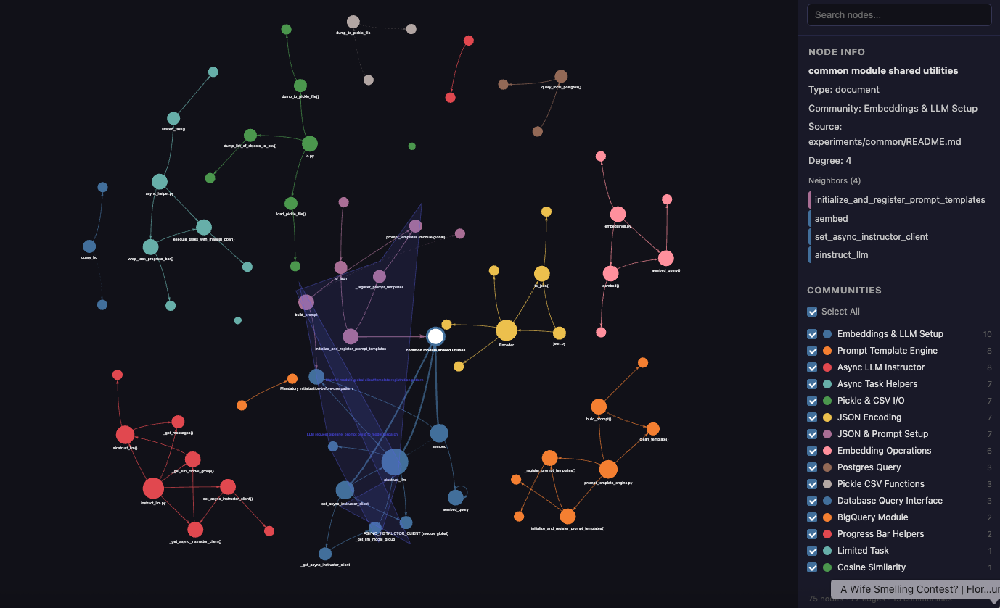

# First impressions running graphify

## /graphify ../common

As a test I ran graphify generation on the experiments `common/` directory.

As per the Skills file, Claude went through and executed a bunch of python blocks, each importing whatever is needed (including graphify) and generated the graph.

**The invocation path felt rough.**

The output is exactly what the graphify docs explain: `graph.html`, `GRAPH_REPORT.md`, `graph.json`.

The `graph.html` is kind of cool. Click it to open in a browser:

You can explore the graph and communities in a visual way.

- Communities are displayed as different coloured nodes.
- Communities can be filtered in the sidebar.
- Different types of edges are different types of lines, e.g. solid, dashed, etc.
- Shaded areas represent hyperedges, and are labelled separately.

## /graphify query "<query_question>"

I started with some simple stuff like `/graphify query "what are the god nodes"`.

Again, the mechanics are awkward - it runs a bash command block. Also, there is a command request after the response to save the query - this is kind of annoying since I got a response but then have to deal with another command request.

The queries are saved in a `memory/` directory for future reference. By running the graph again, `/graphify ../common --update`, the memories are saved into the graph.

To be fair, the output is pretty good, in terms of what is in the graph.

## /graphify path "A" "B"

runs a shortest-path on the existing graph between two named nodes "A" and "B", and prints the hop sequence with each edge's relation and confidence. Then Claude explains in plain language what each hop means.

Again, bash blocks are executed to do this and a command request to save the memory is executed after the path is processed.

## /graphify explain "<node_name>"

Plain language explanation of a given node.

Again, bash blocks are executed to do this and a command request to save the memory is executed after the path is processed.

## Overall impressions

Overall, seems pretty cool to query and interact with the graph.

Driving everything through bash command blocks is awkward, but it works.

Also, it is kind of annoying that after the bash command is executed and the response is outputted, there is a new command request to save the query into a memory. So, I can't just read the output - instead I have to deal with saving the memory. Also, when the memory write command request comes up, there is no way to add it to an allow list, so the command request has to be manually okayed.

The output responses can be pretty technical too. for example: "io.py is the file node for experiments/common/io.py:1 in Community 4 (Pickle & CSV I/O). Degree 3 — it contains exactly three functions...". So, the "community 4" is kind of meaningless.
