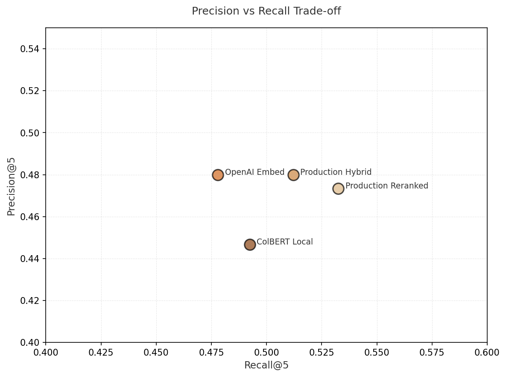
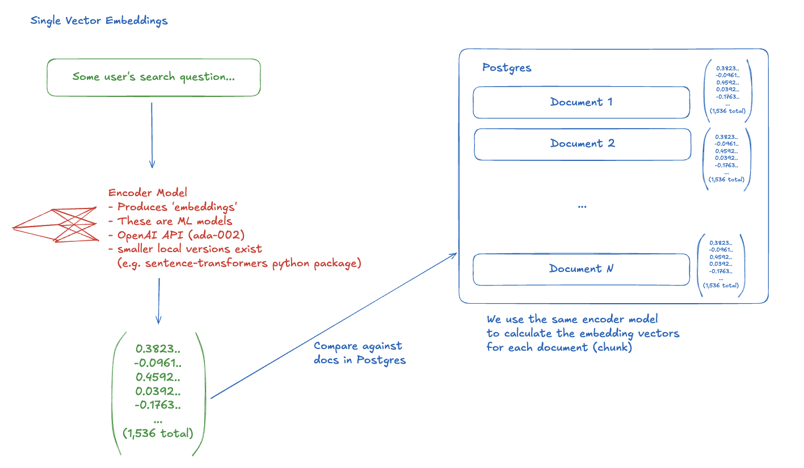
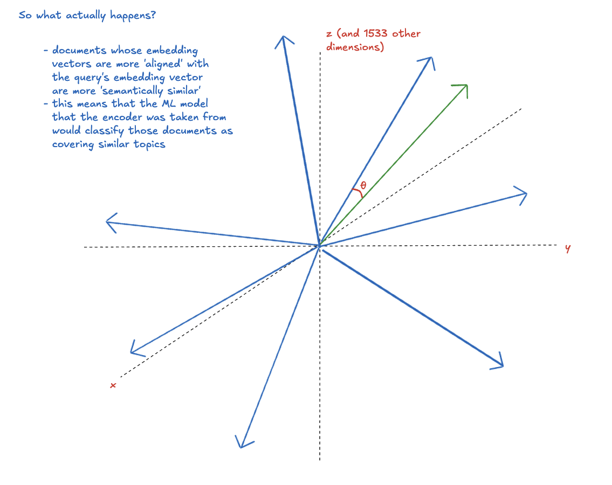
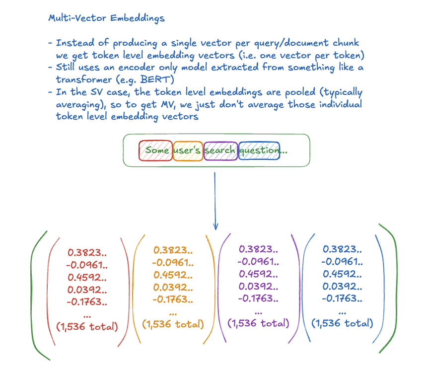
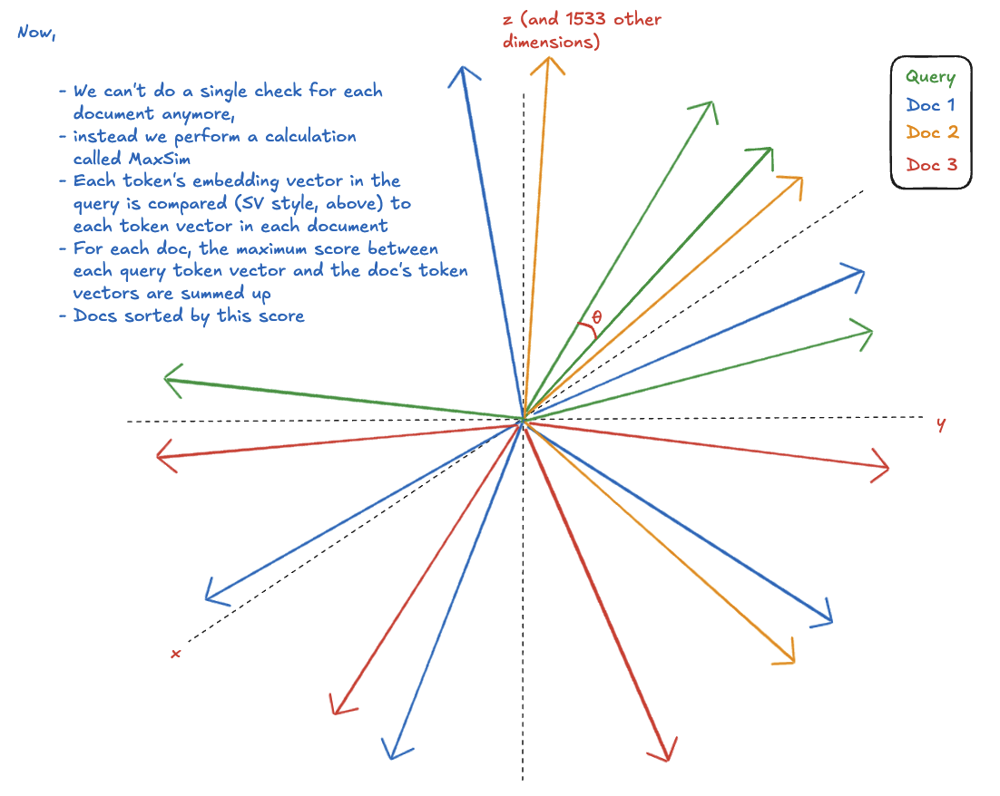

# TLDR

- Sofia's work in the summer found that multi-vector (MV) embeddings are superior to single-vector (SV) embeddings for search and retrieval
- This experiment started as an exploration of what implementation might look like, answered that, and evolved a little into trying to replicate/validate the summer results
- This experiment is, so far, not finding a statistically significant lift in MV performance over our existing production search method
- Further, implementing any MV search or ranking would require either (i) hosting our own MV embedding model (e.g. Jina's colbert-v2 model) which can be heavy and practically require GPU acceleration, or (ii) using a new embedding API provider (again, e.g. Jina) to return the MV embedding arrays

# Experimental Setup

- Four search techniques were used in the comparison: Local Multi-Vector Search, SV cosine similarity, Production search (hybrid keyword + SV), and a MV reranking over Production Search ("MV reranking")
- Using the seed content table (~700 documents), MV embedding arrays are generated for each document and stored in the same table in postgres using pgvector's array functionality; SV embeddings already exist from prod in the table
- All documents with MV embeddings are then randomly shuffled and batched into batches of 50; each batch is sent to the LLM (sonnet-4.5, thinking enabled), and the LLM is asked to generate queries which would be answered by some subset of the retrieved documents. Documents that answer a given LLM generated query are tagged as 'ground truth' for that query
- For each generated query, we now run all four methods and pool their results (that is, create a set of all unique docs retrieved, and for each doc in this set, tag which technique retrieved it)
- In a simple local FastAPI UI, (below), I can then go through each query x retrieved doc and rank the relevancy of the retrieved doc as:
  - 0 - not at all relevant
  - 1 - somewhat relevant
  - 2 - relevant
  - 3 - highly relevant
- Importantly, in this UI, I do not see which techniques retrieved the doc being evaluated

(A screenshot of this eval UI was removed before open-sourcing — it rendered real document
titles and user identifiers.)

# Results

Once all the docs from enough queries are ranked for relevancy, we can calculate the following metrics:

- **MRR (Mean Reciprocal Rank):** Measures how quickly users find a relevant result. It's the average of 1/(position of first relevant doc) across all queries. Higher is better, ranges from 0 to 1.
  - Example: If the first relevant doc typically ranks 1st, MRR = 1/1 = 1.0; if it typically ranks 3rd, MRR = 1/3 = 0.33
  - Note: "Relevant" = documents annotated with score >= 2

- **Recall@K:** Measures what proportion of all relevant documents appear in the top K results. As K increases, Recall can only increase or stay flat (searching deeper finds more docs).
  - Example: If a query has 6 relevant docs and only 3 appear in top-5, Recall@5 = 3/6 = 50%. If all 6 appear in top-10, Recall@10 = 6/6 = 100%

- **Precision@K:** Measures what proportion of the top K results are actually relevant. Answers "Of what you returned, how much was useful?"
  - Example: If top-5 results contain 3 relevant docs, Precision@5 = 3/5 = 60%
  - Unlike Recall, Precision typically decreases as K increases (more results = more noise)

- **NDCG@10 (Normalized Discounted Cumulative Gain):** Measures how well the system ranks results by relevance. Ranges from 0 to 1; higher is better.
  - Uses your full relevancy scores (0-3), not just binary relevant/not-relevant
  - Calculation: Compares the system's ranking to an ideal ranking (all relevant docs sorted by score)
  - Position weighting means highly relevant docs ranked low hurt the score more than low-relevance docs ranked low

**Dataset:** 705 indexed documents; 375 total queries generated, 7072 total retrieved docs to annotate; 30 queries / ~575 docs annotated for the results below.

## Overall Performance (30 queries, ~575 annotations)

| Metric | ColBERT Local (MV) | OpenAI Embed (SV) | Production Hybrid | Production + MV Rerank |
|--------|-------------------:|------------------:|------------------:|-----------------------:|
| **MRR** | 0.619 | 0.621 | 0.646 | **0.685** |
| **Recall@1** | 9.2% | 8.7% | 9.9% | **11.7%** |
| **Recall@5** | 49.2% | 47.8% | 51.2% | **53.3%** |
| **Recall@10** | 100% | 100% | 100% | 100% |
| **Precision@1** | 40.0% | 40.0% | 43.3% | **50.0%** |
| **Precision@5** | 44.7% | **48.0%** | **48.0%** | 47.3% |
| **Precision@10** | 46.0% | **50.0%** | 47.3% | 46.7% |
| **NDCG@10** | 0.760 | 0.772 | **0.790** | 0.789 |

**Key Findings:**
- **No statistically significant differences** between any methods (all p-values > 0.05)
- Production Hybrid performs best on NDCG@10 (0.790)
- MV Reranking shows highest MRR (0.685), Recall scores, and Precision@1 (50%), but differences are not statistically significant
- OpenAI Embed (SV) surprisingly has highest Precision@10 (50.0%), meaning half its top-10 results are relevant
- All methods show moderate precision (40-50%), indicating ~50% of returned results contain some irrelevant documents
- ColBERT Local (pure MV) does not outperform simpler approaches on any metric
- All methods achieve perfect Recall@10, indicating all relevant docs appear in each system's top-10 results

### Recall and Precision @ 5

### Statistical Significance Tests (Paired t-test on NDCG@10)

| Comparison | NDCG Δ | p-value | Significant? |
|-----------|-------:|--------:|:------------:|
| Production Hybrid vs. ColBERT Local | +3.8% | 0.166 | ✗ |
| Production Reranked vs. ColBERT Local | +3.7% | 0.181 | ✗ |
| Production Hybrid vs. OpenAI Embed | +2.3% | 0.214 | ✗ |
| Production Reranked vs. OpenAI Embed | +2.1% | 0.318 | ✗ |
| Production Hybrid vs. Production Reranked | +0.1% | 0.897 | ✗ |

**Note:** With only 30 queries evaluated, we lack statistical power to detect small-to-moderate differences. Standard IR evaluations use 50-100+ queries for reliable conclusions.

## Latency Performance

Query latency measured across all 375 test queries (~700 indexed documents):

| System | Mean (ms) | Median (ms) | P95 (ms) |
|--------|----------:|------------:|---------:|
| **Production Hybrid** | **895** | **833** | **1,412** |
| **Production Reranked** | 7,765 | 7,271 | 11,396 |
| **OpenAI Embed (SV)** | 38,020 | 37,937 | 38,618 |
| **ColBERT Local (MV)** | 56,910 | 56,880 | 57,618 |

**Key Findings:**
- **Production Hybrid is 8-64x faster** than alternatives (under 1 second median)
- **MV Reranking adds ~7s overhead** (Jina API call) but still faster than local embedding methods
- **Local embedding generation dominates latency**: Both OpenAI and ColBERT require re-embedding the query
- **ColBERT Local slowest**: 57s median includes token-level embedding generation on MPS device
- Production methods leverage pre-computed embeddings, avoiding query-time encoding costs

**Note:** Latency measured on MacBook Pro with MPS device. Production deployment with GPU or embedding caching would show different characteristics.

# Stratification of Queries

Not all queries are made equal. Some are simple factoid style questions, "What email provider do we integrate with?"; others are navigational, "Show me all emails between myself and Ben"; and others still are exploratory, "How has our product strategy evolved in 2025?".

The hypothesis is that some techniques will perform better or worse depending on the type of query.

In an attempt to analyze this behaviour, we ask the LLM to classify the generated test queries according to one of the query categories. We can then partition the annotated queries by classification and re-run the evaluation analysis.

Below we show results for the same 30 queries, however as we only started with 30 queries, none of the categories have enough annotated queries to draw confident conclusions. These results are demonstrative only of what we would analyze with more annotated queries:

### Performance by Query Type

**Factoid Queries (8 queries)** - Seeking specific facts or answers

| Metric | ColBERT Local | OpenAI Embed | Production Hybrid | Production Reranked |
|--------|-------------:|-------------:|------------------:|--------------------:|
| **MRR** | 0.570 | 0.460 | **0.597** | **0.643** |
| **Recall@5** | 53.1% | 44.8% | 47.2% | 47.2% |
| **NDCG@10** | 0.711 | 0.695 | **0.740** | 0.739 |

**Navigational Queries (16 queries)** - Finding specific documents

| Metric | ColBERT Local | OpenAI Embed | Production Hybrid | Production Reranked |
|--------|-------------:|-------------:|------------------:|--------------------:|
| **MRR** | 0.605 | 0.632 | 0.653 | **0.693** |
| **Recall@5** | 49.3% | 47.7% | **54.3%** | 53.9% |
| **NDCG@10** | 0.790 | 0.787 | **0.807** | 0.802 |

**Exploratory Queries (6 queries)** - Broad topic investigation

| Metric | ColBERT Local | OpenAI Embed | Production Hybrid | Production Reranked |
|--------|-------------:|-------------:|------------------:|--------------------:|
| **MRR** | 0.722 | **0.806** | 0.694 | 0.722 |
| **Recall@5** | 43.9% | 52.1% | 48.4% | **59.5%** |
| **NDCG@10** | 0.746 | **0.836** | 0.814 | 0.822 |

**Interesting Findings:**
- **Exploratory queries show largest performance gaps**: OpenAI Embed significantly outperforms ColBERT Local (p=0.044, NDCG +10.8%) - opposite of expected pattern
- **Sample sizes too small**: Factoid (n=8), Exploratory (n=6) categories lack power for reliable conclusions
- **Navigational queries**: Most consistent performance across all methods (no significant differences)
- **Production methods generally lead**: Hybrid and Reranked consistently competitive across all query types

# Conclusion and Recommendation

One of Sofia's findings was that the multi-vector approach really starts to shine on longer documents/chunks. This intuitively makes sense as single vectors are forced to capture too much meaning across a long document, causing it to 'average' towards a central mean. Multi-vectors on the other hand retain nuanced semantic meaning as no averaging/pooling of meaning takes place.

However, our content is often short (comments, emails, meeting transcript chunks), and when it is not (google docs, say) our keyword weights in the production hybrid search makes up for the averaged semantic meaning.

With the results of this experiment in mind, as well as this context, the recommendation is to **not adopt multi-vector search or reranking in favour of staying status quo with our current production search**.

# Appendix

## What are Semantic Embedding Vectors?

If while reading this, you found yourself struggling with an intuition for what these vectors are, the below may be helpful:

