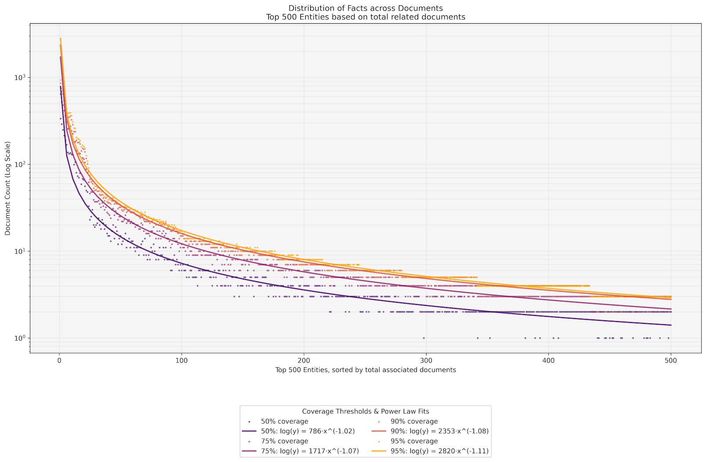
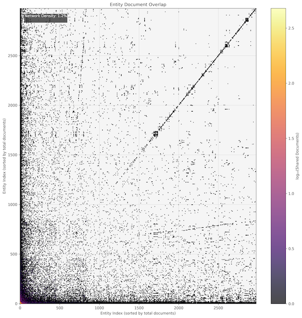
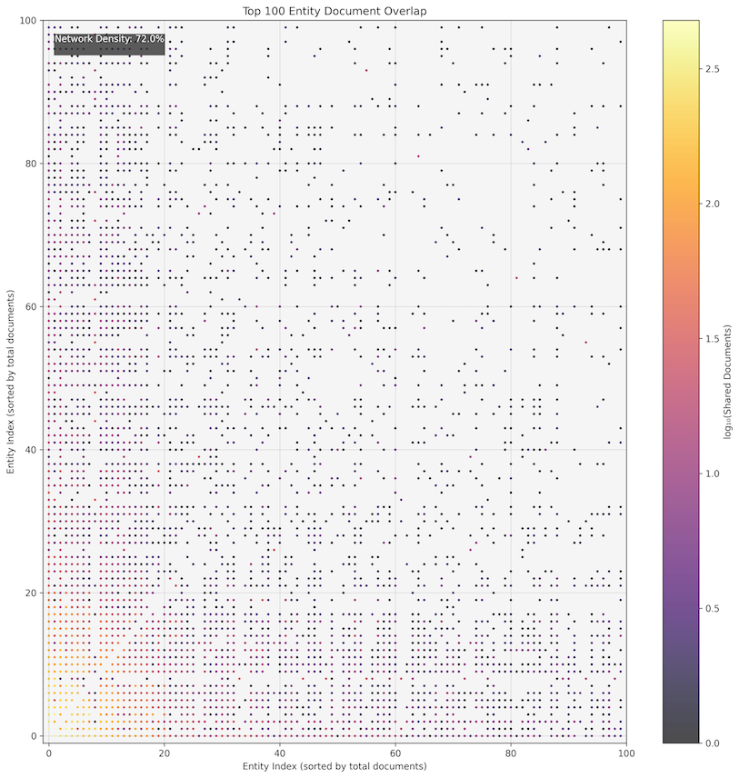
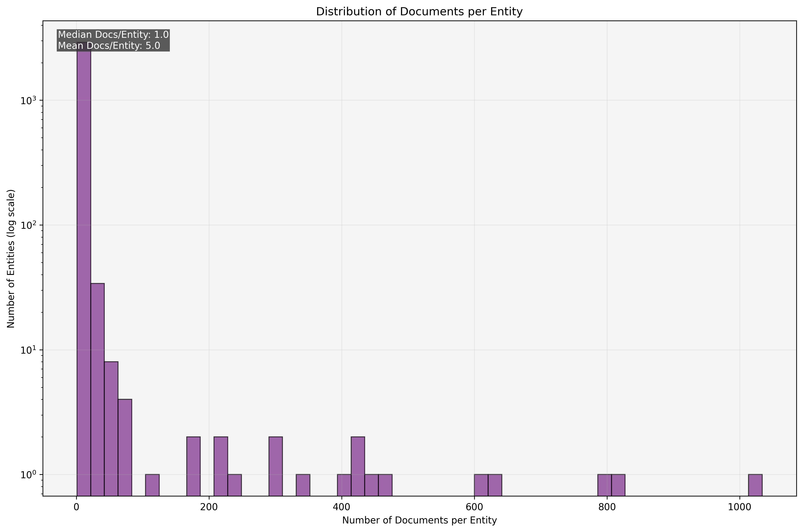
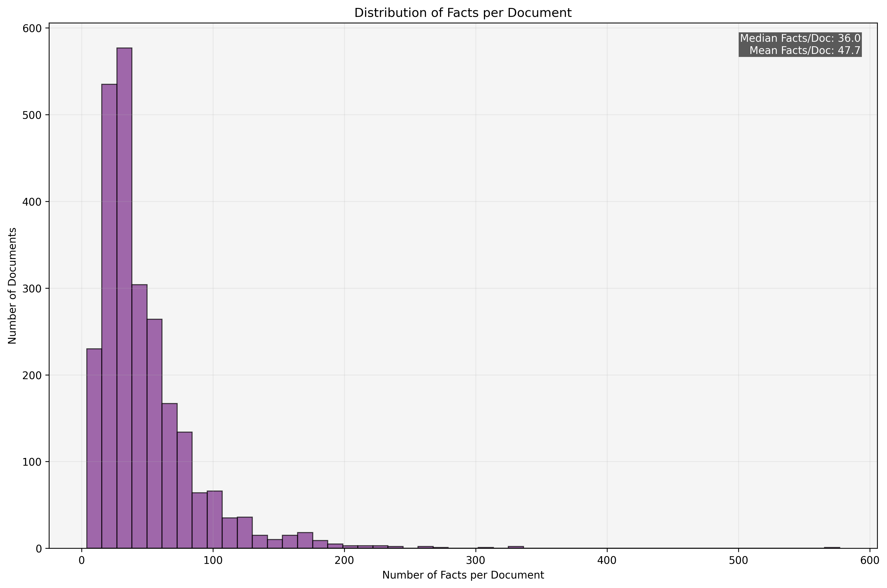

# README

This experiment contains code for building and analyzing named entity knowledge stores based on Facts pulled from individual documents in `cloudsql_decide_public.content` (scoped to Convictional Org).

The main output of this work is writing contained in an essay [internal doc, not public]. The implementation of this experiment is documented in a write up [internal doc, not public].

The experiment can be run by:

```bash
cd experiments
poetry install
gcloud auth application-default login  # If not previously auth'd
make run_experiment ARGS="named_entity_knowledge_store"
```

## High Level Findings
We analyzed 3,281 distinct entities across 16 categories, tracking over 100,000 individual facts about these entities. What emerged was a fascinating pattern in how knowledge is distributed across documents.

### The Power Law of Knowledge Distribution

The most striking finding was just how concentrated knowledge tends to be. For most entities:

- 50% of everything we know about them comes from just 1-2 documents
- 95% of their knowledge is contained in 5-6 documents
- Only 4.7% of entities need more than 10 documents to capture 95% of their knowledge


**Fig 1:** The top 500 entities, ranked by total documents their respective facts span, show the super-exponential drop off in the number of documents needed to span 50% \- 95% of an entity’s facts. We sort entities, descending, by the number of associated documents and plot how many documents are required to reach the varying levels of fact coverage (‘x’ marks). The y-axis has been logged, meaning small integer values are ‘spread’ out leading to the plateaus \- as we see at the start of the long tail, many documents reach less than 5 documents needed to cover 50% of facts. The vertical spread between the blue (50% fact coverage) and green (95% fact coverage) represents the number of additional documents (log-scale) needed to bridge the fact coverage gap.

This has profound implications for RAG implementation. With typical LLM context windows now handling 8-10 documents comfortably (although LLM attention can still be a limitation), pure RAG is theoretically sufficient for over 95% of entities. But the devil, as always, is in the details.

## **The Impact of Entity Size on Knowledge Distribution**

Our analysis revealed a clear pattern: the size of an entity \- measured by the number of facts about it \- strongly influences how its knowledge is distributed across documents. We identified three distinct categories:

###

###

|  | The Long Tail: Small Entities | The Middle Ground: Medium Entities | The Complex Core: Large Entities |
| ----- | ----- | ----- | ----- |
|  | *These small entities are highly efficient from a knowledge management perspective. They rarely cross document boundaries, making them ideal candidates for pure RAG approaches.* | *Medium entities strike a good balance \- while their knowledge spans multiple documents, they remain manageable. Only a small fraction (4.3%) require more than 10 documents for complete coverage.* | *These entities present the greatest challenge for knowledge management. Despite being few in number, they are often your organization's most important entities, and their knowledge is spread across many documents.* |
| ***Size (\# of Assoc. Facts)*** | 1 \- 10 | 11 \- 100 | 100+ |
| ***Proportion of all Entities*** | 67.8% | 28.8% | 3.4% |
| ***Typical Entity Types*** | Individual features, minor projects, peripheral team members | Active projects, core products, team leads | Mission-critical systems, key personnel, major initiatives |
| ***Coverage Pattern*** | Remarkably contained \- typically all facts about these entities are found in a single document | Moderately spread \- typically needs 3-4 documents for comprehensive coverage | Widely distributed \- requires an average of 94 documents for comprehensive coverage |

###

This size distribution has important implications for system design. While pure RAG works well for over 95% of entities (the small and medium categories), that crucial 3.4% of large entities may benefit from more sophisticated handling through entity pre-processing.

## **Implementation Approaches: Finding the Right Balance**

While our data suggests RAG is sufficient for most cases, implementing any approach requires careful consideration of practical tradeoffs. Our production experience has revealed key insights about different implementation strategies:

|  | Pure RAG: The Simple Foundation | Entity Pre-processing: When Complexity Adds Value |
| ----- | ----- | ----- |
| **Advantages** | *Pure RAG offers compelling advantages through its simplicity:* Straightforward pipeline: index documents, store vectors, retrieve, and pass to LLM Always fresh data without maintaining separate knowledge stores No schema maintenance overhead Lower operating costs | *Entity pre-processing provides important benefits for specific use cases:* Improved token efficiency through pre-extracted facts Consistent, deterministic entity views Ability to synthesize information across many documents Type-aware optimization for different entity categories |
| **Challenges** | *However, production deployments reveal important limitations:* Inconsistent responses due to varying document combinations Token inefficiency from including potentially irrelevant content Challenges handling that critical 3.4% of large, complex entities | *But these benefits come with significant costs:* Complex processing pipelines to maintain including temporal and knowledge decay aspects Risk of stale data as information about Entities evolves Schema lock-in and migration complexity Higher processing and storage overhead even in a lightweight approach  |

## Our Research Implementation

Our analysis is based on experimental processing of approximately 2,400 documents spanning GitHub Issues and PRs, Google Drive docs, in-app activity, and meeting transcripts. Here's what we learned from building and analyzing this test dataset:

### **Entity Extraction Process**

We used LLMs(specifically `claude-3-5-sonnet-20241022`) to:

1. Extract entities from documents, categorizing them into 16 types
   * We use Instructor to ensure structured responses
   * We perform an individual glean of each document to extract entities
   * We only chunk documents when/if they surpass the context limit
2. Extract facts about each entity with confidence scores
   * In order to drive completeness, we perform an individual glean of the document for each entity
   * While highly token inefficient, this was necessary to help the LLM properly apply attention \- particularly on long documents
3. De-duplicate entities using embedding similarity, but simply concatenate facts preserving ties to documents
   * We don’t de-duplicate facts as we want to be able to inherit permissions from the underlying documents in order to provide only Facts that the user (or users) would have appropriate access to.
4. Generate entity summaries from consolidated facts
   * For our purposes, we generate a summary for debugging purposes, but it is important to note that this could be replaced with any job over the individually retrieved Facts from the entity at query time.

This process gave us valuable insights into knowledge distribution patterns and the challenges of entity-based knowledge management, though it wasn't implemented as a production system.

## Considerations

### Document Chunking

While our analysis has focused on document-level retrieval, it's important to acknowledge the role of document chunking in RAG systems. Chunking \- breaking documents into smaller pieces \- can increase the number of "documents" you can include in a context window and often improves retrieval relevancy by creating more focused semantic units.

However, chunking introduces its own tradeoffs. While it allows for more granular retrieval, it can actually exacerbate entity fragmentation. Consider a document that discusses a project holistically \- chunking might spread this naturally cohesive information across multiple pieces, potentially losing important context in the process. Our analysis suggests that, with aggressive chunking, entities can end up spread across even more chunks than their original document count would suggest.

Chunking also doesn't fully solve the token efficiency problem. While you can fit more "documents" in a context window, you still risk including irrelevant information within chunks, and the semantic boundaries created by chunking may not align with natural knowledge boundaries about entities.

We chose to focus our analysis on document-level metrics as they provide a clearer picture of how knowledge naturally clusters. However, practitioners should consider how their chunking strategy might affect these patterns. The choice of chunking approach \- whether by fixed token count, semantic boundaries, or maintaining document integrity \- can significantly impact both retrieval effectiveness and entity coverage.

### Multi-Entity Queries

Most practical business queries involve understanding relationships between multiple entities simultaneously. While our analysis has focused on single-entity RAG performance, it's important to acknowledge that real-world usage often requires retrieving information about several interrelated entities.

This multi-entity reality affects RAG's scalability in two key ways. First, when retrieving documents for multiple entities, there's often overlap in the relevant documents. Our analysis shows that related entities frequently share documentation context \- for instance, projects within the same department or team members working on related initiatives. This document overlap can help mitigate the potential explosion of context window usage.

However, in cases where there's minimal document overlap between queried entities, the total document retrieval load grows roughly linearly with the number of entities. This can push up against context window limits more quickly than our single-entity analysis might suggest.

The below scatter plots show how the most well documented topics often overlap (Fig 2, right), but that we see much sparser density in the smaller entities.

|  |  |
| :---- | :---- |

**Fig 2:** Scatter plots showing all pairs of entities (left) and their associated shared document count (scatter point colour). The broad patterns we see is that shared documents become very sparse in the long tail. When we zoom in on only the top 100 entities sorted by total associated documents (right), we see a network density of 72% (compared to a fully connected set) showing extreme overlap of entities in underlying documents.

The practical implication is that while RAG is sufficient for most single-entity queries, teams should carefully consider their typical query patterns when designing their system. For workflows heavily focused on understanding relationships between many entities, selective pre-processing of highly-connected (highly documented) entities may be warranted.

### Documents per Entity

A good indication for the sprawl of an Entity is the number of documents associated with said Entity. However, the Fact efficiency of each Document can either mitigate or exacerbate the ‘entropy’ of the entity

* For Example, an Entity with 100 associated docs could get 95% Fact coverage from a single Document if it was extremely Fact dense
* More on the Fact density of Documents below


**Fig 3:** Number of documents associated with each entity. We see clearly that a majority of entities have a small number of associated docs, while our most sprawling topic saw over 1000 associated documents (this was the Convictional COMPANY instance).

###

### Facts Per Document

Facts within Documents are more normally distributed than the other distributions we’ve observed, but still highly skewed. When combined with the pattern of Documents per Entity, we observe the inverse super-exponential distribution of Fact coverage across Entities (Fig 1).

**Fig 4:** We plot the histogram of how fact-rich each document in our corpus was. Again, we see a sharp drop off in the number of high density documents \- however we do see some extremely fact rich documents leading to hundreds of facts being extracted.
