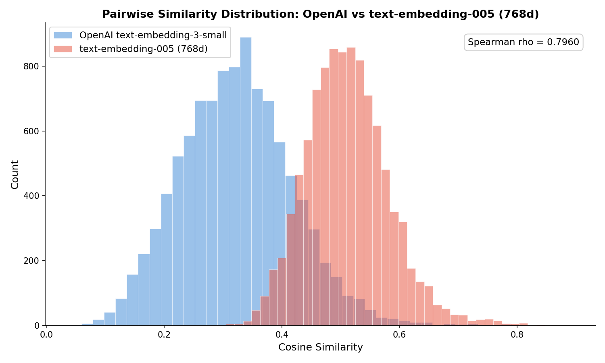
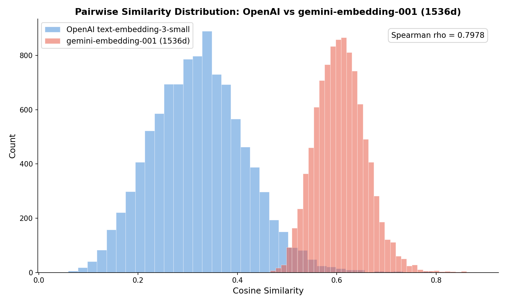
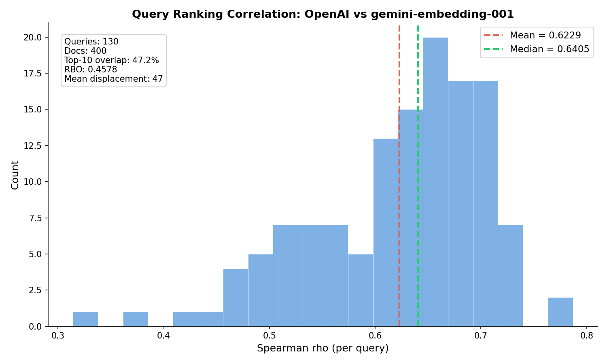
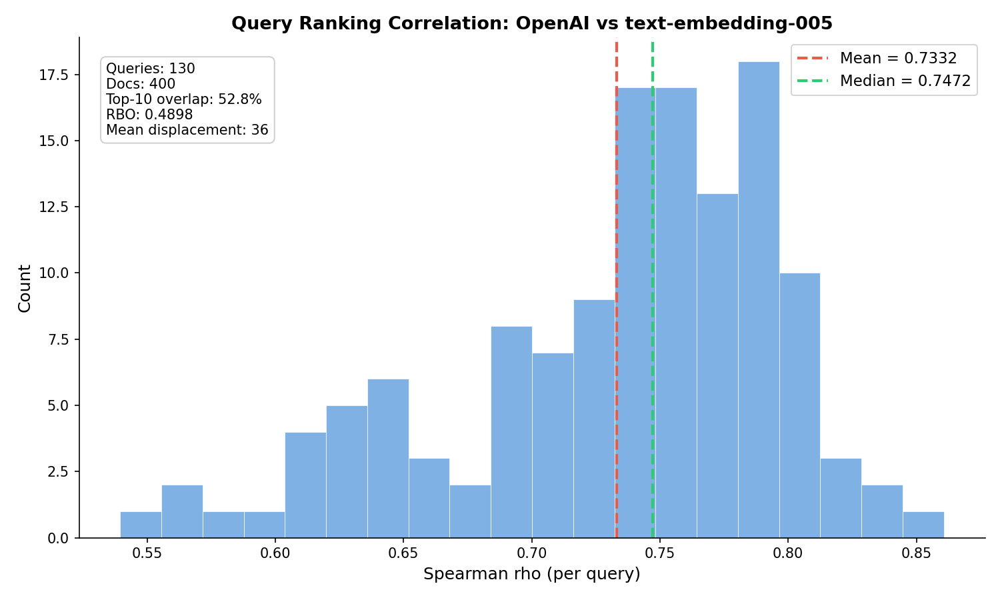

# Test Google Embeddings

**Author:** Adam McCabe

## Hypothesis

Google (GCP) managed embeddings perform as well as OpenAI embeddings for our content search use case, and could serve as a drop-in replacement if we migrate to GCP for LLM services.

## Conclusion

This is not a drop in replacement, the distributions between the two embedding models share some correlations but are fundamentally different, particularly when we zoom in on their top-10 results (what we typically return in the search job).

## Background

Our production search pipeline converts content into numerical vectors ("embeddings") using OpenAI's `text-embedding-3-small` model. These vectors are stored in PostgreSQL via pgvector and used for similarity search — when a user searches, we embed their query and find content with the most similar vectors.

If we're considering a move to GCP for LLM services, it makes sense to evaluate whether Google's embedding models produce comparable search results. A mismatch in embeddings would mean search quality degrades after migration, which is a non-starter.

**Current production setup:** OpenAI `text-embedding-3-small`, 1536 dimensions, stored in PostgreSQL with HNSW indexing (`infra/vectors.py`).

## Models Tested

| Model | Provider | Dimensions | Notes |
|-------|----------|-----------|-------|
| `text-embedding-3-small` | OpenAI | 1536 | Current production model |
| `text-embedding-005` | Google Vertex AI | 768 | Latest Vertex AI text embedding |
| `gemini-embedding-001` | Google Gemini | 1536 (configurable) | #1 on MTEB Multilingual benchmark |

## Method

We sampled 400 content records from the dev database that already have OpenAI embeddings. For each record, we generated embeddings using both Google models. We compared models in two ways:

### 1. Pairwise Similarity Analysis

For 10,000 random document pairs, we computed the cosine similarity within each model and compared the distributions (Spearman rank correlation). This measures whether the models have a similar general sense of "how related are these two documents?"

### 2. Query-Based Ranking Evaluation

We fetched 130 real search queries from the `researchquery` table and embedded them with all three models. For each query, we ranked all 400 documents by cosine similarity under each model, then measured agreement using multiple metrics:

- **Full Spearman rho** — rank correlation over the entire 400-doc ranking
- **Top-10 overlap** — fraction of top-10 results shared between models
- **RBO (Rank Biased Overlap)** — weighted overlap that cares more about position 1 than position 10 (p=0.9 means ~86% of weight goes to top ~10 positions)
- **Top-k Spearman** — rank correlation over only the union of both models' top-10 docs, isolating whether disagreement is in the visible results vs. the irrelevant tail
- **Displacement analysis** — for docs in one model's top-10 but not the other's, where do they actually rank? A doc at position 11 is a near-miss; a doc at position 150 is a genuine disagreement

## Findings

### Pairwise Spearman Rank Correlation

| Comparison | Spearman rho | p-value |
|-----------|-------------|---------|
| OpenAI vs gemini-embedding-001 | **0.7978** | < 0.01 |
| OpenAI vs text-embedding-005 | **0.7960** | < 0.01 |
| text-embedding-005 vs gemini-embedding-001 | 0.7346 | < 0.01 |

A Spearman rho of ~0.80 means the models have a similar general sense of document-to-document similarity. For random document pairs, they largely agree on which pairs are more or less related.

**Important caveat:** This metric compares random document pairs, not query-vs-document rankings. As shown in the query-based evaluation below, this ~0.80 agreement on general similarity (doc to doc) does not translate to agreement on actual search results (short query to doc).

### Pairwise Similarity Distributions

| Metric | OpenAI text-embedding-3-small | text-embedding-005 (768d) | gemini-embedding-001 (1536d) |
|--------|------------------------------|--------------------------|------------------------------|
| Mean | 0.3148 | 0.5040 | 0.6030 |
| Median | 0.3126 | 0.4998 | 0.6016 |
| Std | 0.0923 | 0.0671 | 0.0506 |
| Min | 0.0570 | 0.2948 | 0.4315 |
| Max | 0.8736 | 0.9303 | 0.9085 |

**Why are OpenAI similarities so low?** These are similarities between random *document pairs* — most of which are topically unrelated. In production search, we compare a short focused query against documents, which yields much higher scores. Additionally, longer texts dilute their embeddings as token-level features get averaged out, pushing pairwise document similarities toward a low baseline. A mean of ~0.31 for random document pairs is typical for `text-embedding-3-small`. Google's models use their vector space more tightly (higher baselines of 0.50–0.60), but this is a geometric property of the embedding space, not a quality difference. The tighter distribution represented in Google's models would imply we would want to compare higher similarities using higher precision (e.g. 0.90 vs. 0.905).

What matters is the *relative ordering*, which is captured by the Spearman correlation above.

This distributional difference does have a practical consequence: **any hardcoded similarity thresholds need to be recalibrated.** For example, we currently use a `0.9` cosine similarity threshold for deduplication in `app/jobs/options.py` and `app/jobs/criteria.py`. That `0.9` would mean something very different under a Google model.

#### OpenAI vs text-embedding-005



#### OpenAI vs gemini-embedding-001



### Search Ranking Evaluation

This is the most important section. The pairwise analysis compares random document pairs, but production search compares a short query against documents — a more realistic operation for our app. We used 130 real search queries from the `researchquery` table to directly measure "do users get the same search results?"

#### Ranking Agreement

| Metric | OpenAI vs gemini-embedding-001 | OpenAI vs text-embedding-005 |
|--------|-------------------------------|------------------------------|
| Full Spearman rho | 0.6229 | 0.7332 |
| Top-10 Spearman rho | **-0.0108** | **0.0931** |
| RBO (p=0.9) | 0.4578 | 0.4898 |
| Top-10 overlap | 47.2% (4.7/10 shared) | 52.8% (5.3/10 shared) |

**The top-10 Spearman near zero is the headline finding.** Even for the ~5 documents both models agree belong in the top 10, they rank them in essentially random order relative to each other. This isn't "same results, slightly different order" — the models have no agreement on which top result is best.

The RBO of ~0.46–0.49 confirms that even with top-position weighting, the models agree on less than half of the ranking.

#### Displacement of "Lost" Results

For documents in one model's top-10 but not the other's, where do they actually rank?

| Metric | OpenAI vs gemini-embedding-001 | OpenAI vs text-embedding-005 |
|--------|-------------------------------|------------------------------|
| Mean rank in other model | 47 | 36 |
| Median rank | 27 | 21 |
| P90 rank | 113 | 74 |
| Worst case | 377 | 351 |

These are not near-misses. Documents that OpenAI considers top-10 are ranked 20–50+ positions lower by Google on average, with some ranked 100+ positions away. The models genuinely disagree about which content is relevant for a given query.

#### Per-Query Spearman rho Distribution





#### Why Pairwise Looks Good but Query Ranking Doesn't

The pairwise Spearman (~0.80) measures whether the models agree on general document-to-document similarity. They do — both models broadly agree on which documents are related.

But search ranking is a harder test. It asks: given a specific short query, which of 400 documents are most relevant? This is where the models diverge because:

1. **Query-vs-document is asymmetric** — embedding a < 20-word query and comparing it to long documents amplifies small differences in how models handle the length mismatch
2. **Top-k is sensitive to the tail of the distribution** — a document at the similarity boundary only needs a small score difference to jump in or out of the top 10
3. **Different training data creates different "opinions"** — the models may have learned subtly different notions of relevance from their respective training corpora

### Score Mapping (Percentile-Aligned)

Since the ranking correlation is strong, we can translate thresholds between models using percentile alignment: a score at the 95th percentile in OpenAI "means the same thing" as a score at the 95th percentile in Google.

**OpenAI vs gemini-embedding-001 (1536d):**

| Percentile | OpenAI Score | Gemini Score |
|-----------|-------------|-------------|
| 50th | 0.3126 | 0.6016 |
| 75th | 0.3755 | 0.6351 |
| 90th | 0.4316 | 0.6667 |
| 95th | 0.4664 | 0.6870 |
| 97.5th | 0.4982 | 0.7055 |
| 99th | 0.5502 | 0.7317 |

**OpenAI vs text-embedding-005 (768d):**

| Percentile | OpenAI Score | Google Score |
|-----------|-------------|-------------|
| 50th | 0.3126 | 0.4998 |
| 75th | 0.3755 | 0.5438 |
| 90th | 0.4316 | 0.5873 |
| 95th | 0.4664 | 0.6192 |
| 97.5th | 0.4982 | 0.6473 |
| 99th | 0.5502 | 0.6851 |

**For engineering:** The current deduplication threshold of `0.9` in OpenAI space is extremely high (well above the 99th percentile of general pairwise similarities — it's designed to catch near-identical content). To find the equivalent Google threshold, look at where `0.9` falls in the OpenAI distribution and use the corresponding Google percentile. The script outputs this mapping automatically — run it and check the "Score Mapping" table in the output.

### Latency

Measured over 400 texts in batches of 50, calling from a local machine to GCP `us-central1`. To re-run, delete the `cache/` directory and re-run to get fresh measurements.

| Model | Total Time | Avg per Text | Batch Size |
|-------|-----------|-------------|------------|
| `text-embedding-005` | ~24s | ~59ms | 50 |
| `gemini-embedding-001` | ~15s | ~38ms | 50 |

`gemini-embedding-001` is roughly 2x faster than `text-embedding-005`. Both are fast enough for real-time use — our production search embeds a single query per request.

Note: these are local-to-GCP latencies. In production (GCP-to-GCP), latency would be significantly lower.

### Pricing Comparison

| Model | Provider | Pricing | Notes |
|-------|----------|---------|-------|
| `text-embedding-3-small` | OpenAI | $0.02 / 1M tokens | Current production model |
| `text-embedding-3-large` | OpenAI | $0.13 / 1M tokens | Higher quality alternative |
| `text-embedding-005` | Google Vertex AI | ~$0.025 / 1M tokens | Per-character pricing converted to approximate per-token |
| `gemini-embedding-001` | Google Gemini API | $0.15 / 1M tokens on Vertex AI | Configurable dimensions |

Pricing is roughly comparable between OpenAI `text-embedding-3-small` and Google's models. Google offers a free tier through the Gemini API which could reduce costs for development/experimentation, but production Vertex AI pricing is slightly higher.

### Implementation: What Would Change

Switching the embedding backend from OpenAI to Google would require changes to `infra/vectors.py`. Here's a side-by-side comparison:

**Current (OpenAI):**

```python
# Dependencies: openai
from openai import AsyncOpenAI

async def embed(self, text: str, dimensions: int = 1536) -> list[float]:
    async with AsyncOpenAI(api_key=api_key) as client:
        response = await client.embeddings.create(
            input=[text], model="text-embedding-3-small", dimensions=dimensions
        )
        return response.data[0].embedding
```

**Google option — gemini-embedding-001 (via google-genai SDK):**

```python
# Dependencies: google-genai
from google import genai

def embed(self, text: str, dimensions: int = 1536) -> list[float]:
    client = genai.Client(vertexai=True, project="${GCP_PROJECT}", location="us-central1")
    response = client.models.embed_content(
        model="gemini-embedding-001",
        contents=[text],
        config={"output_dimensionality": dimensions},
    )
    return list(response.embeddings[0].values)
```

**Google option — text-embedding-005 (via google-cloud-aiplatform SDK):**

```python
# Dependencies: google-cloud-aiplatform
from vertexai.language_models import TextEmbeddingModel

def embed(self, text: str, dimensions: int = 768) -> list[float]:
    model = TextEmbeddingModel.from_pretrained("text-embedding-005")
    result = model.get_embeddings([text], output_dimensionality=dimensions)
    return result[0].values
```

**Dependency changes for `gemini-embedding-001` (recommended):**

```diff
# pyproject.toml
- "openai>=1.109.1,<3",            # can remove if no other OpenAI usage
+ "google-genai>=1.0.0,<2",        # Google Gen AI SDK
```

**Other considerations:**
- Authentication switches from an API key (`OPENAI_API_KEY`) to GCP credentials (`gcloud auth application-default login` or service account)
- The `google-cloud-aiplatform` package is already a dependency for other integrations — so `text-embedding-005` needs zero new deps
- If using `gemini-embedding-001` at 1536 dimensions, no database migration is needed — the vector column size stays the same
- If using `text-embedding-005` (768 dims), the `embedding` column would need resizing and the HNSW index rebuilt — a more involved migration
- All existing embeddings would need to be regenerated regardless of which Google model is chosen (you cannot mix embeddings from different models)

## Conclusion

**Google embeddings are not a drop-in replacement for OpenAI.** Users would see a meaningfully different search experience — not necessarily worse, but different enough that it can't be treated as a simple swap. **Further testing would be needed via human evaluation to determine quality impact.**

The key evidence:
- **~50% of top-10 results differ** between models for real search queries
- **Top-10 ordering is uncorrelated** (Spearman ≈ 0) — even shared results appear in random order
- **Displaced results aren't near-misses** — mean displacement of 36–47 positions, with P90 at 74–113
- Pairwise Spearman of ~0.80 gives a misleadingly optimistic picture; query-based Spearman drops to 0.62–0.73

Between the two Google models, `text-embedding-005` shows slightly better agreement with OpenAI on search rankings (0.73 vs 0.62 Spearman, 53% vs 47% top-10 overlap), though neither is close to a drop-in replacement.

### What This Means for a Migration

Switching embedding models is feasible but requires treating it as a **search quality project**, not an infrastructure swap:

1. **Re-embed all content** using the new model (required regardless — you can't mix embeddings from different models)
2. **Recalibrate similarity thresholds** (e.g. the `0.9` deduplication cutoff) using the percentile mapping above
3. **Evaluate search quality independently** — the models may retrieve different but equally good results. This experiment measures agreement, not quality. A human relevance evaluation (or A/B test) would determine if Google's results are better, worse, or equivalent
4. **Expect visible changes to search results** — users will notice different ordering and some different results appearing

### Open Question

This experiment measures whether Google and OpenAI agree, but agreement with OpenAI is not the same as quality. It's possible Google's results are better for some queries and worse for others. Determining actual quality requires relevance judgments — having humans rate "is this result good for this query?" — which is outside the scope of this experiment.

## How to Run

```bash
cd experiments
make auth  # one-time GCP auth
make run_experiment ARGS="test_google_embeddings --limit 400 --pairs 10000"
```

### Arguments

- `--limit N` — Number of content records to sample (default: 200)
- `--pairs N` — Number of random document pairs for Spearman correlation (default: 5000)

PNG plots are saved to `results/`. Delete `cache/` to force re-generation of embeddings (and re-measure latency).
