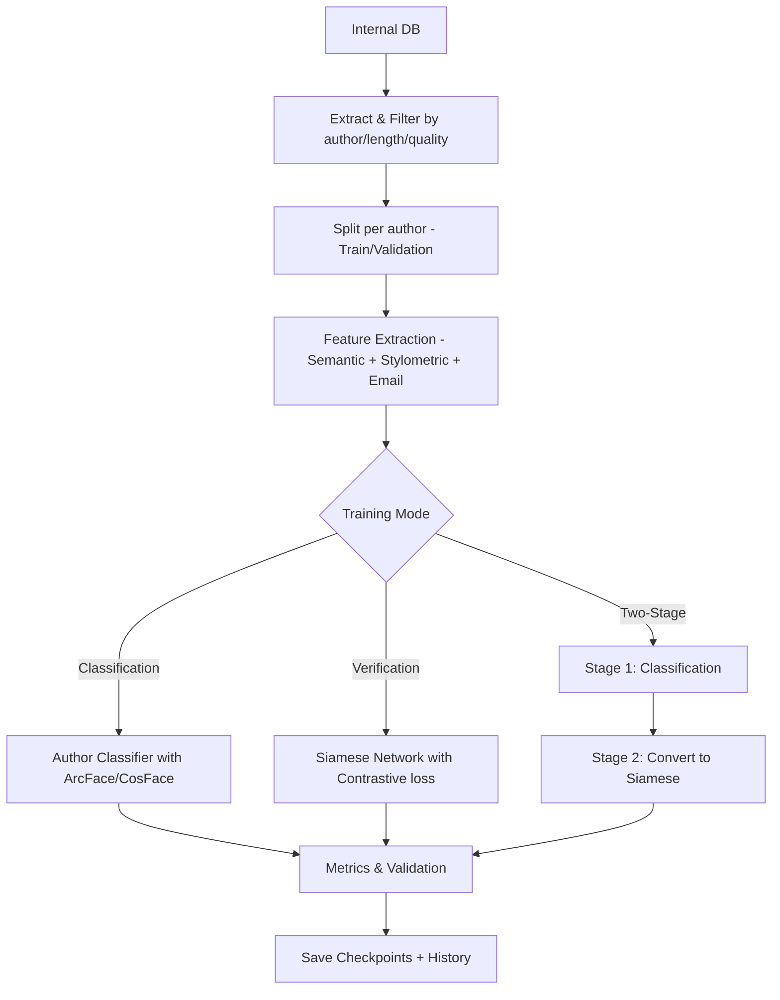
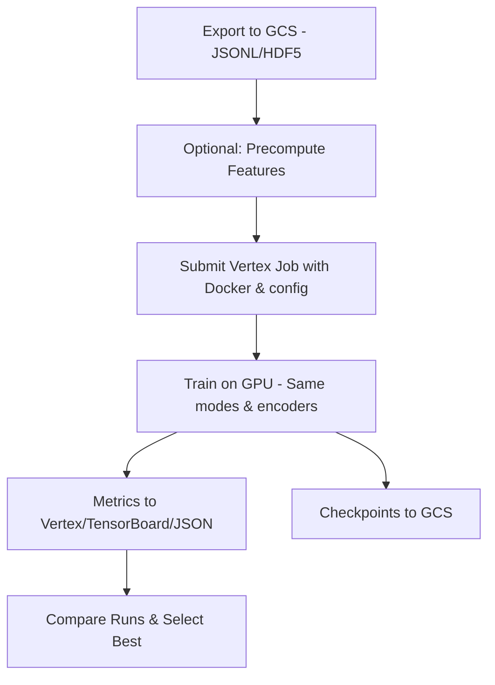
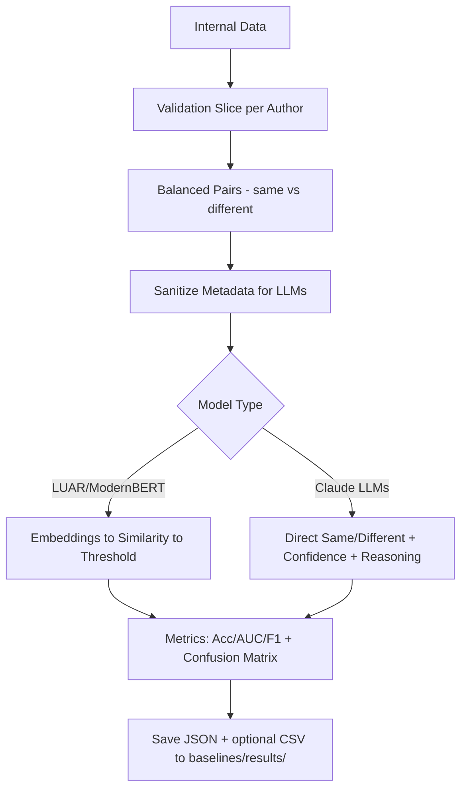
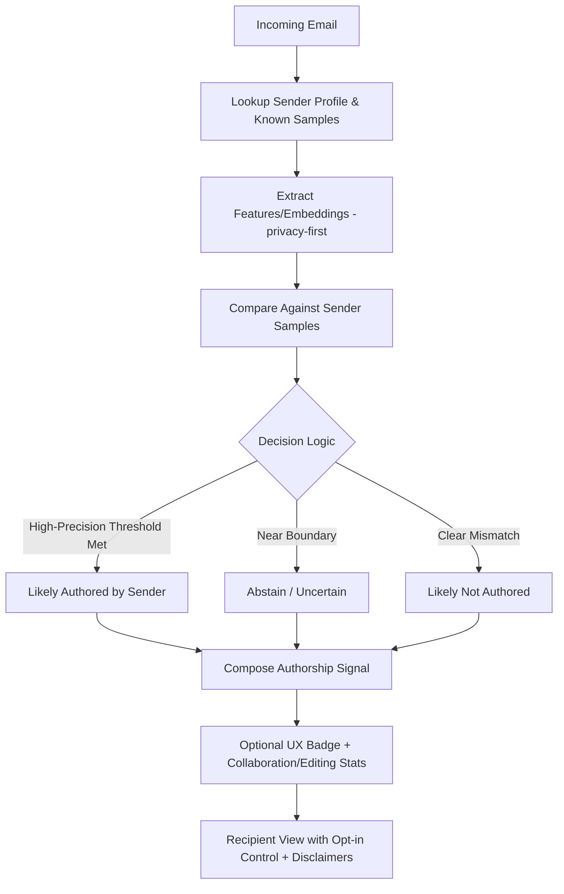

# Experiment Overview

## TL;DR

- Goal: Decide if two texts were written by the same person.
- Why it matters (Convictional email): Recipients are more engaged when confident the sender actually authored the message. We can provide a sender‑opt‑in authenticity signal by comparing new emails against known writing samples from that sender — non‑intrusively and without key‑logging.
- What we compare: Two open‑source baselines (LUAR, ModernBERT), three Claude LLMs (Haiku, Sonnet, Opus), and a custom Siamese model.
- Apples‑to‑apples baselines on the same 630 pairs (September 28, 2025):
  - Claude Opus 4.1: Accuracy 72.86%, AUC 0.553, F1 0.6995
  - Claude Sonnet 4: Accuracy 67.14%, AUC 0.554, F1 0.6601
  - Custom Model: Accuracy 62.70%, AUC 0.664, F1 0.6768
  - Claude Haiku 3.5: Accuracy 62.38%, AUC 0.599, F1 0.6648
  - ModernBERT: Accuracy 58.41%, AUC 0.679, F1 0.3791
  - LUAR: Accuracy 57.94%, AUC 0.687, F1 0.5343
- Reality check: Claude models show promising accuracy (63-73%) with balanced precision/recall. Custom model with proper training demonstrates competitive performance (62.7% accuracy, 66.4% AUC). Traditional models achieve higher AUC but with conservative predictions.

## Product Context: Why We’re Doing This

- JTBD: Help recipients trust that a message was actually authored by the sender (vs AI or someone else), improving engagement and clarity.
- Approach: Compare a received email to a set of known samples from the sender (e.g., past emails or other work the user provides). Output a conservative, opt‑in authenticity signal the sender can include.
- Non‑intrusive by design:
  - No key‑logging. We do not capture keystrokes; copy/paste is expected in real workflows.
  - Prefer embeddings/features over raw text; minimize retention; clear opt‑in.
- Not a standalone feature: Part of a broader “message quality & provenance” UX the sender opts into. Could include:
  - Authorship likelihood (our determination)
  - Collaboration/Editing stats (e.g., dwell time bands, collaborators involved) — aggregated, not keystrokes
  - Clear disclaimers and “uncertain” states to preserve trust

## Conceptual Flows

### Training (Local)

### Training (Vertex AI)

### Baseline Evaluation

### Production Authorship Check (Concept)

## What We’re Testing

- Same/different authorship given two texts.
- Inputs: Real internal content from a set of ~12+ known authors (each generally 100+ samples), plus smaller subsets for quick iteration.
- Outputs: Accuracy, AUC, precision/recall, F1, and confusion matrices.
- Sanitization: For LLM baselines we remove explicit author metadata (names, timestamps) before evaluation to avoid leakage.

## Apples‑to‑Apples Baseline Results (630 Pairs)

- Source files:
  - Open‑source baselines: `baselines/results/baseline_evaluation_20250909_113709.json`
  - LLM baselines: `baselines/results/baseline_evaluation_20250916_151250.json`

### Glossary (Quick Reference)

- Positive/Negative: Same‑author vs different‑author pairs.
- Threshold: Cutoff turning a similarity/score into a binary decision.
- AUC: Threshold‑agnostic separation quality.
- F1: Balance of precision and recall on “same author”.

- Metrics (balanced pairs; 50% is guessing):
  - Claude Opus 4.1: Accuracy 72.86%, AUC 0.553, F1 0.6995
  - Claude Sonnet 4: Accuracy 67.14%, AUC 0.554, F1 0.6601
  - Custom Model: Accuracy 62.70%, AUC 0.664, F1 0.6768
  - Claude Haiku 3.5: Accuracy 62.38%, AUC 0.599, F1 0.6648
  - ModernBERT: Accuracy 58.41%, AUC 0.679, F1 0.3791
  - LUAR: Accuracy 57.94%, AUC 0.687, F1 0.5343

Notes:
- Accuracy is the easiest headline; AUC reflects “ranking” quality (threshold‑agnostic). LLMs show higher accuracy in these runs, while open‑source embeddings show stronger AUC (more stable separation scores).
- We also have a 140‑pair embedding run with higher AUC; treat cross‑run comparisons cautiously due to sample differences.

## What To Know (Without Reading Code)

- We compare two texts and output same/different. Pairs are balanced to avoid skew.
- Why sanitize for LLMs? To prevent models from “cheating” via names/timestamps in headers.
- AUC vs Accuracy: Accuracy is thresholded performance; AUC measures how cleanly scores separate positives/negatives across thresholds.
- The custom model learns a “style embedding” from semantic + stylometric + email‑pattern features and compares them with cosine similarity.

## Implications For Product

- Trust is fragile: False positives (“authored by” when not) harm credibility more than false negatives. Calibrate for high precision on “same author” claims and abstain when uncertain.
- Practical deployment tactics:
  - Per‑sender calibration: Use that sender’s own sample distribution to set thresholds (better than a single global threshold).
  - Abstention: Provide “uncertain” rather than forcing a binary claim near the decision boundary.
  - Confidence bands: Map similarity → probability via calibration (e.g., isotonic/Platt) and show conservative language in UX.
  - Composite “provenance” signal: Combine authorship determination with non‑intrusive stats (dwell time bands, collaborators involved) and clear disclaimers.
  - A/B test the authenticity indicator on real recipients; measure open/click/reply and trust feedback.
- Privacy & non‑intrusiveness:
  - No key‑logging. We do not capture keystrokes or free‑text telemetry.
  - Prefer storing embeddings or hashed features, with short retention and clear opt‑in.
  - Redact obvious metadata; keep signals robust to copy/paste and cross‑tool editing.

## Limitations & Risks

- Current metrics still imply non‑trivial false positives/negatives. We should only claim “likely authored” at very conservative thresholds and show “uncertain” often.
- Domain shift: Performance may differ across content types (emails vs GitHub vs docs); we’ll need domain‑specific calibration and potentially fine‑tuning.
- LLM prompt/temperature sensitivity exists; we standardize prompts and rate‑limit requests.

## Optional: For Engineers

- Baselines: `poetry run python scripts/run_baseline_evaluation.py`
- Training (local): `poetry run python scripts/train.py`
- Vertex: `poetry run python scripts/submit_vertex_job.py` … (see `VERTEX_AI_README.md`)
- Outputs:
  - Baselines: `baselines/results/baseline_evaluation_*.json` (+ `predictions_*.csv` for LLMs)
  - Training: `results/training_history_*.json`; checkpoints in `models/checkpoints/`
